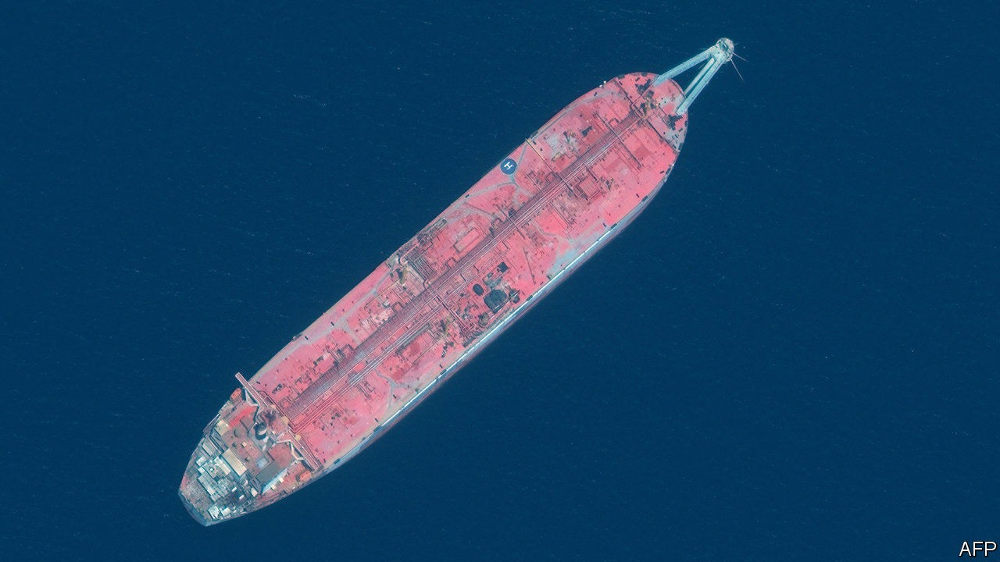
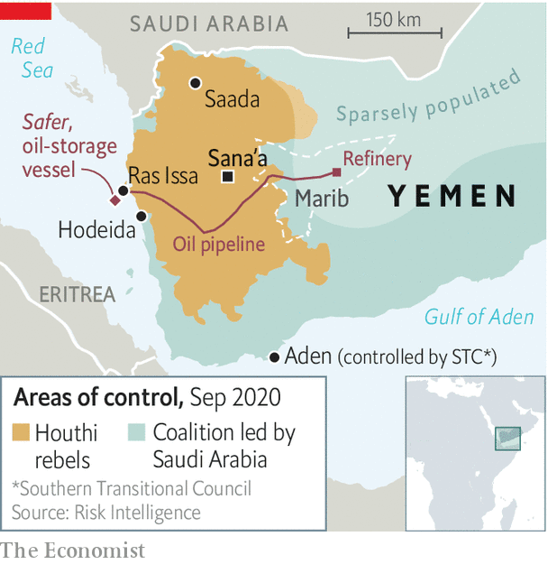

## The good ship Safer: unsafe

# A possible oil leak in the Red Sea adds to Yemen’s crises

> As if war and famine were not bad enough

> Oct 3rd 2020BEIRUT

FOR FIVE years the Safer, a tanker, has been slowly corroding in the Red Sea, a time-bomb waiting to go off. Or perhaps it already has. Built in 1976, sent to Yemen in 1988, it has served ever since as a floating storage unit and export terminal. It sits off the coast of Ras Issa at the terminus of a 430km oil pipeline (see map). Since 2015 the ship and its cargo, more than 1.1m barrels of oil, have been in the hands of the Houthis, a Shia rebel group fighting a Saudi-led coalition in Yemen. On September 24th the Saudi ambassador to the United Nations warned that an “oil slick” had been spotted 50km west of the vessel.

Diplomats, shipping experts and environmentalists had warned for years that the ship was a danger. Sea water is doing what sea water does, eating away at its hull and tanks, a process that happens faster than normal in the salty Red Sea. Photos taken on board last year showed leaking pipes and rusted seals; there are fears the whole thing may explode.

But the Houthis have blocked any maintenance work. The vessel, in their imagination, is a useful obstacle to a Saudi-led assault on Hodeida, the nearby port that handles most of Yemen’s imports. Never mind that a spill would be an environmental disaster: the Safer’s cargo is four times that of the Exxon Valdez, which blighted hundreds of miles of Alaskan coast when it ran aground in 1989. Such short-sighted thinking, from both the Houthis and their foes, has turned the war into an intractable humanitarian catastrophe.

More than 100,000 Yemenis have died as a result of the conflict since 2015, when the Saudis and their allies invaded to fight the Houthis, who had seized control of the capital, Sana’a. Famine and disease stalk the population; the economy has collapsed. A year ago, though, there was guarded optimism that the fighting was near an end. In the summer of 2019 the United Arab Emirates (UAE) withdrew most of its troops, depriving Saudi Arabia of its most effective partner. The kingdom began indirect talks with the Houthis in Oman, a frequent mediator in Gulf disputes.

But those talks (now virtual, because of covid-19) have not produced a deal. The fighting, meanwhile, has grown more complicated. This spring separatists in the south aligned with the UAE began fighting the Saudi-backed government, pitting two ostensible members of the coalition against each other. Then the Houthis began a push to seize Marib, a province that holds much of Yemen’s oil. It has been a place of relative stability, which has made it a hub for civilians displaced from other provinces. Its population has grown perhaps tenfold since the war began, to an estimated 3m. The Houthis have lost thousands of fighters trying to seize it. Their offensive is getting in the way of peace talks.

Even away from the front lines, life is miserable. Fuel shortages are widespread in northern Yemen. Both sides are guilty of exacerbating them: the coalition has barred fuel tankers from unloading at Hodeida, while the Houthis play up shortages to boost a lucrative black market in fuel. Yemen’s currency, the rial, has lost 70% of its pre-war value, including a 25% drop this year. Prices have soared, leaving many civilians unable to afford even food. Most rely on aid, but aid agencies are short of cash. Since March the UN’s World Food Programme has been able to provide only half-rations in Houthi-controlled areas. It estimates that hunger rates have increased from 28% to 43%. It will need $500m in extra funding just to continue that meagre assistance for the next six months.

Yemen has few sources of hard currency: years of war have left little in the way of exports, tourism or investment. A $2bn deposit in the central bank from Saudi Arabia in 2018 is almost depleted. The country’s last remaining lifeline is remittances, which totalled $3.8bn last year. About three-fifths of that comes from the 2m-odd Yemenis working in Saudi Arabia. But their numbers have thinned as the Saudi government tries to evict migrants to free up jobs for citizens. So remittances have dropped by an estimated 70-80% this year.

Diplomats are still hopeful they can broker a truce in Yemen. They are working on a slate of trust-building measures, from a prisoner swap to reopening the airport in Sana’a and shipping lanes. Neither side will gain much from continued fighting: the war is ruinous for Yemenis and costly for Saudi Arabia, in both money and reputation. Yet neither seems ready to stop. ■

## URL

https://www.economist.com/middle-east-and-africa/2020/10/03/a-possible-oil-leak-in-the-red-sea-adds-to-yemens-crises
