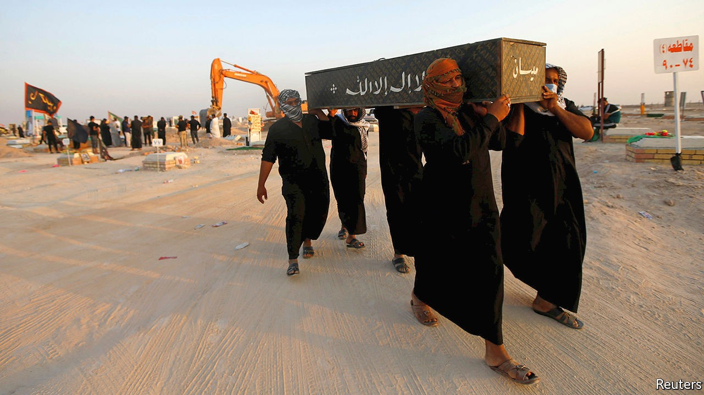

## The most infected Arab state

# Iraq is too broken to protect itself from covid-19

> As the country spirals downwards, the disease spreads

> Oct 3rd 2020

PITY THE doctors of Iraq. Thousands are thought to have contracted covid-19. If the disease doesn’t get them, local tribesmen might. “Every time a patient dies we all hold our breath,” says Dr Tariq al-Sheibani, the director of a hospital in southern Iraq. A month ago a young man from the Hasnawi tribe died of covid-19 in his hospital. That night, as Dr Sheibani left work, 20 of the dead man’s relatives beat him unconscious. The doctor is trying to press charges (CCTV cameras captured the scene), but officials told his family that they would be safer if he did not.

Most Arab regimes have dealt with covid-19 by tightening their grip. Not Iraq. It gave up on lockdowns long ago. The government seems powerless to enforce social distancing or the wearings of masks (some men see the coverings as an insult to their virility). It has little money to spend on a health service gutted by war and corruption. Clergymen still organise mass gatherings. Officially the virus has infected more than 350,000 Iraqis and killed more than 9,000. That is surely an undercount, yet it is still more than in any other Arab country.

Like Iraq’s tribes, the country’s Shia ayatollahs set their own rules. They are going ahead with Arbaeen, an annual pilgrimage to Karbala, a holy city. Thousands of Shia faithful have already begun walking the 500km from Basra, eating and bedding down together in wayside huts. The risk of transmission will increase further when hundreds of thousands more converge on Karbala on October 7th. The surrounding province already has the country’s second-highest infection rate, probably because of a pilgrimage in August.

The government has tried to limit foreign pilgrims by closing Iraq’s land borders and restricting flights from Iran. But there is only so much it can do. “People believe visiting the tomb of Hussein [in Karbala] cures covid-19,” sighs a former government health adviser. Muqtada al-Sadr, a firebrand cleric, has led a campaign to keep the shrines open and defied a ban on Friday prayers. Lately Iraqis have been haphazardly digging up relatives who were buried in a special “coronavirus cemetery” so that they can be given proper funeral rites.

Better medical care would help. Iraq spends about half as much per person as its poorer neighbour, Jordan, on health. A lot of it is wasted—or stolen. The health ministry is led by a technocrat, but it is full of Mr Sadr’s men, who stand in the way of reform. Just ask Alaa al-Alwan, who tried to clean it up. The former health minister resigned last year, citing excessive pressure from within the ministry. Other officials persuaded him to stay on—but he resigned again months later, citing corruption, blackmail and defamation.

Today there are fewer hospital beds and doctors in Iraq than before the American invasion in 2003, though the population has almost doubled. Some 20,000 doctors have fled abroad, says the Iraqi Medical Association, the doctors’ syndicate. Many of those who remain recently went on strike over poor working conditions (basic items, such as masks, are lacking). Hospital directors are so short-staffed that they are loth to let infected doctors go into quarantine. Meanwhile, falling revenues caused by a collapse in the price of oil mean the government has no money to hire thousands of medical graduates. The prime minister, Mustafa al-Kadhimi, suggests they volunteer. The least the government could do is protect them from angry tribesmen. ■

Editor’s note: Some of our covid-19 coverage is free for readers of The Economist Today, our daily [newsletter](https://www.economist.com/https://my.economist.com/user#newsletter). For more stories and our pandemic tracker, see our [hub](https://www.economist.com//news/2020/03/11/the-economists-coverage-of-the-coronavirus)

## URL

https://www.economist.com/middle-east-and-africa/2020/10/03/iraq-is-too-broken-to-protect-itself-from-covid-19
