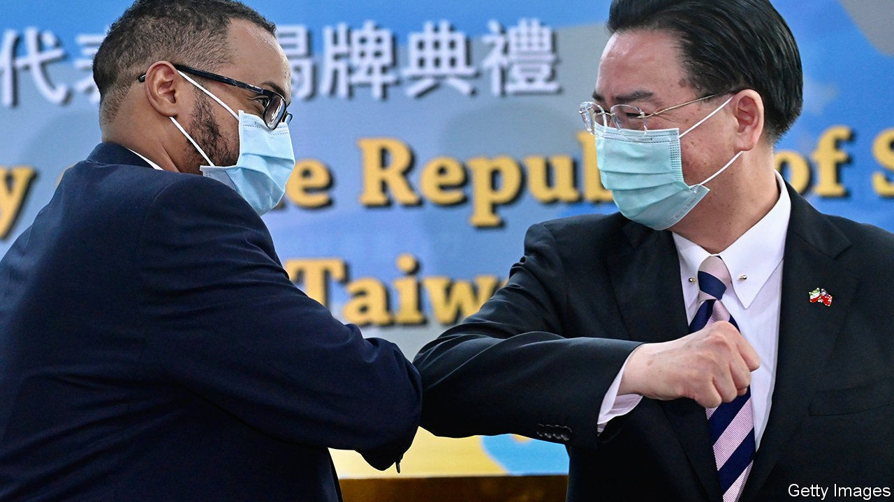
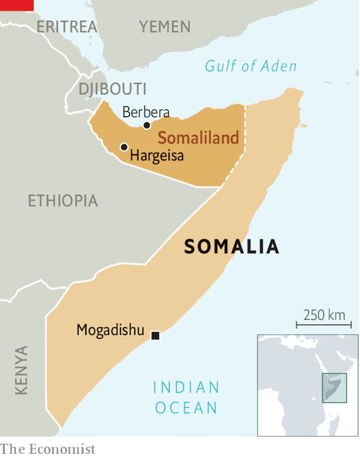

## Outcasts united

# Somaliland and Taiwan establish diplomatic ties

> A hunt for recognition sometimes makes for strange bedfellows

> Oct 3rd 2020

ONE IS A small, surprisingly successful and relatively democratic country bullied by a larger, dictatorial neighbour which considers it to be part of its own territory. The other is Taiwan. On September 9th Somaliland, a breakaway republic in the north of Somalia, opened a “representative office” in Taipei, the capital of Taiwan. It followed the opening in August of a similar Taiwanese office in Hargeisa, Somaliland’s capital.

The exchange of diplomatic relations is a coup for Somaliland, which declared independence in 1991 after the fall of Somalia’s last dictator, Siad Barre. Like Taiwan, it is a country in all but name. It has a government, an army and borders. It holds elections and, unlike the rest of Somalia, has been mostly peaceful for the past 30 years. It issues passports.

Yet Somaliland has struggled for recognition. Barely a dozen countries recognise its passports (a government minister with dual British citizenship confesses that he does not use his Somaliland one: he has less explaining to do when presenting one issued by Her Majesty’s Passport Office). Not one considers it an independent country, and it has no seat at the United Nations. In Mogadishu, the bombed-out capital of Somalia, foreign diplomats studiously ignore Somaliland’s existence lest they upset the squabbling local politicians who consider it part of their country.

According to Liban Yusuf Osman, Somaliland’s deputy foreign minister, Taiwan can be a valuable ally for his country. “Taiwan…has economic advancement we can learn a lot from,” he says. He points out that Somaliland doctors have been training in Taiwan for more than a decade, travelling on their Somaliland passports. He hopes that formal relations may bring more such benefits. At Berbera, Somaliland’s dusty second city on the Gulf of Aden, DP World, an Emirati company, is building a colossal new port. Mr Osman hopes that Taiwanese firms may open up there too, perhaps to develop oil or mining.

Yet it is geopolitics, not economics, that drives the relationship. A few decades ago Taiwan still had a handful of diplomatic relationships across the continent, including with South Africa under apartheid. Loans and aid projects helped seal Taiwan’s ties to poor countries such as Niger, Burkina Faso and the Gambia. But China insists that countries choose relations either with Beijing or with Taipei. As its economic might has grown, so even these holdouts have switched their recognition to China. By 2018 Eswatini (a tiny monarchy formerly known as Swaziland) was Taiwan’s last friend in Africa. Now it has two.

## URL

https://www.economist.com/middle-east-and-africa/2020/10/03/somaliland-and-taiwan-establish-diplomatic-ties
