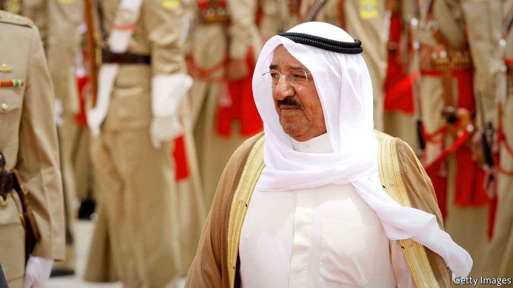

## A king of co-operation

# The death of Kuwait’s emir robs the Gulf of a real diplomat

> Sheikh Sabah al-Sabah’s calming influence will be missed

> Sep 30th 2020BEIRUT

HIS LAST role was as a monarch, but it was his longest, as a diplomat, that defined him. Before he ascended the throne in 2006, Sheikh Sabah al-Sabah (pictured) spent decades as Kuwait’s foreign minister. Rather than letting Kuwait slip into the undertow of Saudi Arabia, its larger neighbour, he helped turn a small country—with fewer than 5m people today, mostly migrant workers—into an influential player. On September 29th, after a long illness, Sheikh Sabah died at the age of 91.

He was born in a different Kuwait, one that relied on a pearl trade soon to collapse. Oil discovered nine years later transformed it into one of the world’s richest states. Sheikh Sabah became its foreign minister in 1963 and held the post for 40 years, a period that included the loss of his country when Saddam Hussein, the Iraqi despot, invaded in 1990. The occupation gave him an enduring appreciation for America, which led the coalition that liberated Kuwait. When he fell ill in July it was an American air-force plane that ferried him to the Mayo Clinic in Minnesota for treatment.

The war also reinforced a belief in multilateralism. Sheikh Sabah was one of the architects of the Gulf Co-operation Council, a six-member club founded in 1981. It never quite became the tight political and economic union its founders intended. Still, it is more than a talking-shop, and Sheikh Sabah was keen to protect it. When three of its members—Saudi Arabia, the United Arab Emirates (UAE) and Bahrain—imposed a blockade on a fourth, Qatar, in 2017, Kuwait refused to take part, and the emir tried to mediate in the dispute.

Perhaps the diplomacy was a welcome distraction: politics at home could be tumultuous. Unique among the Gulf monarchies, Kuwait has a raucous parliament with genuine power. Sheikh Sabah dissolved it more than once because of disputes with lawmakers. In recent years, as low oil prices blew a hole in Kuwait’s finances, he has also had to grapple with budgetary problems. The treasury now has only enough cash on hand to pay public-sector salaries until the end of October.

The emir, however, remained a popular figure. In 2015, when jihadists bombed a Shia mosque in Kuwait City and killed 27 people, he rushed to the scene to console victims—a personal, emotional display rare among the region’s aloof rulers.

The crown prince, Nawaf al-Sabah, a half-brother of the late emir, ascended the throne hours after Sheikh Sabah’s death was announced. He is an untested leader, and already 83; his time in office will be defined largely by his choice of a successor. Aspirants have waged an unusually public struggle in recent years, some swapping allegations of corruption. Here, too, Kuwait’s parliament has a role: it may reject the new emir’s chosen successor. (Sheikh Sabah himself took power after his infirm predecessor was voted out of office.)

Kuwait is the second Gulf country to change rulers this year. Sultan Qaboos of Oman died in January. Both men commanded great respect in the region, which gave them the freedom to pursue independent foreign policies. Like his Omani counterpart, Sheikh Sabah preferred diplomacy to belligerence in dealing with Iran. With their passing, power in the Gulf will slip further into the hands of Saudi Arabia and the UAE, led (in practice) by younger, headstrong princes. The Gulf has lost its most effective diplomat at a time when diplomacy is badly needed. ■

## URL

https://www.economist.com/middle-east-and-africa/2020/09/30/the-death-of-kuwaits-emir-robs-the-gulf-of-a-real-diplomat
