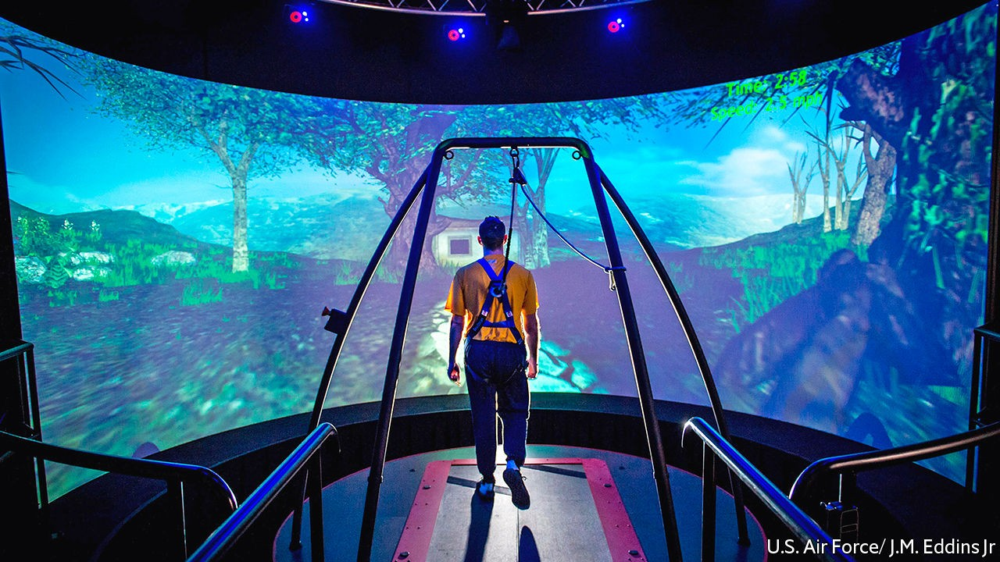
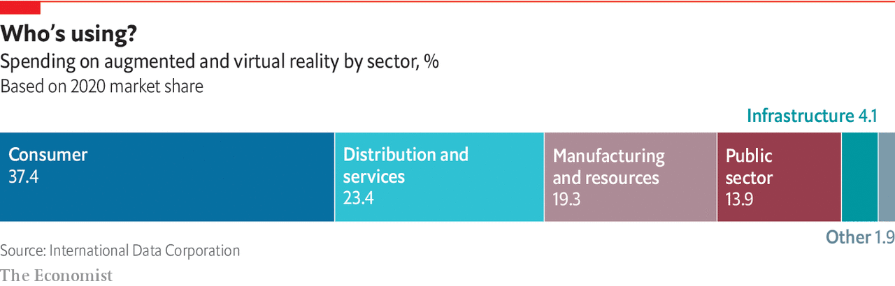

## Health care

# Health care is already benefiting from VR

> Surgery and mental-health treatment are leading the way

> Oct 1st 2020

A  SOLDIER WATCHES a car approaching a check-point on a hot, dusty road. As the vehicle slows to a stop in front of him, he asks the driver to get out and show his identification. Seconds later, the rattle of gunfire pierces the air, followed by a bang and an intense, searing flash. Knocked to the ground and scrambling to safety, the soldier turns to see a flaming wreck where the car had been just moments before.

The scene pauses. A voice in the soldier’s ear says: “Let’s rewind the simulation to the seconds just before the explosion—describe exactly what happened.” The voice is a therapist, speaking to a veteran who is placed in a virtual environment. The simulation they are watching has been modelled on the veteran’s own experiences in a war zone, events that have led him to develop post-traumatic stress disorder (PTSD).

This is the Bravemind system, developed in 2005 by Albert “Skip” Rizzo and Arno Hartholt, experts in medical virtual reality at the University of Southern California, to treat soldiers returning home from the wars in Iraq and Afghanistan. Immersed in a virtual environment that mimics their traumatic experiences, veterans narrate the scene to a therapist, who can control how the events in the simulation unfold. The sounds, time of day and number of people or vehicles on the scene can all be customised. Over several sessions, the veteran is exposed to increasingly intense scenarios that get closer to reliving the memory of the original trauma. The aim of the therapy is to steadily dampen the veteran’s negative reactions to the memory. Bravemind is now used in around 60 treatment centres around the world.

Bravemind builds on a well-established psychological technique known as exposure therapy, in which people are brought to face their fears in a controlled way. VR adds a way of creating detailed, carefully tuned scenarios that can elicit different levels of fear. It works because, even when people know they are watching computer graphics, their brains nonetheless react to virtual environments as if they were real.

Someone who is afraid of heights will find that their heartbeat quickens and palms get clammy even if the precipitous drop they can see is clearly a computer graphic in a VR headset. This is because the brain’s limbic system, which controls the fight-or-flight response, activates within milliseconds in response to potential threats, long before the logical part of the brain—which knows the VR experience is not physically real—can intervene.

Scientists have used VR systems to create and control complex, multi-sensory, 3D worlds for volunteers in their labs since the 1990s. Rather as an aircraft simulator can train and test pilots in a wide variety of settings, virtual worlds allow psychologists and neuroscientists to watch people’s cognitive and emotional responses in situations that are difficult to set up or control in the real world. But the technology has usually been too clunky and expensive for widespread clinical use.

That has started to change, thanks to the falling costs of computing and the increasing capability of the new generation of VR systems. At the same time, the scientific evidence base for the clinical uses of VR has grown. The technology has been successfully applied to tackling schizophrenia, depression and phobias (including the fear of flight, arachnophobia, social anxiety and claustrophobia), and reducing pain in cancer patients undergoing chemotherapy. It can help train spatial-navigation skills in children and adults with motor impairments and assist in rehabilitation after a stroke or traumatic brain injury. The kit can also be used to monitor people and identify medical problems: VR has been used to diagnose attention-deficit hyperactivity disorder (ADHD) and Parkinson’s and Alzheimer’s diseases.

Though each condition is unique, researchers have found common ground rules for designing virtual experiences that work: therapists need to be in control of the scene, deciding what a patient sees and hears in order to modify the strength of the fearful stimulus; the therapy works best when the patient is embodied within an avatar, rather than floating, so that they feel present within the scene; and the patient needs agency, so that they can leave the scene if it gets too overwhelming for them. All this adds up to giving the patient the illusion of control and makes the VR experience feel psychologically “real”.

In some cases the therapeutic regime is so robust that, instead of a real-life therapist guiding a patient through an anxiety-inducing simulation, an animated avatar can do the job instead. A clinical trial showed that such an automated system, designed by Daniel Freeman, a psychiatrist at the University of Oxford, helped people reduce their fear of heights. In the simulation, a virtual counsellor guided patients up a virtual ten-storey office complex, where the upper floors overlooked a central atrium. At each floor, the counsellor set the patient tasks designed to test and help them manage their fear responses, such as walking to the edge of a balcony while the safety barrier was lowered or riding on a moving platform over the space above the atrium.

Dr Freeman found that six sessions of virtual, automated therapy over two weeks significantly reduced people’s fear of heights, compared with people who had no therapy. A similar automated virtual therapy for arachnophobia, developed by Philip Lindner at Stockholm University, helped patients eventually touch spiders. The reduction in fear was still apparent when the participants were followed up a year later.

For doctors, virtual environments also provide a risk-free way to practise important procedures. Surgeons operate in high-pressure environments with a lot of cognitive demands. “You’ve got to learn very rapidly, and you’ve got to make decisions under time pressure, with millimetre precision,” says Faisal Mushtaq, a cognitive neuroscientist at the University of Leeds in England.

Practising with computer simulations can help. In the NeuroVR system, developed by a group of Canadian hospitals and universities, surgeons can use MRI scans from their patients to rehearse removing brain tumours before going in with the knife for real. The surgeon gets a 3D view of the tumour on screens and practises cuts and movements by manipulating instruments attached to a robotic arm that responds with haptic feedback. This allows users to sense whether they are cutting through hard or soft material, or through a tumour versus healthy tissue. An advantage of such a system is that, once a doctor is trained, the technology can be used to perform remote surgery. Both virtual training and remote procedures for patients are useful at a time when covid-19 has forced health-care systems around the world to keep doctors and non-emergency patients apart.

When surgeons try to reconstruct a limb, a key problem is identifying important blood vessels that need to be protected during the surgery. In the past a surgeon would try to identify those vessels using an ultrasound probe, but the process is lengthy and imprecise. So James Kinross, a consultant surgeon at Imperial College London, has been experimenting with Microsoft’s HoloLens, an augmented-reality headset, which can overlay computer-generated text and images onto the real world.

Dr Kinross has used a CT scan of a patient’s limb to highlight the most important blood vessels. He reconstructed that scan as a 3D model in Unity, a games engine. The HoloLens then overlaid that simulation onto the patient’s real limb in the operating theatre during treatment. “What it meant was that the surgeon could immediately visualize, and very precisely map, the anatomy of these blood vessels, and very quickly identify them and protect them,” says Dr Kinross, who has also used this technique during cancer surgery to help surgeons identify and protect healthy tissue. The adoption of the technology has proceeded very smoothly, he adds, because it is easy to learn and provides “an immediate and very obvious advantage to the clinician”.

He thinks the technology could be pushed much further and wants to try some real-time collaboration with his colleagues during a surgical procedure. “So if you’re running an operation that’s challenging, or you want to have a discussion with a peer, it’s very easy to do and they can have a first-person view of what you’re looking at,” he says.

Medical uses for computer simulations are promising, but how useful they are will take time to evaluate. That will require robust clinical trials and discussions of frameworks for data protection on technologies that could, if their potential is achieved, become a new type of medical device.

“We don’t want to poison the well,” says Dr Mushtaq. “We don’t want to put out systems that are ineffective, that are going to cost our health-care system, and that are going to negatively impact on the growth of this sector.” His research focuses on closing some of those knowledge gaps by examining how the lessons users learn from practising on virtual simulators translate into skills in the real world. Surprisingly, the fidelity of the images to real surgery is not so important. “Something can look very, very, flashy…it’s got all the blood spewing everywhere and so on,” he says. “But it doesn’t necessarily translate to better learning.”

Defining the validity of a simulator can take several forms. The most basic is “face validity”, which reflects how well a simulation looks like the task in the real world. “Construct validity” is a way of comparing performance differences on the simulation between experts and novices. Finally, “predictive validity” is most useful, because it measures how well a person’s performance on a simulator predicts their ability to do the same task in the real world.

This can also be used to flag when learners are struggling, and provide early intervention and support. Dr Mushtaq and his colleagues have demonstrated both construct and predictive validity for the Nissin (formerly Moog) Simodont dental-surgery simulator, used by the University of Leeds to train its students. In research published in 2019, they found that scores on the simulator predicted someone’s performance in a clinic two years later.

Video-game engines have made face validity easier to achieve for simulators. The next step is to measure construct and predictive validity more robustly. Unfortunately, precious little of this kind of validation work is undertaken by academics or companies selling simulators. To help grease the wheels and encourage researchers to build a body of knowledge, Dr Mushtaq and his colleagues recently created a set of tools and protocols that streamline human-behaviour research and make use of the Unity game engine as a platform. This Unity Experiment Framework takes care of the tedious programming steps—downloading files that track all of a user’s movements, for example, or anonymising participants—needed to turn the game engine into an environment optimised for studying people.

Mark Mon-Williams, a cognitive psychologist at the University of Leeds who has worked with VR for more than two decades, reckons simulated worlds have huge potential for improving education and physical and mental health. “But if you’re going to make the most of that powerful set of tools,” he says, “then use the scientific process to ensure that it’s done properly.” ■

## URL

https://www.economist.com/technology-quarterly/2020/10/01/health-care-is-already-benefiting-from-vr
