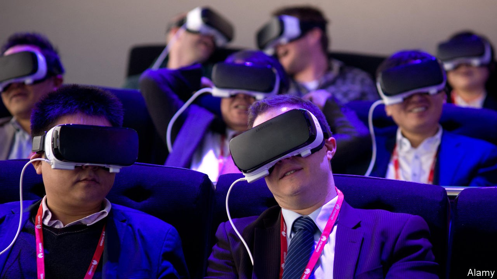

## The future

# The Metaverse is coming

> But people need to be kept at the centre of it

> Oct 1st 2020

WITNESS ANY videoconference call, and it is striking how awkward it still is—everyone is in boxes, looking off in random directions. Microsoft tried to fix this recently with “Together” mode for its Teams application. Created by Jaron Lanier, a virtual-reality pioneer, it does away with boxes and puts everyone in a shared virtual space such as an auditorium. All participants see the whole group at once, as if they were all being reflected in a huge virtual mirror. Mr Lanier says this allows social and spatial awareness functions in the brain to work more naturally, and makes it harder to notice irregularities in eye contact.

For Mr Lanier, “Together” mode is a small contribution to a philosophy he holds dear—that, as technology develops, it should keep people in mind. Instead of asking “is videoconferencing good or bad?” or “is VR good or bad?”, he says, the real question is “how can we make this more human-centred?” He sees virtual realities as a path to that goal, by making computing more human-friendly.

Take posture, for example. Sitting at a keyboard, locked in position for hours and focusing on a fixed screen is a recipe for a range of physical complaints, from sore necks to tingling hands. “Humans have not evolved to sit for long periods of time at a desk, staring at a screen whilst hammering away on a keyboard,” says Mark Mon-Williams of the University of Leeds. Humans evolved to walk around and use their hands to explore the world that is in front of them.  Virtual and augmented realities afford the option of using more natural movements when interacting with computer-generated environments—grasping and pointing at text or objects, for example, and physically moving them around a workspace.

Alex Kipman, a computer engineer at Microsoft and inventor of the company’s Kinect and HoloLens devices, poses a similar question: why are humans required to conform to the needs of computers, rather than the other way around? “Why don’t we flip it?” he asks. “Why don’t we ask technology to understand our world? How do we get digital technology to come out into our analogue space, as opposed to trying to get us into the digital space?” His inventions are specifically aimed at tackling those challenges. The Kinect sensor’s microphones and infrared cameras let people use speech and gestures to control games and other functions on Microsoft Xbox devices. The HoloLens extends that by mapping and understanding the user’s environment, too. Both devices bring technology out of screens and into the real world.

These sorts of ideas will bring increased ease and richness to interactions between humans and computers. The same technologies could also be used to push people beyond their own, or even any, human experiences. Scientists know that, as long as an avatar in a virtual world is programmed to respond in real time to a user’s actions, those users will often co-opt the avatars as almost-real extensions of their own bodies. People can easily inhabit avatars of a different gender or ethnicity, for example. They can even easily learn to control drastically different bodies, soaring over landscapes as virtual eagles or munching grass as virtual cows.

This is more than just a curiosity. Mr Lanier wants to know what would happen if inhabiting different bodies in virtual reality gave people access to new forms of human intelligence and understanding—the kind that “peeks out once in a while with a great athlete or with somebody playing jazz piano”. And if that could be made more accessible, he believes, then it might get interesting. “Can you turn yourself into a mathematical equation…in order to gain the kind of rapid body intelligence that’s possible?”

That is the future of extending human experience. Travis Scott’s concert in “Fortnite” hinted at some of the creative opportunities already available. His was not the first concert in that virtual world. In 2019 Marshmello, a DJ and producer, performed a set in the game watched by more than 10m fans, but that was just a musician playing a concert on a virtual stage in a game world. By contrast, Mr Scott’s event played with the idea of how a concert might look if it did not have to take place in the real world. The audience could therefore fly around beaches, in outer space and underwater. “You can think of this as, how would you tele-concert if you were God?” says Matthew Ball, a tech guru. “If you controlled physics.”

That the event took place during a pandemic, when this was the only type of concert people could participate in, is important. Such events might in the past have been dismissed as “video-game experiences”. But as interactions through Zoom and other services come to be seen as “legitimate” meetings, parties and performances, so events such as Mr Scott’s should also be seen as legitimate concerts, says Mr Ball. “We can’t go to physical concerts,” he says. “So, either we have to say it’s a concert or we have to accept that there are no more concerts.”

There are still many technical hurdles to making the digital and physical worlds work together. As fast and capable as computer graphics have become, for example, VR focuses only on just two of the senses through which people experience reality: sight and sound. In the physical world, it would be difficult to imagine life without the other senses and, in particular, touch—grasping and manipulating objects is a fundamental part of the way people experience and gather information about their surroundings.

If history is a guide, computing platforms and internet connectivity will become faster and more widespread, latency will go down, input and output devices will improve and game engines (and their successors) will be able to create customised virtual worlds on the fly. At some point in the future, anyone who wants to may be able to switch in and out of fully immersive virtual worlds, flitting in and out of whatever the real version of Neal Stephenson’s Metaverse turns out to look like.

What seems certain is that sophisticated 3D digital worlds will appear on ever more of the screens of successive generations of devices that people already use every day. As activities, particularly interactions between people, in virtual realities can generate practical and aesthetic outcomes that have moral consequences and personal meanings, the idea that the “real” world is limited to that which is physically present nearby will seem increasingly bizarre. What, after all, is real, anyway? ■

## URL

https://www.economist.com/technology-quarterly/2020/10/01/the-metaverse-is-coming
