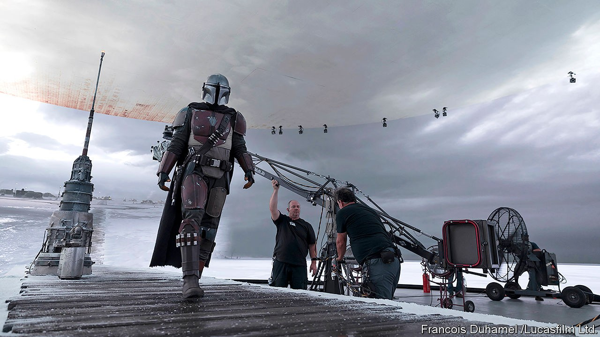

## Simulation

# Virtual environments are being used everywhere

> Film-making is one of the biggest beneficiaries

> Oct 1st 2020

IN AN EARLY scene from Disney’s new television series, “The Mandalorian”, a door opens to reveal a barren, icy landscape. The camera swoops outside to follow the titular character, a solitary gunslinger in silver armour, making his way across the vast expanse of ice. It is an impressive, expensive-looking shot, of the kind you might expect for a show set in the “Star Wars” universe.

The “Star Wars” franchise has been pushing the limits of film-making technology for more than 40 years. Its creator, George Lucas, set up a now-iconic special-effects company, Industrial Light and Magic (ILM), specifically to serve the fantastical effects needs of his space opera. ILM went on to create special effects for dozens of films, including some of the earliest computer-generated 3D characters in “The Abyss”, “Terminator 2” and “Jurassic Park”, pioneering a new industry in the process. Now ILM is at the forefront of using computer-generated reality to bring cinematic special effects to the small screen—and it is using game engines to do it.

The shot of the Mandalorian walking across the ice was one of many created on a film set in Manhattan Beach, California, using its “StageCraft” technology (pictured). This is a facility (or a “volume”, as ILM calls it) in which a giant curved video wall is positioned behind the actors. The wall is 6 metres (20 feet) high by 55 metres wide, and composed of more than a thousand individual LED screens. The photorealistic imagery that appears on the screen is generated from a 3D virtual world (Unreal Engine was used during the development process). As the camera moves, the view on the screen changes accordingly. The result is that the video wall, from the camera’s perspective, behaves exactly like a window looking onto a 3D environment. This approach also helpfully lights the actors realistically, with the scenery reflecting off the Mandalorian’s silver armour, for example. That would not have been possible using conventional green-screen techniques, says ILM’s general manager, Janet Lewin, who co-produced the show.

“The Mandalorian” is filmed in a partially virtual world. Though tested beforehand, producers had their doubts about the set-up. “The Mandalorian was the first time that we had used real-time graphics at this scale to completely wrap around a set and photograph it directly and put it right in the show,” says Rob Bredow, chief creative officer at ILM. “And to be honest, we weren’t sure that it was going to work when we started. [But] it really exceeded all of our expectations.”

The techniques pioneered by “The Mandalorian” are now spreading across the industry, because they allow for cinema-quality special effects within the tighter budgetary and time constraints of television production. For the third season of HBO’s “Westworld”, producers digitally recreated the City of Arts and Sciences complex in Valencia, which stood in for the headquarters of one of the main companies in the series, using the Unreal Engine. On set in Los Angeles, the digital images were rendered on an LED wall, 15 metres by six, showing the view from the floor-to-ceiling office windows of one of the lead characters. Look at a window and move your head from side to side, and you will notice the scene framed by the window changes slightly. Similarly, the images shown on the LED wall changed as the camera moved, perfectly mimicking a window onto a 3D world.

ILM recently announced plans to build a second StageCraft volume at Manhattan Beach and a third at Pinewood Studios in Britain. A fourth—in Sydney, Australia—will mark StageCraft’s arrival into major feature films for Marvel’s upcoming “Thor: Love and Thunder”. Mr Bredow says there are more volumes in the pipeline. “Our technology has just advanced so much from what everyone is familiar with from the first season of ‘The Mandalorian’,” he says.

Watching a sci-fi series is one situation where you may not be surprised to learn that the images you see have been conjured from a virtual world. But the same thing is happening in more mundane situations. Open a catalogue from IKEA, a giant furniture retailer, and you will see images of kitchens, living rooms and other interiors. They look perfectly realistic, if spotlessly clean. The vast majority of these photographs are in fact computer-generated from detailed 3D models, saving the company time and money.

Photographing kitchens is particularly challenging because they look so different from one country to the next. Ensuring that each country’s catalogue reflected local tastes meant bringing appliances from all over the world to a studio in Europe to create multiple sets, and then sending everything back at the end. Assembling virtual kitchens using 3D digital models of furniture and other items is far easier. Software lets designers mimic the way lights reflect and scatter across surfaces, making the computer-generated scenes indistinguishable from the real thing. Different versions of products, in different colours, can be easily swapped in and out. Images shot in a virtual world are also easier to fix if a piece of furniture gets redesigned or withdrawn from sale—its digital version can simply be replaced or removed in the image, which is preferable to the expense and hassle of reassembling a roomful of furniture for a fresh photo shoot.

3D product rendering has been adopted by other industries as a convenient way to produce flawless photorealistic images and videos for advertisements, websites or in-store displays, for everything from cars to industrial machinery to smartphones. Taking pictures in the virtual world, rather than the real one, makes it possible to zoom in on tiny details, fly through a product, or show it in exploded form that then reassembles itself.

Having 3D models of its entire product range to hand also meant that it took IKEA just seven weeks to build IKEA Place, an augmented reality (AR) app that lets customers drop virtual furniture into spaces in their homes and see whether they fit and how they look on the screen of a smartphone. It was one of the first apps to appear after Apple added support for AR to iOS, the software that powers the iPhone, in 2017. The app’s success prompted the company to add AR features (powered by the Unity engine) directly into the latest version of its main shopping app.

The techniques and engines used to create realistic game worlds can do more than just produce images, however. As video games have become more sophisticated, so their underlying world simulations have become more capable and realistic. “Right now, the world is increasingly understanding that these game engines aren’t toys,” says Matthew Ball, a media analyst. “They’re actually hyper-capable.”

Architects can use the technology to simulate, rather than simply render images of, the buildings they are working on. The operators of Hong Kong International Airport, for example, have produced a “digital twin” of one of its terminals—a virtual replica of a physical asset—using Unity. On their computers, they can wander through a photorealistic 3D model that integrates real-time data from sensors all over the terminal, including information on passenger and baggage flows, staff movements and equipment status. The model displays the state of the terminal at any given time and can provide alerts for areas that need attention or maintenance.

Such models can also be used to look into the future, by using the data collected about the real-world operation of the airport as the basis of simulations. It is then possible to evaluate how a new construction project might affect the operation of the airport, or model people-flow in the event of a terrorist attack or the simultaneous arrival of several large aircraft. Engineering and rendering software is not designed to do that. What that actually requires is simulation technology, which is precisely the type of situation that games have been focusing on.

Virtual environments are also increasingly used for simulation-based training. The US Army uses immersive environments, including VR helmets, for training in areas such as infantry combat and the operation of weapons systems. Its spending on VR and AR simulation has increased from $1.6bn in 2015 to an expected $3bn in 2020, according to Bloomberg Government. Globally, the military training and simulation market is worth over $9bn, says Frost & Sullivan, a market-research firm, and will be worth nearly $20bn by 2027, it predicts. The same technology also has peaceful uses. Network Rail, a British railway operator, uses simulations built using Unreal Engine to plan maintenance and track-renewal operations. VR Perspectives, a company based in Ohio, uses simulations of office environments for diversity and inclusion training, enabling trainees to experience the same events from the perspectives of different people.

Sometimes it is machines, not people, that are trained in virtual environments, as in the case of autonomous vehicles. For self-driving cars to become a reality, their software needs to understand busy urban environments. They need to recognise street signs, traffic lights and road markings. They need to be able to deal with dozens or hundreds of moving objects (including people, cars, lorries, bikes, animals) at complex junctions. They need to be ready for emergencies such as a rogue driver barrelling down the wrong side of the road or a child suddenly jumping into the road. All that needs training—billions of miles of it.

Physically training autonomous cars on the streets is expensive and time-consuming—and dangerous, if things go wrong. Computer simulations and racing games have long been used to train autonomous cars’ vision systems, by testing them with highly realistic computer-generated streetscapes. But more advanced simulators can replicate the complexity of city driving, with its rules, intersections and pedestrians. One such system is CARLA, built by researchers at the Computer Vision Centre in Barcelona, Spain, with support from Intel, a chipmaker, and the research arm of Toyota, a Japanese car giant. To create test scenarios for their autonomous-vehicle algorithms, carmakers can customise several aspects of CARLA’s world, from vehicle and pedestrian density to weather conditions, time of day and illumination. It is now the leading open-source simulator for autonomous driving.

Oxbotica, an autonomous-vehicle startup created by engineers from Oxford University, built a virtual environment in Unity in which to test its algorithms. Software agents in the simulation perform tasks such as driving from one place to another, stepping out onto zebra crossings and obeying (or disobeying) traffic lights. Oxbotica’s autonomous vehicle is then placed in this virtual world and tricked into believing it is real. “Our gaming simulation helps us to train the software to understand what it can do in difficult scenarios that are almost impossible to create in real life,” says Todd Gibbs, the company’s head of simulation development. Almost all development in the self-driving algorithm is now put through the simulator first before being unleashed on a real road.

Realistic simulated worlds have a promising future. In 2018 Unity announced a partnership with DeepMind, an AI-research firm owned by Google. Danny Lange, Unity’s vice-president of AI and machine learning, said at the time that the game engine would become “a primary research platform for creating complex virtual environments that will enable the development of algorithms capable of learning to solve complex tasks”. Unity’s platform can create simulated environments that are rich in sensory complexity and contain multiple intelligent agents that can all interact with each other. These virtual worlds can set up the cognitive challenges that AI researchers need to improve their algorithms for everything from computer vision and natural-language processing to industrial robots.

Simulated worlds could help architects design more user-friendly and liveable buildings. By populating proposed designs with intelligent virtual occupants, designers can identify potential problems before having to break ground, for example, by watching how well the virtual inhabitants are able to navigate around the floors of the buildings. In future, these kinds of simulations could also help fundamental researchers. Chemists might use virtual environments to carry out billions of experiments using virtual chemicals as a way of winnowing down interesting leads for potential drugs or other industrial uses.

Anyone raising an eyebrow that such serious uses for simulated worlds could come from not-so-serious gaming roots should perhaps bring to mind the words of Chris Dixon of Andreessen Horowitz, a venture-capital firm, who wrote a decade ago that “the next big thing will start out looking like a toy”. Mr Ball points to a few more examples. “Look at the Wright Flyer. It was dinky. It could barely stay in the air, and it could only hold one person. It looks like a toy, in that regard. The early mobile phones, or even a BlackBerry, to some extent. Snapchat felt like a toy.” ■

## URL

https://www.economist.com/technology-quarterly/2020/10/01/virtual-environments-are-being-used-everywhere
