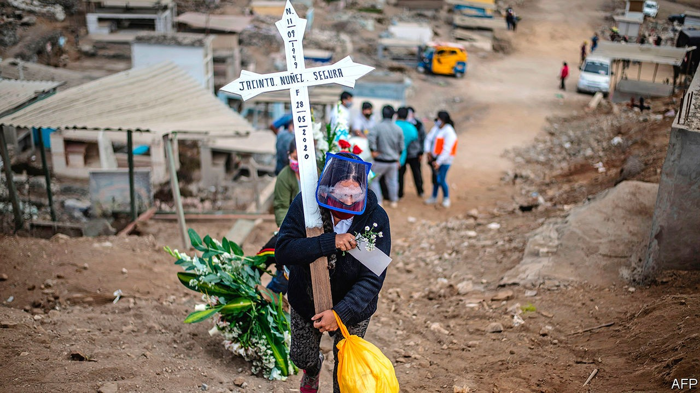

## Patient, don’t heal thyself

# Self-medication increases pandemic deaths in Peru

> The gullible gobble steroids and anticoagulants

> Oct 3rd 2020LIMA

LUIS ESPINOZA has been battling covid-19 in Peru since March. A doctor specialising in tropical medicine and infectious diseases, he was sent by the health ministry to Iquitos, in the northern jungle, when the pandemic began, then moved to Sullana, a sweltering northern city. Both cities have high numbers of deaths from covid-19. Many, says Dr Espinoza, were avoidable. “Patients who should not be dying are dying because of complications caused by self-medicating,” he says. That may help explain why Peru has had more deaths from the disease as a share of its population than all but one other country.

Self-medication is not a new problem. A third to a half of Peruvians use medicines that are not prescribed by a doctor, studies show. Against a variety of maladies they swallow antibiotics, steroids, anti-clotting medicines and the veterinarian version of ivermectin, which is used against parasites such as intestinal worms. Chlorine dioxide, a disinfectant, is also popular.

More than half of Peruvians think ivermectin and chlorine dioxide are possible remedies for covid-19, according to a poll by the Peruvian Studies Institute, a think-tank. In Sullana patients take steroids, which suppress the immune system, wear a mask, “and think they are totally protected”, says Dr Espinoza. “When I see them it is usually too late.” In Iquitos at least half the 700 who died in the hospital where he worked could have been saved, had they not taken steroids and ivermectin.

Early in the pandemic many Peruvians, having heard that the coronavirus causes blood clots, gobbled anticoagulants. Some bled to death, says Percy Mayta-Tristán, editor of Acta Medica, a magazine published by the Peruvian medical association. Some politicians push chlorine dioxide as a cure. Union for Peru, a populist left-wing party, called for the formation of a committee to study its effects.

Peru has laws to prevent misuse of medicines, but they are hard to enforce. Carol Avalos, a clerk at a pharmacy in Lima, the capital, says customers object to being told they need prescriptions. The pandemic has made them more aggressive, she says. Some pharmacists are reluctant to argue. Alberto Tutaya, a paediatrician who worked on a government plan to curb self-medication, says it is a response to a shortage of clinics and doctors. Peru has just 13 doctors per 10,000 people, among the lowest rates in South America. “Self-medication shows the limits of our health system,” he says. “The desperation caused by the virus has only made it worse.”■

## URL

https://www.economist.com/the-americas/2020/10/03/self-medication-increases-pandemic-deaths-in-peru
