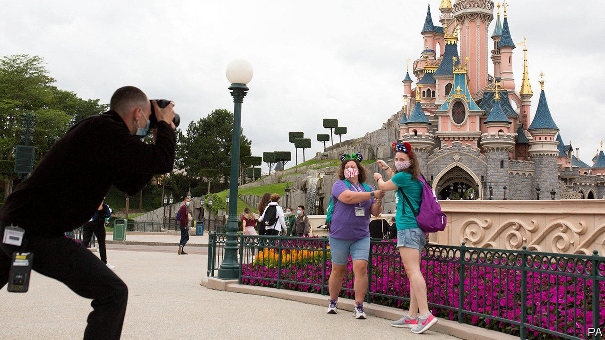
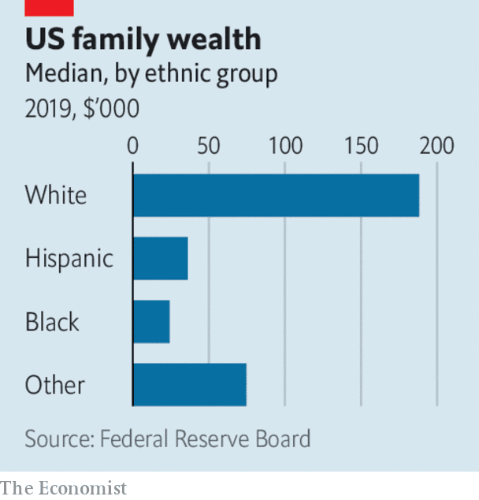

# Business this week

> Oct 3rd 2020

Disney decided to lay off 28,000 workers at its theme parks. Last year the parks accounted for more than a third of Disney’s profit, income that vanished when they were ordered to close during the pandemic. Those that have reopened have seen visitor numbers plummet because of social distancing. Disney’s parks in California remain shut, which one executive said had “exacerbated” the situation. Most of the jobs being shed are part-time.

Shell said it would cut 9,000 jobs, more pain for an oil industry beset by falling demand and low prices.  bp’s share price dropped to a 25-year low, evidence that it is finding it hard to convince investors that its ambitious switch to low-carbon energy will be profitable.

LVMH filed a lawsuit arguing that it was walking away from the deal it struck last November to take over Tiffany because the American jeweller’s performance has been disastrous during the pandemic and its prospects are poor. Tiffany wants the French luxury-goods company to complete the $17bn agreement. See article.

A judge granted TikTok a reprieve from a ban by the American government, hours before it was due to be imposed. Donald Trump had ordered a halt to downloads of the Chinese-owned video-sharing app. But the judge found that the act from the 1970s on which the president based his order does not cover “informational materials”, including film, photographs or artwork. TikTok argued that 100m Americans use its platform to share those very materials. 

Democrats in America’s House of Representatives unveiled a revised pandemic stimulus package with a lower price tag of $2.2trn, around $1trn less than the bill they presented in May that Republicans deemed too costly. Most of the savings in the new bill come from reductions in aid to state and local governments.

Despite the gains of past decades, the median wealth of black families in America was still some 85% below that of white families last year, according to the Federal Reserve’s Survey of Consumer Finances. Conducted every three years, the survey listed the factors, such as intergenerational transfers and homeownership, that explain the gap. The median wealth of black households has risen by 33% in real terms since 2016 (and by 65% for Hispanic ones), compared with 3% for white families. But that cannot make up for the loss of wealth during the recession a decade ago, which hit blacks and Hispanics the hardest.

Palantir Technologies, a secretive software provider founded in the aftermath of the 9/11 terrorist attacks of 2001, floated its shares in New York. A highly complex shareholder structure means its three founders—Peter Thiel, Alex Karp and Stephen Cohen—will retain control.

American authorities slapped JPMorgan Chase with a $920m fine for placing hundreds of thousands of spoof orders in precious metals and other contracts on three exchanges. Spoofing is the illegal practice of placing and cancelling orders rapidly in order to fool markets about the demand for an asset. The fine is the largest ever for such a tactic. See [article](https://www.economist.com//node/21792381).

NTT, Japan’s legacy telecoms company, announced a deal to buy the remaining shares it does not own in NTT DoCoMo, the country’s biggest mobile operator, for ¥4.3trn ($41bn). The company dismissed reports that the takeover is linked to pressure from the new prime minister, Suga Yoshihide, to lower phone charges, but said there “will be room to cut the fees”.

The Tokyo stock exchange suspended trading for at least a day because of a glitch in its system for communicating market information. It was the worst disruption the Japanese bourse has experienced since going fully electronic in 1999.

Ramping up its ambition to overtake Tesla as the world’s premier maker of electric cars, Volkswagen said it was investing €15bn ($17bn) on “e-mobility” in China with its three Chinese joint-ventures.

Caesars Entertainment, which owns casinos and hotels in Las Vegas, took a bet on expanding its sports-gambling ventures when it agreed to buy William Hill for £2.9bn ($3.7bn). Listed in London, William Hill’s business has grown rapidly in America as states loosened some restrictions on gambling; its British and other European operations are to be sold off by Caesars.

Uber can continue operating in London, after a judge upheld its appeal against the suspension of its licence last year by the city’s transport authority, the latest battle in a long-running saga between the ride-hailing giant and the regulator. The new licence is valid for 18 months. London is a very different place since the outbreak of covid-19 and its famous black cabs have struggled because of absent customers. Uber drivers may be roaming the streets of the capital, but their passengers are not.

## URL

https://www.economist.com/the-world-this-week/2020/10/03/business-this-week
