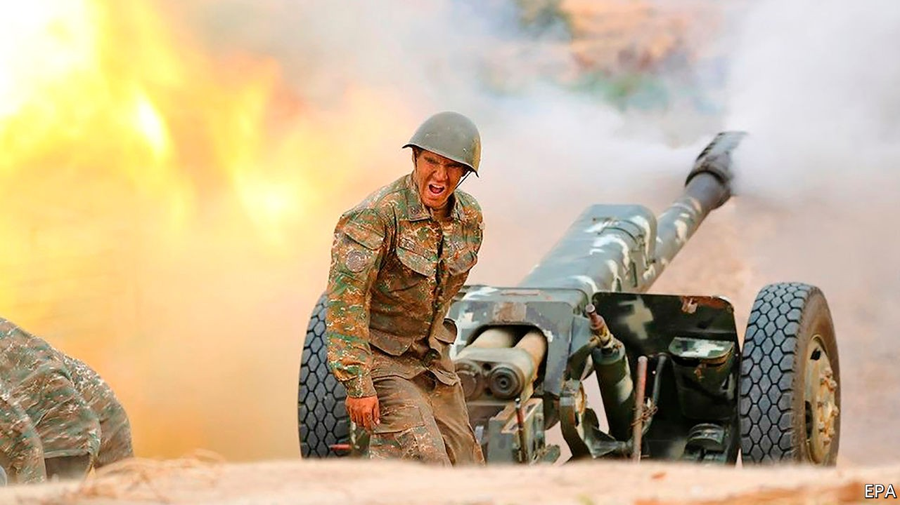
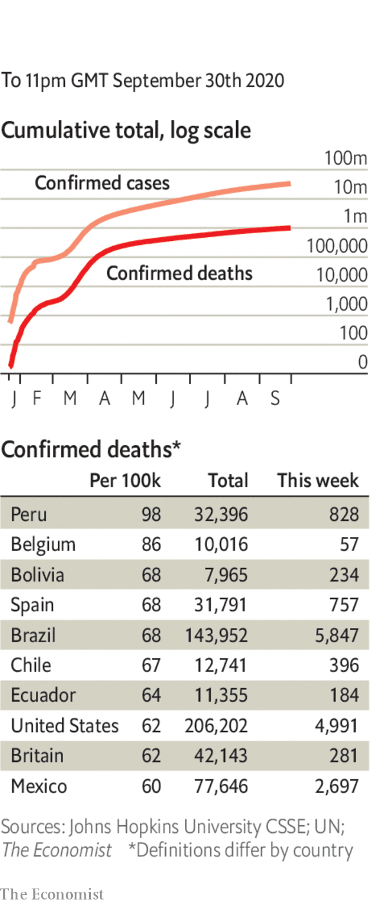

# Politics this week

> Oct 3rd 2020

Fighting erupted in and around Nagorno-Karabakh, a disputed enclave inside Azerbaijan, mostly populated by ethnic Armenians and backed by Armenia. More than 100 people, mostly soldiers, are thought to have been killed. Turkey’s president, Recep Tayyip Erdogan, Azerbaijan’s main supporter, urged his fellow Muslims to wrest back control of the area, whose inhabitants are largely Christian. The fighting was the worst since a ceasefire in 1994. The two countries, which were both subjugated by the Red Army in the 1920s, fought each other after the Soviet Union collapsed. See [article](https://www.economist.com//node/21792362).

On a trip to Lithuania France’s president, Emmanuel Macron, visited an exiled opposition leader, Svetlana Tikhanovskaya, who many people believe won the recent presidential election in Belarus. Alexander Lukashenko, the Belarusian dictator who rigged the vote, seems determined to stay in power despite huge protests at home and gestures like Mr Macron’s.

El Salvador’s president, Nayib Bukele, announced an inquiry into whether El Faro, a digital newspaper, had engaged in money-laundering. El Faro recently reported that Mr Bukele’s government secretly asked imprisoned leaders of MS-13, a big criminal gang, to reduce violence in exchange for privileges.

Protests broke out across Venezuela against power cuts and shortages of fuel and water. Among the demonstrators were teachers demanding higher pay and patients wanting better conditions in hospitals. Security forces fired rubber bullets and tear gas.

West Africa’s regional bloc, ECOWAS, said sanctions will remain in place against Mali until the leaders of a coup hand power to a civilian administration. The appointment as president of Bah Ndaw, a retired colonel, does not satisfy this demand, it said.

Doctors and others working for the World Health Organisation and aid agencies fighting an Ebola outbreak in Congo were accused of sexually exploiting local women. Allegations include rape and demanding sex from job applicants.

A French court agreed to extradite Félicien Kabuga, a Rwandan businessman, to face trial in Tanzania on charges that he financed militias that carried out the genocide in Rwanda in 1994.

Lebanon’s prime minister-designate, Mustapha Adib, failed to form a government. He had reportedly met resistance from Shia parties who want to control the finance ministry. 

The emir of Kuwait, Sheikh Sabah al-Sabah, died after a long illness. He was 91. His 83-year-old half-brother, Nawaf al-Sabah, has been named as his successor. See [article](https://www.economist.com//node/21792380).

Israel’s parliament gave the government the power to ban mass protests, one of a range of measures aimed at curbing the spread of covid-19. Critics accused the prime minister, Binyamin Netanyahu, of trying to silence critics who have called on him to resign over his handling of the pandemic and alleged corruption.

The Australian Strategic Policy Institute, a think-tank, said it had identified 380 suspected detention centres for ethnic Uighurs in China’s Xinjiangregion,about 40% more than previous estimates. It found that building work had been taking place in dozens of them over the past two years, despite official claims that all internees had “graduated” by 2019.

Amnesty International, a human-rights watchdog, shut its offices in India, complaining that the government had made its work impossible by closing its bank accounts, among other things.

Police in Pakistan arrested Shehbaz Sharif, the titular leader of the main opposition party and brother of its actual leader, Nawaz Sharif, who is in exile in London. A court had revoked Mr Sharif’s bail on corruption charges. A former president, Asif Zardari, was indicted for corruption in a separate case. The two politicians say the charges are politically motivated.

North Korea unexpectedly apologised for the killing of a South Korean fisheries official intercepted at sea by a North Korean patrol. The victim was shot and his body burned, in an apparent effort to prevent the spread of covid-19. Kim Jong Un, the North’s dictator, said he was “deeply sorry”.

Amy Coney Barrett, Donald Trump’s pick to fill the vacancy on the Supreme Court left by the death of Ruth Bader Ginsburg, met Republican leaders in the Senate, who hope to confirm her in the job before the election. A devout Catholic, Ms Barrett has said that abortion is immoral, but also that Catholic judges should not try to align the legal system with their faith. See [article](https://www.economist.com//united-states/2020/10/03/would-the-supreme-court-hand-donald-trump-a-second-term).

“He’s a liar.” “You’re the liar.” “Will you shut up, man.” Joe Biden and Donald Trump sparred in the first presidential debate. The atmosphere was unedifying. The rules may be changed for the two remaining debates, to make it harder for candidates to interrupt each other. See [article](https://www.economist.com//node/21792394).

The number of people worldwide who have died from covid-19 officially passed 1m. The true figure is much higher.

The WHO announced a plan to provide 120m testing kits to poorer countries. The kits cost $5 and can provide a result in 15-30 minutes.

Russia reported its most daily infections since June.

Kenya’s national curfew will last another two months, though it won’t start now until 11pm. Bars can start reopening, but schools remain closed.

Authorities in Brussels announced a ban on prostitution to limit the spread of covid-19.

Hopes that the world’s longest- running play, “The Mousetrap”, could reopen soon were dashed. Agatha Christie’s classic whodunnit had run continuously in London’s West End since 1952, until covid-19 closed theatres in March.

## URL

https://www.economist.com/the-world-this-week/2020/10/03/politics-this-week
