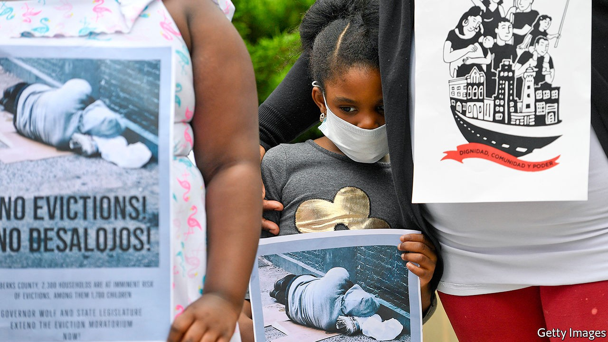
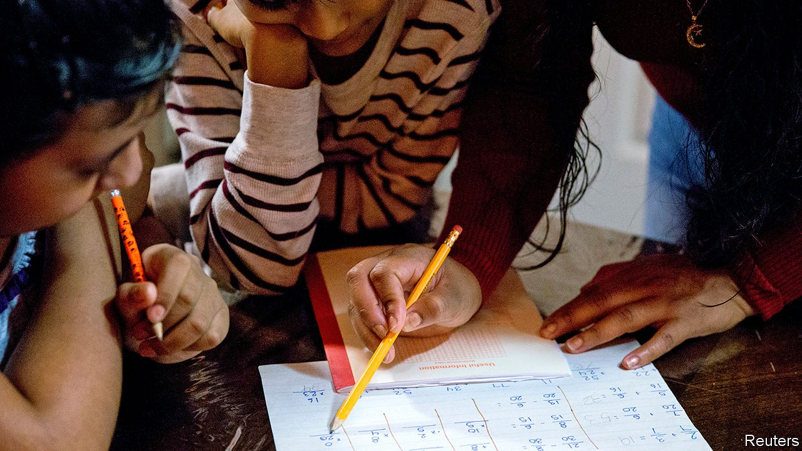

## The other half

# Measuring poverty in the midst of America’s covid-19 epidemic

> After a temporary reprieve, poverty and hardship are increasing

> Oct 3rd 2020WASHINGTON, DC

AT FIRST, A remarkable thing happened in the midst of an epidemic and the lockdown-induced recession. Poverty declined in America. A gargantuan stimulus package, which sent most households one-off cheques worth $1,200 or more and topped up unemployment benefits by $600 a week, buoyed millions of families above the official poverty line (set at $21,720 for a family of three). Ariel Kalil, a developmental psychologist at the University of Chicago, was conducting a long-running study on parental behaviour among poor parents (mostly single mothers) of young children in the city before the pandemic struck. Surveying these parents again when families were somewhat protected from the economic shock, she found parents and children getting along better despite the added stress from job losses.

Those supports expired in July, even as the pandemic persisted. And the reprieve proved transient. By August, poverty levels had nearly returned to their pre-pandemic levels. Other measures of hardship—like difficulties in affording food and housing—are at eye-popping levels, especially for less-educated workers and non-Asian minorities. The consequences for poor children might become apparent years from now in the form of reduced education, earnings and opportunity. With schooling, a theoretically equalising force, still disrupted and no vaccine yet, how can the extent of the damage be assessed?

Poverty measurement is usually a staid and slow affair. The Census Bureau issues an official number once a year. Using data from the monthly unemployment survey, however, economists have recently developed a procedure for generating timelier estimates to give real-time feedback. “We can explain the entire decline in poverty from April to June by the stimulus package,” says Bruce Meyer of the University of Chicago. His recent work, published with James X. Sullivan of the University of Notre Dame and Jeehoon Han of Zhejiang University, shows a nearly 15% drop in the poverty rate that then reversed after the stimulus lapsed (see chart). As before the pandemic struck, these rates are higher for African-Americans, workers without college degrees and children.

The Census Bureau has a new, more frequent survey which is designed to measure food insecurity, housing instability and other forms of distress. Among households with children, 14.4% reported not having enough to eat sometimes or often in the preceding seven days. For black and Hispanic households, this share rises to above 22%. Among those making less than $25,000 a year (and probably counting as officially poor), 35% report difficulty meeting this most basic need. These figures are high despite increased private and public attempts at relief. Food banks have reported operating at double capacity, and sometimes more. To compensate for children no longer receiving subsidised lunches at school, the federal government launched a programme to top up the nutrition-assistance benefits (“food stamps”, colloquially) for affected families. Though this amounted to just $5.70 per day of school missed, a recent analysis of that policy, published by the Hamilton Project, found that it reduced food hardship among children by 30%.

When food is difficult to afford, so is housing. Among renting families, 28% have little or no confidence in being able to pay next month’s rent (and some have already deferred it). Among Hispanic households who are renting, the share is 40%. This need not result in soaring homelessness. Citing the risk to public health of forced relocation during the pandemic, the Centres for Disease Control and Prevention (CDC) has announced a nationwide moratorium on eviction. Many states and cities have issued their own moratoria as well. But these are temporary salves. Under the CDC scheme, rent missed is not forgiven.

The picture from official government surveys matches that in self-reported ones. More than 40% of black, Latino and Native- American households said they had exhausted most or all of their savings (compared with 25% of whites) in a poll released by the Robert Wood Johnson Foundation. Robert Blendon of Harvard, who helped conduct the survey, likened the results to others he has conducted in the immediate aftermath of natural disasters like hurricanes. “I’m worried that there’s this false sense as the stockmarket does incredibly well that people’s lives are doing well,” says Richard Besser, the president of the foundation and former director of the CDC. “I’m worried coming into colder weather that there are so many people in America who have trouble paying for their utilities and putting food on the table.”

Indeed, all this is happening even as the stockmarket, President Donald Trump’s preferred economic barometer, has nearly recovered its yearly losses. The impact of the pandemic on economic growth overall is now expected to be more modest than once feared. These averages are encouraging, but a narrow focus on them ignores the serious problems for those at the bottom of the income distribution. “If we know anything about recessions, it’s that workers with low levels of education take a while to recover. And with kids out of school too, we can be sure that it will be bad for them too,” says Diane Schanzenbach, an economist at Northwestern University whose work has shown that government-nutrition programmes for children lead to better health and job-market opportunities later in life.

What chance is there of the federal government coming to the rescue? Talks between the House and the Treasury Secretary continue, but Congress is even less likely to put through a compromise package now that a Supreme Court battle looms. Even the programme to give boosted food stamps for children missing school came close to being scuppered during negotiations to fund the federal government.

States, cities and school districts are trying to cushion the blow. And charities are doing much more. Robin Hood, a large charity in New York City, has distributed $50m in relief since the city was hammered by the virus in March. Of that, $20m went to direct cash assistance for the most vulnerable—such as families whose breadwinner had died and undocumented immigrants, who don’t quality for aid. The City University of New York had 50,000 or more students who lost their jobs “overnight”, says Deb McCoy, who runs early childhood and youth programmes for Robin Hood. As extensive as these efforts are, they are little substitute for the fiscal firehose of the federal government. But those spigots are likely to stay closed for a few months more.■

## URL

https://www.economist.com/united-states/2020/10/03/measuring-poverty-in-the-midst-of-americas-covid-19-epidemic
