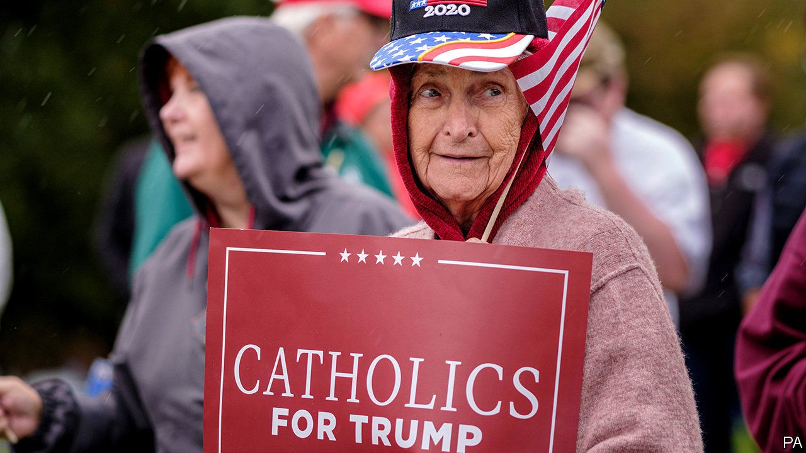

## Render unto Donald

# Priestly guidance on voting is dividing the Catholic church in America

> In theory priests shouldn’t tell their flock how to vote. In practice they often do

> Oct 3rd 2020

CAN A CATHOLIC vote for Joe Biden and avoid damnation? Bishop Joseph Strickland of Tyler, a diocese covering 33 counties in east Texas, doesn’t think so. Last month he endorsed a video made by a priest in Lacrosse, Wisconsin, which urged Catholic Democrats to “repent of your support of that party...or face the fires of hell”. In a tweet, Bishop Strickland thanked the priest for his courage and urged his followers to “HEED THIS MESSAGE”.

America’s political polarisation is reflected in the leadership of the Catholic church, which constitutes the country’s biggest single religious voting group. But the nomination of a Catholic as the Democratic candidate has accelerated the process. Although the church says clergy should not tell the faithful how they should or should not vote—such activity also imperils churches’ exemption from certain taxes—several prominent priests have castigated Mr Biden, claiming his pro-choice position on abortion means he is no Catholic. When Mr Biden announced his running mate, Kamala Harris, Thomas Tobin, the bishop of Providence tweeted: “First time in a while that the Democratic ticket hasn’t had a Catholic on it. Sad.”

In so doing they echo President Donald Trump’s efforts to play down his rival’s faith. The president has described Mr Biden, a practising Catholic, as following “the radical-left agenda…no religion, no anything, hurt the Bible, hurt God”. Some clerics have endorsed Mr Biden and rebuked Mr Trump, though they have been slapped down. When a priest in the archdiocese of Boston said he backed the former vice-president, explaining that although he was pro-life he believed women had the right to choose (a position he believed Mr Biden held too), he was forced to apologise.

It is not surprising that the church in America has become infected by partisan politicking. But the US Conference of Catholic Bishops (USCCB) has played a role in this. In 2009 many of the bishops signed the Manhattan Declaration, an agreement between socially conservative Catholics and Protestants that they would work together for traditional family values, that is, against gay marriage and abortion. Only the latter remains a live issue, but the bishops’ insistence that it is more important than any other has meant that tacit approval for Republican candidates—especially Mr Trump, who has embraced the pro-life cause—has become increasingly explicit.

That has led to rows. Though the church teaches that abortion is unequivocally wrong, it does not elevate it above other issues. It also has a strong tradition of emphasising issues of social justice. In a recent article in America magazine, a Catholic weekly, John Carr, a former adviser to the bishops, described how a small group of relatively progressive bishops argued against the USCCB’s plan to add a phrase to its voter-guidance document describing abortion as the “pre-eminent priority”. They also wanted it to include a paragraph by Pope Francis, explaining that “the lives of the poor, those already born, the destitute, the abandoned” were “equally sacred” as those of the “innocent unborn”. The bishops dismissed both proposals.

The partisanship this policy has encouraged among conservative priests increasingly extends to issues beyond abortion. A recent weekly newsletter at a church in Damascus, Maryland, rued the spate of Black Lives Matter protests without mentioning the cause of them.

How might all this affect the election? There is no homogenous Catholic vote: the church’s members vote along a jumble of social and demographic lines. Yet they will play a decisive role in the election. White Catholics are disproportionately represented in many battleground states, especially in the Midwest. Some 21% of the population is Catholic; in Wisconsin, which Mr Trump won by around 20,000 votes, that rises to 25%. In 2016 white Catholics voted for Mr Trump, though by a much smaller margin than white evangelicals did. Recent polls suggest Mr Biden may be stealing some of that support.

That is why Cardinal Timothy Dolan, the archbishop of New York, who has described Mr Trump as “a great friend of mine”, was invited to say the opening prayer at the Republican convention in August. The Democrats, meanwhile, showcased liberal Catholics: their convention featured a closing prayer by Father James Martin, who lobbies to make the church more welcoming to LGBT people (his appearance at the convention earned him a particular mention in the hell video). He was not a perfect fit: having prayed for the unemployed, poverty-stricken and desperate, he added “the unborn child in the womb”.■

Dig deeper:Read the [best of our 2020 campaign coverage](https://www.economist.com//us-election-2020) and explore our [election forecasts](https://www.economist.com/https://projects.economist.com/us-2020-forecast/president), then sign up for Checks and Balance, our [weekly newsletter](https://www.economist.com//checksandbalance/) and [podcast](https://www.economist.com/https://play.acast.com/podcasts/2020/01/24/checks-and-balance-our-new-weekly-podcast-on-american-politics) on American politics.

## URL

https://www.economist.com/united-states/2020/10/03/priestly-guidance-on-voting-is-dividing-the-catholic-church-in-america
