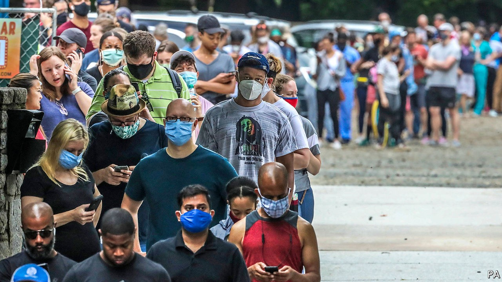

## Rashomon, with ballots

# Why do voters in Georgia face so many hurdles to voting?

> Republicans see hiccups, Democrats see racism

> Oct 3rd 2020ATLANTA

PARK TAVERN anchors the south-east corner of Atlanta’s charming Piedmont Park. It offers eclectic bar food, home-brewed beer, abundant outdoor seating, and a warm welcome to dogs. Like most bars, it usually comes to life in late afternoon. But on June 9th this year the queue stretched out of the door and round the building before 7am, and did not thin out until well after the dinner rush ended.

Atlantans were lined up not for Cowboy Rolls or (shudder) Unity Triple-Goddess Ginger Kombucha Beer. They were lined up to vote. No polling place served more Georgians in the June primary than Park Tavern, though the experience of waiting hours to cast a ballot was sadly common across the state. Whether this experience is repeated in November could matter a great deal.

In Georgia the secretary of state’s office certifies candidate eligibility, oversees voter registration and creates ballots, but leaves electoral administration to the state’s 159 counties—more than any state except Texas. The state maintains voter rolls, which many complain it does too rigidly, rejecting registrations, for instance, because, in the judgment of an election official, an applicant’s signature fails to precisely match a signature already on file. But counties choose and staff polling places, set electoral budgets and tabulate results.

Georgia was one of just nine states wholly subject to the “pre-clearance” requirement of the Voting Rights Act of 1965—meaning it had to seek federal approval for any changes to its voting practices—imposed on jurisdictions with a history of racially discriminatory voting practices. Since the Supreme Court invalidated that requirement in a ruling in 2013, Georgia’s counties have closed hundreds of polling places; between 2012 and 2018, only Texas and Arizona closed more.

According to data-crunching by Georgia Public Broadcasting News, more than 10% of Georgia’s polling places in the June 9th primary had to remain open past official closing time to accommodate voters (anyone in line when polls officially close can still vote). Two-thirds of them were in majority-minority precincts. Many black Georgians have grown accustomed to waiting hours to vote. Wanda Mosley, Georgia’s senior coordinator for Black Voters Matter, visited a precinct in a wealthy suburb north of Atlanta on June 9th. “When we pulled up,” she explained, “I thought we were in the wrong place. There were no lines. That’s not something I’m used to seeing.”

Georgia’s secretary of state’s office has a benign explanation for this. First, the primary took place during a pandemic; voters in other states also faced long waits because of higher-than-expected turnout, poll-worker shortages and a reduction in voting machines to maintain social distancing. For November’s election, Georgia has recruited more poll workers. Many of its counties have added polling places and will have trained technicians on hand to help with voting-machine problems. Second, in June’s primary, all Georgia’s counties used new voting machines for the first time. Some poll workers had problems operating them, which led to delays.

All this may be true. But many Georgians—particularly Democrats—view them sceptically. They remember, for instance, 2018, when the then secretary of state, Brian Kemp, defeated Stacey Abrams in an election plagued by irregularity that he oversaw. They may also remember Mr Kemp’s devotion to a regulation that rejected voter-registration applications because of discrepancies between names. A professor named Carlos del Rio, for instance, was erroneously registered as “delRio,” and, according to a lawsuit filed by Ms Abrams’s group Fair Fight, had to “navigate a lengthy process” to be able to vote. This exact-match system tends not to affect voters with names like Brian Kemp.

Perhaps the closures were a budgetary matter, and measures such as exact signature-matching are needed to prevent voter fraud. That is what Georgia’s Republicans would like their voters to believe. Perhaps the governor’s race was stolen, and Georgia’s electoral system is tainted by systemic racism. That is what Democrats would like their voters to believe. The state’s two Senate races (one is a special election) are on a knife’s edge: a lot hangs on which story motivates more voters.■

Dig deeper:Read the [best of our 2020 campaign coverage](https://www.economist.com//us-election-2020) and explore our [election forecasts](https://www.economist.com/https://projects.economist.com/us-2020-forecast/president), then sign up for Checks and Balance, our [weekly newsletter](https://www.economist.com//checksandbalance/) and [podcast](https://www.economist.com/https://play.acast.com/podcasts/2020/01/24/checks-and-balance-our-new-weekly-podcast-on-american-politics) on American politics.

## URL

https://www.economist.com/united-states/2020/10/03/why-do-voters-in-georgia-face-so-many-hurdles-to-voting
