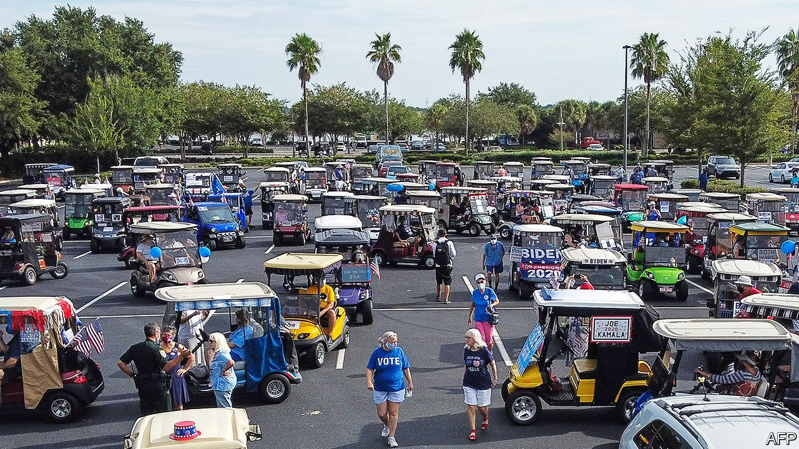

## Key largo

# Why Donald Trump is doing surprisingly well in Florida

> The president probably cannot win without his adopted home state

> Oct 3rd 2020LAKE MARY AND WILDWOOD

ON A SWELTERING Saturday afternoon, Joe Gruters and Linda Trocine, Republican party chairmen respectively for Florida and for Seminole County, were hunting for votes the old-fashioned way: by knocking on doors. Armed with an app that aggregates masses of voter and consumer data, they were targeting NPAs (no party affiliation) and persuadable Democrats in Lake Mary, a northern suburb of Orlando, and they were hitting their targets. A rangy, sandy-haired NPA with a deep smoker’s voice handed the flyers back: “Don’t waste ‘em on me. I’m voting Republican straight down the ticket.” A Latino NPA mowing his lawn enthused about President Donald Trump, as did a 50-ish Democrat watching a college football game in his garage. “We’re out there pounding the pavement every day,” says Mr Gruters. “We’ve knocked on more than 1.7m doors...while Joe Biden and his team are basically trying to win this campaign from their basements.”

That is not entirely true. Mr Biden visited central Florida on September 15th, and at weekends his Hispanic supporters have been organising raucous parades of cars decked out in Biden flags in south Florida. But his campaign relies on contacting voters virtually rather than in-person, reasoning that during an epidemic people would rather be called or texted than visited. That may change as election day approaches. Mr Biden has increased his spending in-state, and some of the $100m that Michael Bloomberg, entrepreneur, former mayor of New York and briefly a candidate in the Democratic presidential primary, plans to spend in Florida on Mr Biden’s behalf will go towards the ground game.

Only two states, California and Texas, offer more electoral votes and, unlike them, Florida swings. Barack Obama and George W. Bush each won it twice; Mr Trump beat Hillary Clinton by less than two points in 2016. Just once in the past 12 presidential elections (1992) has Florida voted for the loser. Should Mr Trump win his adopted home state, our model reckons he would be about 50:50 to win in the electoral college. Should he lose Florida, he has almost no chance. The state will probably announce its results on election night, so a win for Mr Biden would make Mr Trump’s inevitable doubt-casting about the results that much hollower. Polls show a tight race—much closer than the overall national picture. Between now and November 3rd, Floridians should prepare themselves for an onslaught of ads, attention and hand-wringing from the two campaigns.

Two groups hold the keys to Florida’s fortunes: Latinos and the elderly. Mr Trump is overperforming with the first group and underperforming with the second. A recent Univision poll showed Mr Biden winning 52% and Mr Trump 36% of Latino voters in Florida (other polls show narrower leads). By comparison, the poll showed Mr Biden winning 65% of Latino voters in Arizona and 66% in Texas.

That partly reflects the difference between Florida’s sizeable Latino population—comprising one in four Floridians—and Latinos in other states. Roughly one-third of Florida’s Hispanics are Cuban, a group that traditionally votes Republican. It also has sizeable Venezuelan, Colombian and Nicaraguan communities—all groups more favourable to Republicans than Mexican-Americans, who tend to vote more reliably for Democratic candidates.

But Hillary Clinton won 62% of Florida’s Latino vote in 2016, and Mr Obama took 60% in 2012. Republicans, taking a page from Mr Obama’s playbook, have invested time and money in Latino-voter outreach. That was partly why, in 2018, Rick Scott and Ron DeSantis, both Republicans, won their Senate and governor’s races, fending off the Democratic wave that crested across the rest of America that year. Mr Trump is doing the same. Fernand Amandi, a pollster who heads a Miami-based market research firm, says that the president has been in “permanent campaign mode” in Florida since 2016, whereas “the Democratic strategy has been we’re going to parachute in and see if we can win late”.

Many Democrats worry that when Mr Trump labels them as socialists that may particularly deter Cuban-, Venezuelan- and Colombian-Americans, many of whom have experienced socialism first-hand. Carlos Odio, who worked in Mr Obama’s White House before co-founding Equis Labs, a political consultancy, notes that Mr Trump, like Mr Scott, uses “targeted appeals to peel off votes” from various Latino constituencies. He is unlikely to win the Latino vote in Florida, but those messages could help hold down his losses, increasing pressure on Mr Biden elsewhere.

To counter that weakness, Mr Biden can look at least partly toward grey-haired Floridians. A recent AARP poll shows Mr Trump narrowly leading Mr Biden, 50%-47%, among all voters over 50, but Mr Biden leading 49%-48% among voters over 65, who comprise 21% of Florida’s population, and a higher share of the state’s electorate. No Democrat has won their support since Al Gore convinced them that George W. Bush was coming for their Social Security in 2000. Mr Biden is unlikely to do so this year, either in Florida or nationally. But he may limit his losses enough to balance a poor performance with Latinos.

On Saturdays Chris Stanley, who heads the Democratic Club in The Villages, a retirement community in central Florida, waves Biden signs with other club members along the main drag in nearby Wildwood. She cites Mr Trump’s “mishandling of the covid crisis” as the reason “we have a constant stream of Republicans coming in and saying, ‘I’m a Republican, and I’m going to stay a Republican, but what can I do to help you get rid of that guy?’ ”

Mr Trump may also do worse than last time among white Floridians. In 2016 Hillary Clinton won a paltry 32% of them, while a recent poll shows Mr Biden on 38%. Such shifting allegiances make Florida in 2020 more complex than the traditional political picture, in which Democrats try to run up their numbers in diverse south Florida to offset losses in the whiter north, Republicans do the opposite, and both sides brawl over the I-4 corridor, which runs through Tampa and Orlando.

Florida is protean, shaped by waves of immigration from inside and outside America. Conservative midwestern pensioners who would otherwise have gone to Arizona have moved to places such as The Villages. An influx of Puerto Ricans into Orlando and Kissimmee has pushed central Florida farther left than it was, and Mr Trump’s weakness with suburban voters means the street-by-street brawl has moved to the exurbs. Republican efforts have made the south less of a vote-bank for Democrats. In 2018, Andrew Gillum, the Democratic candidate for governor, won usually Republican Duval County, up north, but failed to carry the state.

Florida’s demography—larger than average shares of African-Americans and Latinos—would seem to favour Democrats. Yet too often that has been a curse in disguise, leading Democrats to assume votes rather than hustle for them. Republicans are taking no such chances. Says Mr Gruters, “I was the Trump co-chairman in 2016 for the state, and at the very peak we had 62 staffers. We have 190 on the ground right now...Usually we have multiple events going on across the state on a daily basis.” Republicans are fighting for Florida as though Mr Trump’s presidency depends on it—which it probably does. He will be hard to beat on his home ground.■

Dig deeper:Read the [best of our 2020 campaign coverage](https://www.economist.com//us-election-2020) and explore our [election forecasts](https://www.economist.com/https://projects.economist.com/us-2020-forecast/president), then sign up for Checks and Balance, our [weekly newsletter](https://www.economist.com//checksandbalance/) and [podcast](https://www.economist.com/https://play.acast.com/podcasts/2020/01/24/checks-and-balance-our-new-weekly-podcast-on-american-politics) on American politics.

## URL

https://www.economist.com/united-states/2020/10/03/why-donald-trump-is-doing-surprisingly-well-in-florida
