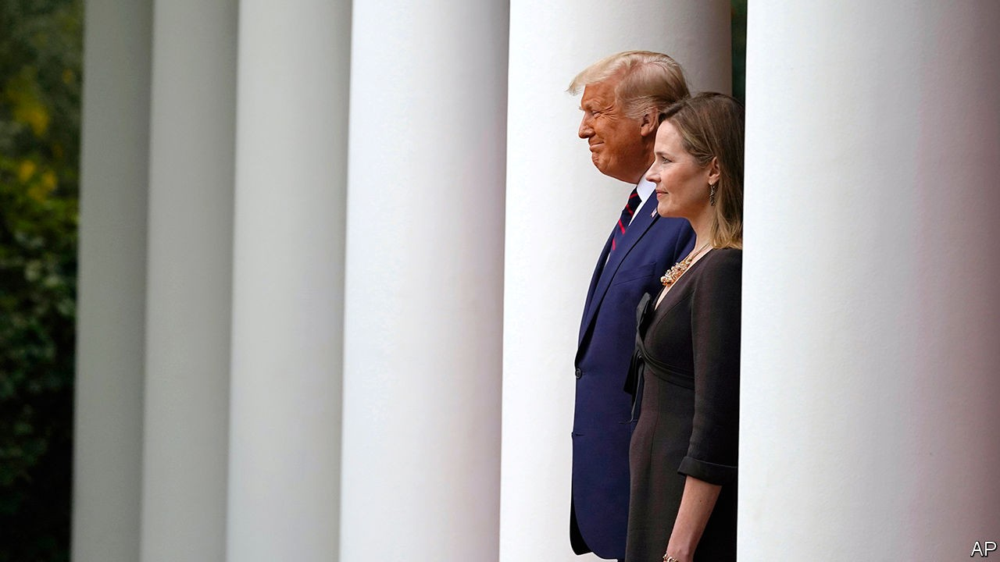

## Courting votes

# Would the Supreme Court hand Donald Trump a second term?

> His wish may not be the justices’ command

> Oct 3rd 2020NEW YORK

“I THINK [the election] will end up in the Supreme Court”, Donald Trump said on September 23rd, a forecast he reiterated during his debate with Joe Biden on September 29th. It is “very important that we have nine justices” in place before the election, Mr Trump said, and he is “counting” on them to “look at the ballots”. With his deficit in the polls stuck at about eight points nationally, Mr Trump has baselessly impugned the integrity of mail-in voting and refused to commit himself to a peaceful transfer of power if he loses. He expects America’s high court to come to his rescue should he fail to win a clear victory on November 3rd. But the president may find peril in what he believes to be a safe harbour—even if his choice to succeed Ruth Bader Ginsburg, Judge Amy Coney Barrett, dons her robes in time.

There are a few reasons to doubt that a Supreme Court populated with three of Mr Trump’s appointees would be a lock to usher him into the White House for four more years. One is that Bush v Gore, the Supreme Court ruling that in effect gave George W. Bush the nod over Al Gore 36 days after the fraught 2000 election, may not be a good guide to 2020. The circumstances leading to that contest—the race coming down to a tight battle for Florida’s 25 electoral votes—are less likely to be repeated this year. The Economist’s model currently suggests Mr Biden would win 335 electoral votes, giving him a buffer.

Yet if Mr Trump appears to be losing on election day, or if he is winning before the expected deluge of postal ballots is counted—“we might not know for months” who wins, he lamented at the debate—the president seems determined to continue his campaign in court. In order to challenge “fraud like you’ve never seen”, Mr Trump is primed to line up lawyers to try to stop vote-counting in states where he holds provisional leads. It is a travesty, he suggested during the debate, that rules in states “run by Democrats” allow absentee ballots to be counted “seven days after the election”. Some battles will be fought in federal court; others in state court. And if he is dissatisfied with the results, he will try his hand at the Supreme Court he has reshaped since 2016.

But if his pleas get that far, Mr Trump may be hampered by justices whose first fidelity is to the law, not to him. A specific, credible charge of postal-ballot chicanery may get a hearing. But general shouting about too much counting or unfounded accusations of fraud—like his calls in 2018 to stop tallies in two key Florida races when they began to narrow—will be difficult to adapt into legal briefs. As steward of a court he aims to insulate from charges of politicisation, Chief Justice John Roberts will have no interest in handing Mr Trump a win on such weak grounds. Neither may any of his colleagues. Mr Trump’s first two appointees, Neil Gorsuch and Brett Kavanaugh, showed an independent streak in July when they largely sided with the New York district attorney in his quest to get access to years of Mr Trump’s financial records. Displaying objectivity will also be a priority for Mr Trump’s pending nominee. Ms Barrett would tarnish her reputation on the court if—especially so early in her tenure—she joined a party-line vote to abet the re-election of the president who appointed her weeks earlier. And she may yet decide to recuse herself from such cases.

If the Supreme Court is to give Mr Trump a leg-up, it is more likely to come in the weeks before the election. The Republican Party is fighting in a host of states to rein in postal voting by—among other tactics—insisting on witness and postage requirements, narrowing the window for posting and receiving ballots, removing ballot drop boxes and limiting curbside voting. The five Republican-appointed justices do not have a robust record of standing up for voting rights, or for blessing voting rules eased because of covid-19, to make it safer for voters to exercise the franchise. In April they blocked, by a 5-4 vote, a lower-court order that would have extended mail-in voting deadlines in the Wisconsin primary. They have handled related questions similarly in Alabama, though not in Rhode Island.

A pair of Republican challenges to counting un-postmarked absentee ballots in Pennsylvania three days after November 3rd arrived at the Supreme Court on September 28th. How the justices handle these applications may be a harbinger of their approach to the lawsuits Mr Trump’s team will continue to bring. But it is one thing to throw a wrench into judicially created voting accommodations, and quite another to dispute or halt vote counts after the fact. If he loses and the Supreme Court does not resuscitate his presidency, the question becomes whether Mr Trump accepts the result without further drama. At this week’s debate Mr Trump did not convey a reassuring message. “This”, he said, “is not going to end well.”■

Dig deeper:Read the [best of our 2020 campaign coverage](https://www.economist.com//us-election-2020) and explore our [election forecasts](https://www.economist.com/https://projects.economist.com/us-2020-forecast/president), then sign up for Checks and Balance, our [weekly newsletter](https://www.economist.com//checksandbalance/) and [podcast](https://www.economist.com/https://play.acast.com/podcasts/2020/01/24/checks-and-balance-our-new-weekly-podcast-on-american-politics) on American politics.

## URL

https://www.economist.com/united-states/2020/10/03/would-the-supreme-court-hand-donald-trump-a-second-term
