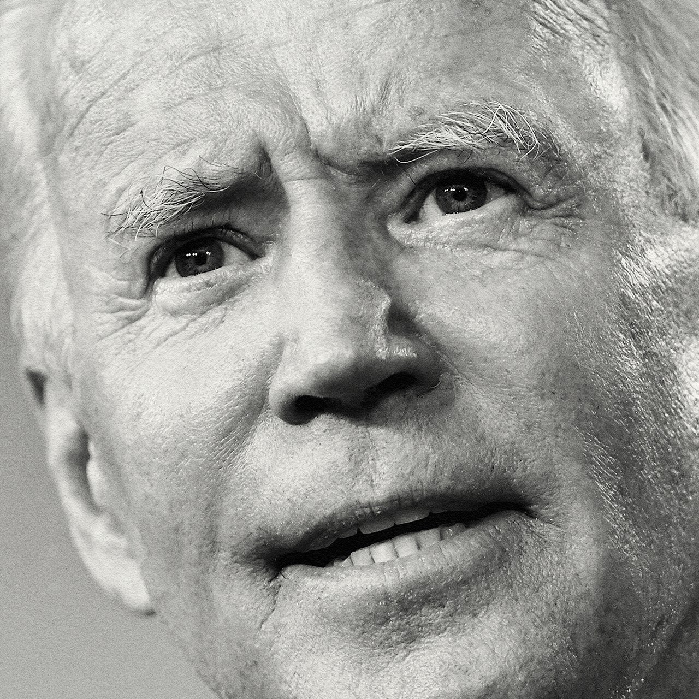

## Bidenomics: The good, the bad and the unknown

### The world this week
#### [Politics this week](./The%20world%20this%20week/politics-this-week.md)
#### [Business this week](./The%20world%20this%20week/business-this-week.md)
#### [Kals cartoon](./The%20world%20this%20week/kals-cartoon.md)
### Leaders
#### [Bidenomics the good the bad and the unknown](./Leaders/bidenomics-the-good-the-bad-and-the-unknown.md)
#### [Booming house prices spell more trouble for the social contract](./Leaders/booming-house-prices-spell-more-trouble-for-the-social-contract.md)
#### [Famine in yemen need not happen](./Leaders/famine-in-yemen-need-not-happen.md)
#### [Thirty years after reunification germany is shouldering more responsibility](./Leaders/thirty-years-after-reunification-germany-is-shouldering-more-responsibility.md)
#### [China is demolishing villages and forcing people into bigger ones](./Leaders/china-is-demolishing-villages-and-forcing-people-into-bigger-ones.md)
### Letters
#### [Letters to the editor](./Letters/letters-to-the-editor.md)
### Briefing
#### [Joe biden would not remake americas economy](./Briefing/joe-biden-would-not-remake-americas-economy.md)
### Asia
#### [Is pakistan really handling the pandemic better than india](./Asia/is-pakistan-really-handling-the-pandemic-better-than-india.md)
#### [Unable to export its natural gas uzbekistan tries using it itself](./Asia/unable-to-export-its-natural-gas-uzbekistan-tries-using-it-itself.md)
#### [A fairy tale election result beckons for new zealands prime minister](./Asia/a-fairy-tale-election-result-beckons-for-new-zealands-prime-minister.md)
#### [Myanmars government makes life difficult for western investors](./Asia/myanmars-government-makes-life-difficult-for-western-investors.md)
#### [Anwar ibrahim is in a familiar place close to leading malaysia](./Asia/anwar-ibrahim-is-in-a-familiar-place-close-to-leading-malaysia.md)
### China
#### [To put idle land to use chinese officials want to erase many villages](./China/to-put-idle-land-to-use-chinese-officials-want-to-erase-many-villages.md)
#### [A risky stimulant thrives in chinas capital of chewing](./China/a-risky-stimulant-thrives-in-chinas-capital-of-chewing.md)
#### [China is celebrating 70 years since it entered the korean war](./China/china-is-celebrating-70-years-since-it-entered-the-korean-war.md)
### United States
#### [Why donald trump is doing surprisingly well in florida](./United%20States/why-donald-trump-is-doing-surprisingly-well-in-florida.md)
#### [Would the supreme court hand donald trump a second term](./United%20States/would-the-supreme-court-hand-donald-trump-a-second-term.md)
#### [Why do voters in georgia face so many hurdles to voting](./United%20States/why-do-voters-in-georgia-face-so-many-hurdles-to-voting.md)
#### [Measuring poverty in the midst of americas covid 19 epidemic](./United%20States/measuring-poverty-in-the-midst-of-americas-covid-19-epidemic.md)
#### [Priestly guidance on voting is dividing the catholic church in america](./United%20States/priestly-guidance-on-voting-is-dividing-the-catholic-church-in-america.md)
#### [The end of the debate](./United%20States/the-end-of-the-debate.md)
### Middle East & Africa
#### [How big firms rip off african consumers](./Middle%20East%20&%20Africa/how-big-firms-rip-off-african-consumers.md)
#### [Somaliland and taiwan establish diplomatic ties](./Middle%20East%20&%20Africa/somaliland-and-taiwan-establish-diplomatic-ties.md)
#### [The death of kuwaits emir robs the gulf of a real diplomat](./Middle%20East%20&%20Africa/the-death-of-kuwaits-emir-robs-the-gulf-of-a-real-diplomat.md)
#### [A possible oil leak in the red sea adds to yemens crises](./Middle%20East%20&%20Africa/a-possible-oil-leak-in-the-red-sea-adds-to-yemens-crises.md)
#### [Iraq is too broken to protect itself from covid 19](./Middle%20East%20&%20Africa/iraq-is-too-broken-to-protect-itself-from-covid-19.md)
### The Americas
#### [Life is about to get harder for canadas minority government](./The%20Americas/life-is-about-to-get-harder-for-canadas-minority-government.md)
#### [A mexican state with a tradition of giving children odd names](./The%20Americas/a-mexican-state-with-a-tradition-of-giving-children-odd-names.md)
#### [Self medication increases pandemic deaths in peru](./The%20Americas/self-medication-increases-pandemic-deaths-in-peru.md)
#### [The growing importance of latin americas mayors](./The%20Americas/the-growing-importance-of-latin-americas-mayors.md)
### Europe
#### [Germany is being forced to take a leadership role it never wanted](./Europe/germany-is-being-forced-to-take-a-leadership-role-it-never-wanted.md)
#### [War returns to nagorno karabakh](./Europe/war-returns-to-nagorno-karabakh.md)
#### [A by election shows why hungarys opposition struggles](./Europe/a-by-election-shows-why-hungarys-opposition-struggles.md)
#### [Spains poisonous politics have worsened the pandemic and the economy](./Europe/spains-poisonous-politics-have-worsened-the-pandemic-and-the-economy.md)
#### [What do dua lipa rita ora and ava max have in common](./Europe/what-do-dua-lipa-rita-ora-and-ava-max-have-in-common.md)
#### [The revenge of strategic yogurt](./Europe/the-revenge-of-strategic-yogurt.md)
### Britain
#### [Britains mixed race population blurs the lines of identity politics](./Britain/britains-mixed-race-population-blurs-the-lines-of-identity-politics.md)
#### [The battle over londons road closures](./Britain/the-battle-over-londons-road-closures.md)
#### [British universities may be particularly susceptible to covid 19](./Britain/british-universities-may-be-particularly-susceptible-to-covid-19.md)
#### [Another promise to improve vocational education in britain](./Britain/another-promise-to-improve-vocational-education-in-britain.md)
#### [Cornish miners hope to profit from the shift to electric cars](./Britain/cornish-miners-hope-to-profit-from-the-shift-to-electric-cars.md)
#### [Rewilding in the scottish highlands](./Britain/rewilding-in-the-scottish-highlands.md)
#### [The tories launch a culture war](./Britain/the-tories-launch-a-culture-war.md)
### International
#### [Working class parents are becoming more like middle class ones](./International/working-class-parents-are-becoming-more-like-middle-class-ones.md)
### Technology Quarterly
#### [Computer generated realities are becoming ubiquitous](./Technology%20Quarterly/computer-generated-realities-are-becoming-ubiquitous.md)
#### [Virtual environments are being used everywhere](./Technology%20Quarterly/virtual-environments-are-being-used-everywhere.md)
#### [Headset technology is cheaper and better than ever](./Technology%20Quarterly/headset-technology-is-cheaper-and-better-than-ever.md)
#### [Health care is already benefiting from vr](./Technology%20Quarterly/health-care-is-already-benefiting-from-vr.md)
#### [A novelists vision of the virtual world has inspired an industry](./Technology%20Quarterly/a-novelists-vision-of-the-virtual-world-has-inspired-an-industry.md)
#### [The metaverse is coming](./Technology%20Quarterly/the-metaverse-is-coming.md)
### Business
#### [Can tata sons regain its footing](./Business/can-tata-sons-regain-its-footing.md)
#### [The epic apple courtroom battle commences](./Business/the-epic-apple-courtroom-battle-commences.md)
#### [Why devon energy wants to buy wbx energy](./Business/why-devon-energy-wants-to-buy-wbx-energy.md)
#### [Why the rocky engagement between tiffany and lvmh might survive](./Business/why-the-rocky-engagement-between-tiffany-and-lvmh-might-survive.md)
#### [The proliferation of sustainability accounting standards comes with costs](./Business/the-proliferation-of-sustainability-accounting-standards-comes-with-costs.md)
#### [Why we need to laugh at work](./Business/why-we-need-to-laugh-at-work.md)
#### [How good a businessman is donald trump](./Business/how-good-a-businessman-is-donald-trump.md)
### Finance & economics
#### [Why despite the coronavirus pandemic house prices continue to rise](./Finance%20&%20economics/why-despite-the-coronavirus-pandemic-house-prices-continue-to-rise.md)
#### [Is chinas biggest property developer truly too big to fail](./Finance%20&%20economics/is-chinas-biggest-property-developer-truly-too-big-to-fail.md)
#### [Mastercard and visa seek to get the most out of the digital payments boom](./Finance%20&%20economics/mastercard-and-visa-seek-to-get-the-most-out-of-the-digital-payments-boom.md)
#### [Jpmorgan chase faces a fine of 920m for market manipulation](./Finance%20&%20economics/jpmorgan-chase-faces-a-fine-of-920m-for-market-manipulation.md)
#### [Why east and west german women still work vastly different hours](./Finance%20&%20economics/why-east-and-west-german-women-still-work-vastly-different-hours.md)
#### [Foreign capital helps ease indias credit drought](./Finance%20&%20economics/foreign-capital-helps-ease-indias-credit-drought.md)
#### [Lessons from the endowment model](./Finance%20&%20economics/lessons-from-the-endowment-model.md)
#### [Outright bans can sometimes be a good way to fight climate change](./Finance%20&%20economics/outright-bans-can-sometimes-be-a-good-way-to-fight-climate-change.md)
### Science & technology
#### [How hybrids have upturned evolutionary theory](./Science%20&%20technology/how-hybrids-have-upturned-evolutionary-theory.md)
### Books & arts
#### [Mexicos chroniclers tell the other half of history](./Books%20&%20arts/mexicos-chroniclers-tell-the-other-half-of-history.md)
#### [An indictment of the cia through the lives of four spies](./Books%20&%20arts/an-indictment-of-the-cia-through-the-lives-of-four-spies.md)
#### [The magical allure of islands](./Books%20&%20arts/the-magical-allure-of-islands.md)
#### [The author of convenience store woman returns](./Books%20&%20arts/the-author-of-convenience-store-woman-returns.md)
#### [The battle against racist language is too important to trivialise](./Books%20&%20arts/the-battle-against-racist-language-is-too-important-to-trivialise.md)
### Economic & financial indicators
#### [Economic data commodities and markets](./Economic%20&%20financial%20indicators/economic-data-commodities-and-markets.md)
### Graphic detail
#### [Its better to be a poor pupil in a rich country than the reverse](./Graphic%20detail/its-better-to-be-a-poor-pupil-in-a-rich-country-than-the-reverse.md)
### Obituary
#### [Harold evans died on september 23rd](./Obituary/harold-evans-died-on-september-23rd.md)
