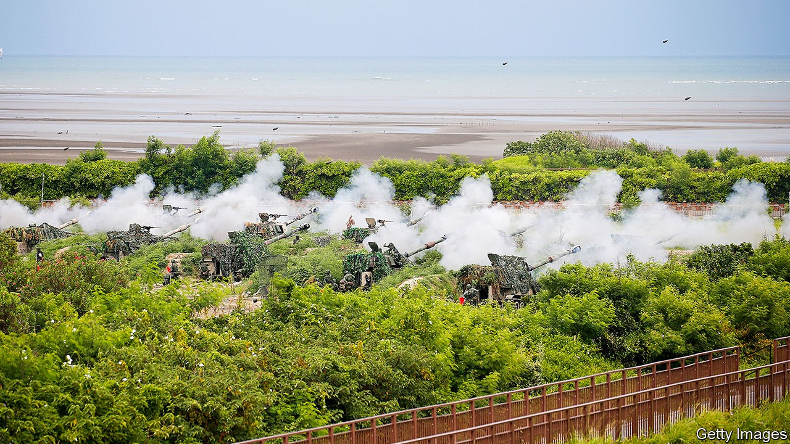
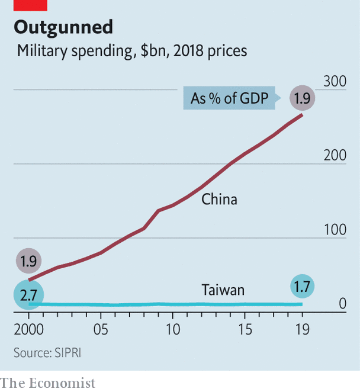
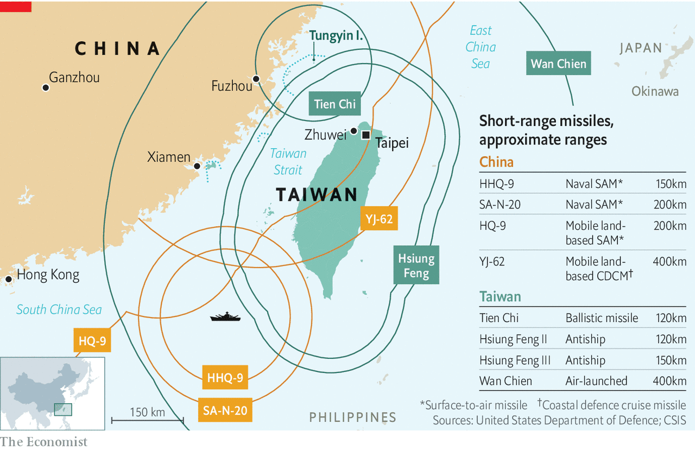

## Strait shooting

# Defending Taiwan is growing costlier and deadlier

> Would America have the stomach for such a fight?

> Oct 10th 2020ZHUWEI

ROUSING MUSIC accompanies the H-6K, a hulking Chinese bomber, as it sweeps up into a pink sky. Moments later, its pilot presses a red button, with the panache and fortitude that only a People’s Liberation Army (PLA) officer could muster, and a missile streaks towards the island of Guam. The ground ripples and a fiery explosion consumes America’s Andersen air force base. Never mind that the PLA propaganda film released in September pinches footage from Hollywood blockbusters; the message is that this is what America can expect if it is foolhardy enough to intervene on behalf of Taiwan in a regional war.

China’s Communist Party claims Taiwan, a democratic and prosperous country of 24m people, although the island has not been ruled from the mainland since 1949. A tense peace is maintained as long as Taiwan continues to say that it is part of China, even if not part of the People’s Republic. China once hoped that reunification could be achieved bloodlessly through growing economic and cultural ties. But two-thirds of Taiwanese no longer identify as Chinese, and 60% have an unfavourable view of China. In January Tsai Ing-wen of the Democratic Progressive Party was resoundingly re-elected as president over a China-friendly rival.

Last year Xi Jinping, China’s leader, declared unification to be an “inevitable requirement for the historical rejuvenation of the Chinese nation”. The PLA has stepped up pressure on Taiwan in recent months, sending warplanes across the “median line” that long served as an unofficial maritime boundary and holding large naval drills off several parts of Taiwan’s coast.

Defending Taiwan is growing ever harder. A decade ago China had four times as many warships as Taiwan. Today it has six times as many. It has six times the number of warplanes and eight times as many tanks. China’s defence budget, merely double Taiwan’s at the end of the 1990s, is now 25 times greater (see chart).

American intelligence officials do not think that China is about to unleash this firepower. The PLA’s amphibious fleet has grown slowly in recent years. China has never held even a single exercise on the scale that would be required for a D-Day-type campaign. Indeed, no country has assaulted a well-defended shore since America did so in Korea—with good reason.

Although China could wipe out Taiwan’s navy and air force, says William Murray of the US Naval War College, the island would still be able to fire anti-ship missiles at an invading armada, picking out targets with mobile radar units hidden in the mountainous interior. That could make mincemeat of big ships crossing a narrow strait (see map). “The PLA can’t use precision weapons to attack small, mobile things,” says Ethan Lee, who as chief of general staff at Taiwan’s defence ministry in 2017-19 developed a strategy for asymmetrical warfare.

Nor can China put all its forces to use. “Only a fraction of the PLA could be deployed,” says Dennis Blasko, a former American army attaché in Beijing, “because its overwhelming numbers can’t all fit into the Taiwan front or in the airspace surrounding Taiwan at one time”. Satellite reconnaissance would give Taiwan weeks of warning to harden defences and mobilise reserves. Mr Blasko thinks a nimbler air assault, using helicopters and special forces, is more likely than an amphibious attack. Even then, he says, the island is “very defensible, if it is properly prepared and the people have the will to defend it”.

Alas, Taiwan’s preparedness and its will to fight both look shaky. “The sad truth is that Taiwan’s army has trouble with training across the board,” says Tanner Greer, an analyst who spent nine months studying the island’s defences last year. “I have met artillery observers who have never seen their own mortars fired.” Despite long-standing efforts to make the island indigestible, Taiwan’s armed forces are still overinvested in warplanes and tanks. Many insiders are accordingly pessimistic about its ability to hold out. Mr Greer says that of two dozen conscripts he interviewed, “only one was more confident in Taiwan’s ability to resist China after going through the conscript system.” Less than half of Taiwanese polled in August evinced a willingness to fight if war came.

A vital question is therefore whether Americans would do so, for the sake of a distant country whose defence spending has fallen steadily as a share of GDP over two decades. America does not have a formal alliance with Taiwan. But it sells the island weapons—$13bn-worth over the past four years—and has long implied that it would help repel an invasion if Taiwan had not provoked one. Yet the same trend that imperils Taiwan in the first place—China’s growing military power—also raises the price of American involvement.

In wargames set five or more years in the future, “the United States starts losing people and hardware in the theatre very quickly,” says David Ochmanek of the RAND Corporation, a think-tank. “Surface combatants tend to stay far from the fight, forward air bases get heavily attacked and we’re unable to project power sufficiently into the battlespace to defeat the invasion.” America is disadvantaged by geography, with its air force reliant on a handful of Asian bases well within range of Chinese missiles. American bombers can swoop in from the safety of American soil, but there is a shortage of missiles to arm them. Nor is it clear how America’s technology-dependent armed forces would fare against an inevitable physical and electronic barrage on their satellites and computer networks.

In another wargame conducted earlier this year, the Centre for a New American Security (CNAS), another think-tank, assumed that Taiwan would fight tenaciously and that America would have access to weapons still under development. Under those rosier circumstances, the island survives—at least after ten notional days of combat—but even then only at huge cost. The seas around Taiwan would look “like no-man’s-land at the Somme”, notes Christopher Dougherty of CNAS.

The question is whether America has the stomach for this. The conquest of Taiwan would not just dent American prestige but also expose the outlying islands of Japan, an ally America is pledged to defend. The Trump administration has sent several high-level officials to Taipei to show its support—one reason for the recent Chinese bluster. In Congress support for Taiwan is at “new highs”, says Bonnie Glaser of the Centre for Strategic and International Studies (CSIS), another think-tank.

Polls by CSIS show that Americans broadly support coming to Taiwan’s aid, roughly as much as they support helping South Korea, Japan or Australia. Such enthusiasm may wane, however, if American ships start getting sunk in large numbers. American losses in the CNAS wargame amount to a hundred or so aircraft, dozens of ships and perhaps a couple of carriers. “An aircraft-carrier has 5,000 people on it,” says Mr Murray. “That’s 100 voters in every state of our union. That’s a lot of funerals.”

Fear of such losses might deter an American president from entering the fray. But incurring them might stiffen American resolve. America and its partners can use this dynamic to their advantage, says Elbridge Colby, a former Pentagon official. If American troops were to disperse in allied countries like Japan and draw on allied support to repel a Chinese attack, China would have to choose between striking a wide range of targets beyond Taiwan, and outraging American and Asian public opinion, or sacrificing military advantage.

Escalation might go even further. The fact that Chinese nuclear missiles can now reach any American city raises the stakes dramatically. “When the bullets really start flying,” says Michael Hunzeker of George Mason University, “the American people, most of whom can’t find Taiwan on a map, will be hard-pressed to say, ‘No, I’m really willing to trade Los Angeles for Taipei.’”

Taiwanese officials acknowledge these grim trends. Even if America is willing to come to Taiwan’s aid, that is no use if it is not capable of doing so, Su Chi, a former secretary-general of Taiwan’s National Security Council, has argued. But the logical response, transforming Taiwan’s own defences, is hard when only a fifth of people think war will come. In the sleepy fishing village of Zhuwei, on the north-west coast, an area thought to be a prime landing site for the PLA, tourists eat stir-fried seafood in restaurants as multicoloured fishing vessels bob in the harbour. “The Chinese won’t invade,” says Lin Fu-fun, an airport safety inspector who has come to watch the waves splash on a jagged breakwater. “Our language and culture are the same.” ■

## URL

https://www.economist.com/asia/2020/10/10/defending-taiwan-is-growing-costlier-and-deadlier
