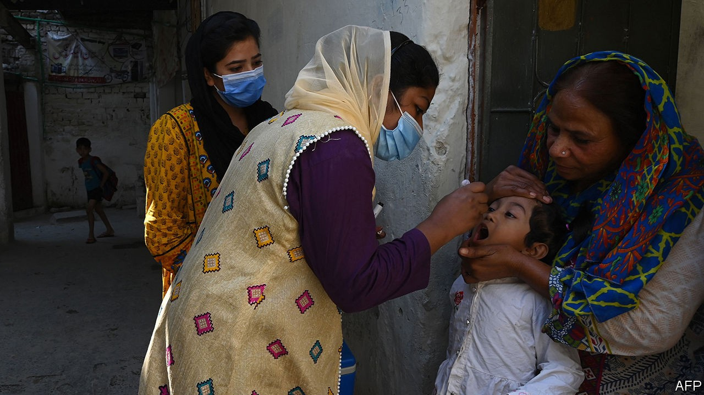

## Deliverance delayed

# Pakistan and Afghanistan are the last countries fighting polio

> Covid-19 has contributed to a resurgence in the poliovirus

> Oct 10th 2020LAHORE

CLIPBOARD IN ONE hand and polio drops in the other, Afshaan Shaukat walks her neighbourhood methodically. The dense lanes of houses, workshops and kiosks close to Lahore’s splendid Badshahi mosque are her beat. She knows which family lives behind each gate, how many children they have and often their names, too. Undaunted by the frazzling heat, she spends hours knocking at house after house. Her task is simple, yet exacting: she must administer drops to every young child in the neighbourhood, making sure no one demurs or goes undetected.

Pakistan’s polio-vaccination drive involves a remarkable mass-mobilisation of workers like Ms Shaukat. She and her brother, Humza, make up one of 4,000 door-to-door teams in Lahore alone. Another 1,000 teams hang around waiting to vaccinate children in bazaars and bus stations. Nationwide there are 260,000 vaccinators at work, chasing 40m children.

Despite the pandemic gloom, the world reached a welcome public-health milestone in August when Africa was declared free of wild poliovirus (cases derived from mutations of the weakened version of the virus used in the oral vaccine still crop up in some countries). Thirty years ago some 350,000 people around the world were afflicted by the crippling virus each year; now it survives only in Afghanistan and Pakistan. Yet in those two countries, despite the efforts of Ms Shaukat, the news is far from good.

An international monitoring board of public-health specialists has declared the programme to stamp out polio in the two countries to be in “dire straits”. The number of cases in Pakistan has risen after a “jaw-dropping slump of performance”. Nationwide cases had fallen to 12 in 2018, only to jump to 147 last year. Across the border in Afghanistan the insurgents of the Taliban have prohibited door-to-door teams in areas they control, leaving many children unvaccinated. On top of that, covid-19 halted vaccination campaigns in both countries for four months. A polio-free world now seems “a distant pinpoint of light”, say the monitors.

The coronavirus has meant that Ms Shaukat has added a face mask and bottle of hand-sanitiser to her kit, but things in Lahore were already on the slide. Pakistan’s cultural capital recorded five cases last year, having been polio-free since 2011. Another two have appeared so far this year. Sewage samples once showed no trace of the virus; now they now detect it everywhere. Complacency had set in, officials admit, letting polio creep back from its strongholds in the cities of Karachi and Quetta and along the border with Afghanistan. What is more, disinformation and conspiracy theories, including the claim that the vaccinators are in fact administering a drug to sterilise children as part of a Western plot to weaken Islam, have spread like wildfire on social media. Last year a health worker and two police guards were killed in a series of attacks on vaccinators around the country and panicked parents rushed thousands of children to hospital for fear the vaccine was poisoning them.

The campaign has six months to sort itself out. Otherwise, the monitors reckon, “the wheels will come off the Pakistan bus.” Dr Rana Muhammad Safdar says an overhaul is already under way. As national polio co-ordinator from 2015 to 2019, he steered the campaign within touching distance of eliminating the bug and has returned to prevent further regression. Politicians, unusually, have united behind the campaign and harmful rumours are being rebutted, says the doctor. While he acknowledges that covid-19 has slowed momentum as medical staff switch their focus, he says he is confident the ground can be made up. Indeed, some officials say the fight against coronavirus has sharpened the public-health service.

India’s example shows that progress can be fast, says Dr Hamid Jafari, the World Health Organisation’s polio-eradication director in the region. That country went from 741 cases in 2009 to 42 the next year and registered its last in 2011. That breakthrough, he says, brings to mind a saying of Nelson Mandela: “It always seems impossible until it’s done.” ■

## URL

https://www.economist.com/asia/2020/10/10/pakistan-and-afghanistan-are-the-last-countries-fighting-polio
