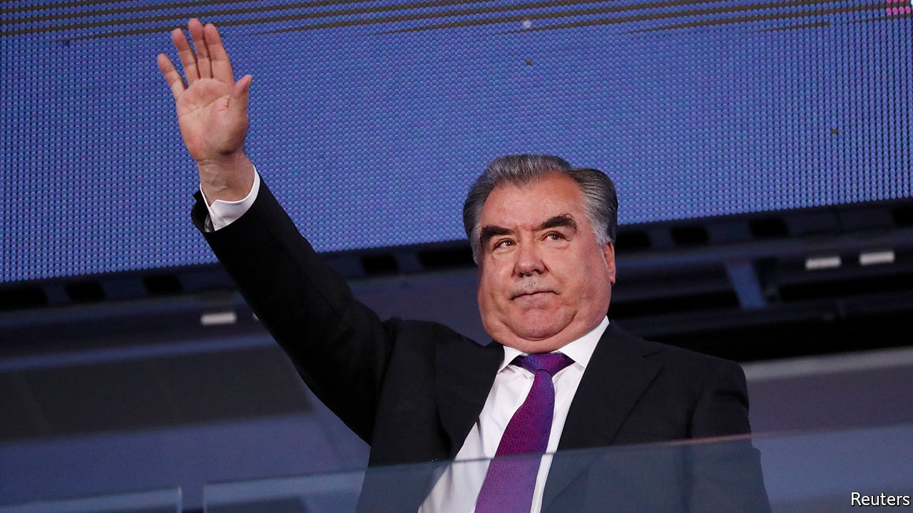

## Ballot-ticking exercise

# Why Tajikistan’s president will win a fifth term

> Emomali Rahmon has arrested or chased away any better candidates

> Oct 10th 2020ALMATY

ELECTIONS IN TAJIKISTAN are a staid affair compared with Kyrgyzstan’s. When voters go to the polls to elect a president on October 11th, the ballot paper will offer them a false choice: either tick the box next to the name of Emomali Rahmon, the strongman who has ruled for 28 years, or choose one of four stooges also on the ballot and watch Mr Rahmon storm to victory anyway. The only question is how big a landslide Mr Rahmon will award himself: it would be poor form if he did not better the 84% he won in 2013.

The Founder of Peace and National Unity, Leader of the Nation—to give Mr Rahmon his official title—faces no genuine opposition because he has rooted it out with zeal. In 2015 a court banned the moderate Islamic Renaissance Party of Tajikistan, his main challenger, branding it a terrorist group. Its leader, Muhiddin Kabiri, fled abroad. Other senior members were put in jail, where some have died in mysterious circumstances (officially, in a “prison riot”). Umarali Quvvatov, the leader of a reformist movement called Group 24, which is also outlawed in Tajikistan, was gunned down in Istanbul in 2015.

More recently the government has turned its sights on the National Alliance of Tajikistan, a coalition of dissidents living in Europe. Last year, a court—predictably—found the group guilty of terrorism and banned it. The alliance has called for a boycott of this election, as has the Social Democratic Party of Tajikistan, the last legal opposition movement left inside the country. It did take part in a rigged parliamentary election in March, winning a meagre 0.3% of the vote and no seats.

There had been speculation that the 68-year-old Mr Rahmon, the longest-serving leader in the former Soviet Union, was thinking of stepping down. He came to power in 1992 during a civil war which he eventually ended by negotiating a power-sharing deal. To many older voters, therefore, he embodies peace and stability (even though he later reneged on the pact).

Still, he appears to be looking to the future. He has been grooming his son, Rustam Emomali, as his successor. In April Mr Emomali, already mayor of the capital, Dushanbe, became speaker of the Senate, too. That means he would become acting president if the incumbent were to step down—not that Mr Rahmon seems inclined to do so very soon. ■

## URL

https://www.economist.com/asia/2020/10/10/why-tajikistans-president-will-win-a-fifth-term
