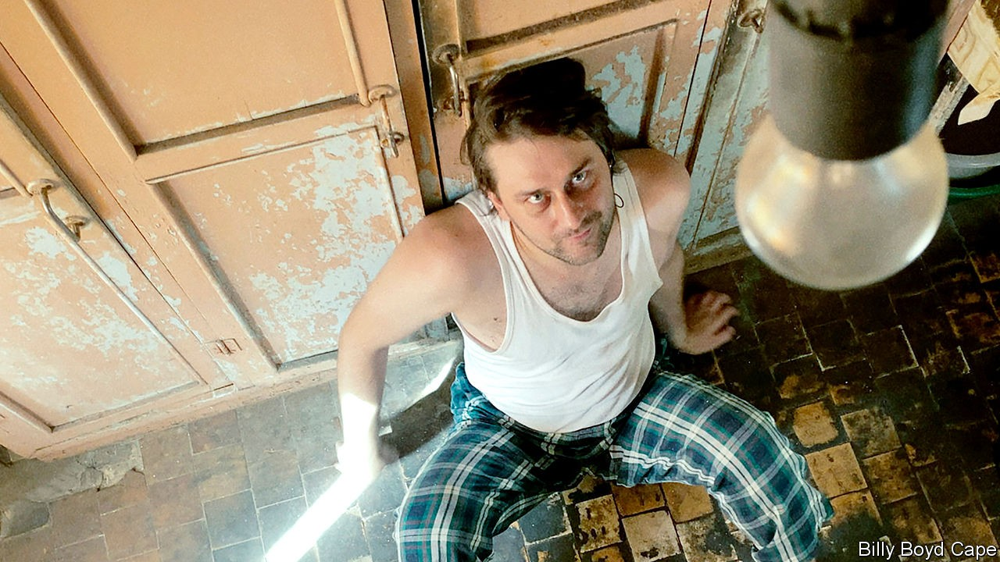

## Phoning it in

# How to produce an opera in lockdown

> “Eight Songs from Isolation” shows how the form can adapt to the pandemic

> Oct 10th 2020

IN THE VOID left by restrictions on theatres, opera has pursued a shadow life elsewhere. The English National Opera has managed a zany drive-in version of “La bohème” in a car-park in north London, but most companies have resorted to streaming old shows, with the odd effort on Zoom. “Eight Songs from Isolation”, a 45-minute work created by eight composers, takes a new approach: forget the stage, commission for today’s medium, and put the drama where it counts—in the music.

The idea of a “socially distant” opera occurred to Oliver Zeffman, a British conductor, when it became clear that two fundamental elements of concerts—interaction between artists, and between them and their audiences—might be out of reach. He commissioned eight composers around the world, from established names such as Nico Muhly, an American, to Freya Waley-Cohen, a rising talent based in Britain, to write songs responding to the concept of isolation. Using iPhones, the singers filmed themselves performing the results in or around their homes, guided by Billy Boyd Cape, the director, and accompanied remotely by musicians from the Academy of St Martin in the Fields in London.

Together they show how digital opera can maintain some of the enchantment that makes the onstage kind so powerful. The traditional linear plot is abandoned in favour of eight miniatures. By turns subdued, playful and deranged, the songs run the gamut of bridled lives under lockdown.

Some of the libretti are drawn from poems; others take inspiration from reality. The Russian composer Ilya Demutsky unexpectedly adapts the rant delivered by a hostage-taker during a recent bank heist in Moscow. The use of a sheng (a reed instrument) and the Chinese lute make Du Yun’s piece the least conventional. The lyrics reflect on a city’s burst of blooms: “re-awakening/the spring begins to trill outside the window”. The line becomes more poignant when you learn that it comes from a newspaper report written by the libretto’s co-author, Yang Nan, who was locked down in Wuhan earlier this year.

Now available on Apple Music, “Eight Songs from Isolation” proves that remote collaborations can succeed if classical musicians abandon conventions that belong to the proscenium. In the 18th century Mozart saw the potential in song and orchestration to dramatise life’s more absurd predicaments. Today, with almost all auditoriums closed, that is harder. Mr Zeffman’s decision to shed the theatrics of the stage to focus on stories and music forfeits some of opera’s glamour. But it brings a serious musical response to these times onto listeners’ screens and into their homes. ■

## URL

https://www.economist.com/books-and-arts/2020/10/10/how-to-produce-an-opera-in-lockdown
