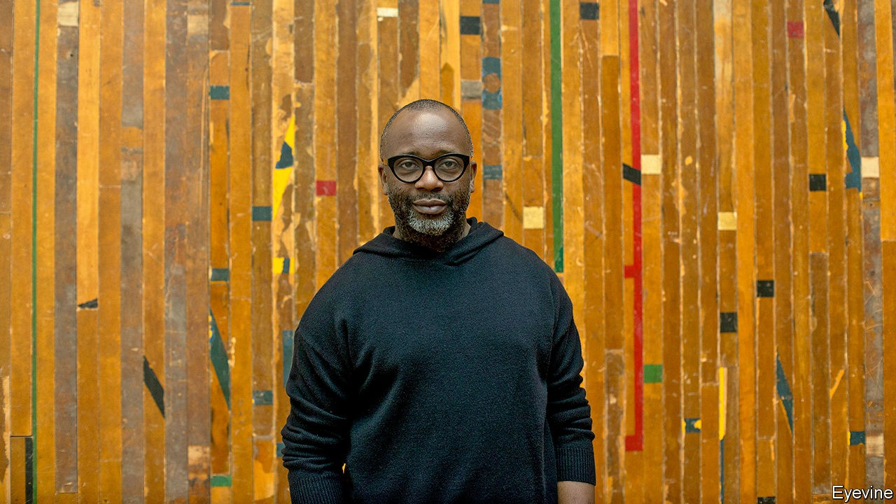

## A visionary American artist

# Theaster Gates turns discarded objects into art

> He has never had a major solo show in America—until now

> Oct 10th 2020

IN 2012 THEASTER GATES shipped a cargo of construction materials from a dilapidated house on the South Side of Chicago to the German city of Kassel. He had been invited to exhibit at Documenta, a city-wide art show held there every five years. In Kassel Mr Gates had come upon Huguenot House, a run-down hotel built by migrants and named after the French Protestants who fled abroad in the 17th and 18th centuries. Once people had sought refuge in the building’s cellar, but it had been abandoned since the second world war. He was fascinated by parallels between the Huguenots who made a new home in Germany and the African-Americans who travelled north to Chicago during the great migration of the mid-20th century. He asked to take over the whole building.

Mr Gates and his team exposed torn wallpaper and stripped away plaster. They filled one of the disused rooms with staircases to nowhere, made wall hangings out of mattress ticking and a shoeshine stand from old floorboards. (Those stands feature a lot in Mr Gates’s installations: at openings he often asks his well-heeled collectors to polish visitors’ shoes.) The project, entitled “12 Ballads for Huguenot House”, became one of Documenta’s biggest draws, with Mr Gates’s music ensemble, Black Monks of Mississippi, playing ballads that blended Zen chanting with slave spirituals. “You know we had Kassel rocking,” he remembers. “It became an extremely electric place.”

The artist’s postbox began to fill up with invitations from other European curators, intrigued by the way he trawled through African-American history to create conceptual artworks about memory and music. These led to solo exhibitions in Switzerland, Sweden, Austria, France and Britain. But not in America, where he featured only in group shows.

“I think that [in] the US we can be quite provincial,” Mr Gates comments. But there may have been another reason. In his home country, where he studied urban planning, he is best known for something else. In 2006 he moved to the South Side and bought a former sweetshop, aided by a loan from his mother and a subprime mortgage. Ever since, he has been scooping up condemned buildings and transforming them into vibrant culture centres, with libraries, studios and space for meetings, exhibitions and performance—in a part of Chicago that is 93% African-American and notoriously short of such places.

He coaxed the University of Chicago to spend $2m on an arts hub in the neighbourhood. He persuaded Rahm Emanuel, then the mayor, to sell him the Stony Island State Savings Bank, boarded up but owned by the city, for a dollar—plus a promise that Mr Gates would raise the money to turn it into an arts venue. In 2013 he cut 100 marble slabs from the building, inscribed them with the words “In Art We Trust”, and sold them for $5,000 each at Art Basel as if they were bonds.

These days Mr Gates owns or manages more than a dozen buildings in Chicago. “Every morning I check on fences, make sure the grass is mowed,” he says. “If it’s rained I check there are no major leaks. I’m a landlord.”

That is Mr Gates the social entrepreneur. But America is about to learn more about Mr Gates the artist, thanks to a major new show that opens at Gagosian in New York on October 10th. As his centres in Chicago closed when covid-19 took hold in the spring, Mr Gates retreated to his studio. He spent a month cleaning assiduously, “to help me cope with the anxiety”. Then came the killing of George Floyd and the nationwide protests against racial injustice. His advice to white Americans who want to help improve race relations is eminently practical: “If you really want to help, get some black friends, marry a black man. The number of white people I know who don’t have one real black friend, it’s scary. It blows my mind that we live such racially distanced lives.”

Lockdown helped him hone his ideas for the Gagosian show. Called “Black Vessel”, it is a tribute to family life (an only son, Mr Gates has eight older sisters), maternal love and manual labour. His father was a roofer, and this exhibition, based on clay and roofing materials, will be his “origin story”, he explains. “It’s about homage to my dad,” but also about the transfer of “a skill and a way of making from one generation to another”. The elder Gates did not want his son to be a roofer; that is why he sent him to college. “The show says a lot about the potential within blackness, the potential within labour, the potential between—in this case—a father and a son to transfer and do better.”

Some of the work harks back to the years he spent making pottery in America and Japan. In 2007, at a series of dinners in Chicago, he memorably served up soul food on plates that he crafted, supposedly in honour of a Japanese potter named Shoji Yamaguchi, who turned out not to exist. His new pots will fill one room at the gallery.

A second will display his “roofing” sculptures: slabs of rubberised roofing from some of Mr Gates’s building projects, coated with tar and painted in industrial colours (tile red, terracotta and blueish-green). These recall the work of Robert Rauschenberg or Alberto Burri, an innovative Italian painter and sculptor who took up working with plastic, blowtorches and sacking after he was released from a POW camp in Texas. Prices for Mr Gates’s ceramics will start at $200,000, and for the roofing sculptures at $500,000—far above his previous auction prices, but a sign of his growing following and of soaring demand for African-American artists.

But the showstopper, and the real “Black Vessel”, will be the large main gallery, which Mr Gates is lining entirely with special bricks from a factory in South Carolina. Whenever the plant switches from, say, making red bricks to blue ones, the offcuts produced during the transition are thrown away. Some of these were saved for him, and fired black. They are symbols of Mr Gates’s artistic and civic interests: the salvage and repurposing of discarded black artefacts. It will transform Gagosian into “an empty black sanctuary”, which, in a difficult year, “feels really, really good”. ■

“Theaster Gates: Black Vessel” will be at Gagosian, 555 West 24th St, New York, from October 10th

## URL

https://www.economist.com/books-and-arts/2020/10/10/theaster-gates-turns-discarded-objects-into-art
