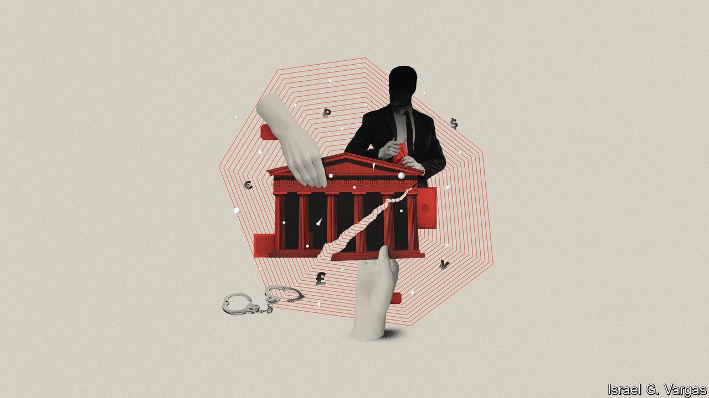

## The way of the world

# Two books examine the global role of corruption

> It is a slippery problem, for both authorities and authors

> Oct 10th 2020

Kleptopia: How Dirty Money is Conquering the World. By Tom Burgis. Harper; 464 pages; $28.99. William Collins; £20.

On Corruption in America. By Sarah Chayes. Knopf; 432 pages; $28.95. Published in Britain as "Everybody Knows"; C. Hurst & Co; £20.

A FEW YEARS ago Francis Fukuyama, a political scientist, described corruption as “the defining issue of the 21st century”. Whereas the 20th century saw ideological battles between democratic, fascist and communist regimes, he argued, the chief divide among today’s governments is whether they primarily serve the interests of their people (as in Denmark or Canada) or of their leaders (as in Zimbabwe or Russia). The worst are “kleptocracies”, states whose very purpose is to enable elites to plunder resources, in which bribes, favours and violence are the methods of rule.

In an era when prime ministers and presidents from Malaysia to Ukraine amass billions in cash, and Western banks that handle the money turn a blind eye to its provenance, Mr Fukuyama’s thesis commands widespread assent. Yet the lineaments of corruption can be hard to define, not least because corrupt people tend to be good at constructing excuses for themselves. After all, isn’t government supposed to encourage commerce? Shouldn’t politicians and businessmen talk? Corruption on a grand scale is fantastically complicated and tough to write about, not least (in Britain especially) because of libel law. Two new books take up the challenge.

“Kleptopia” does the job brilliantly. Tom Burgis of the Financial Times spins his tale of global corruption from the ground up. He begins with a hero straight out of a John le Carré novel. Nigel Wilkins is an ageing, introverted economist with an obstreperous streak. He takes a job as a compliance officer at the London office of BSI, a Swiss bank, just as the global financial crisis strikes. He soon suspects that BSI is laundering money for a long list of the international high and mighty, and surreptitiously copies reams of documents which he tries to bring to the attention of the Financial Services Authority. It ignores him.

Mr Burgis also follows the story of ENRC, a metal and minerals outfit that listed in London in 2007. Partly owned by the government of Kazakhstan, the firm was founded by three Central Asians who bought ex-Soviet factories at discount prices, quickly becoming billionaires. The listing brings an injection of cash from Western investors; they also expand into Africa, taking in more money in Zambia and Congo. A parallel storyline concerns Mukhtar Ablyazov, a former Kazakh minister and banking tycoon turned opposition leader. In this telling, after Mr Ablyazov falls out with the regime, he, his family and his staff face lawsuits, surveillance, false arrest and torture. In 2009 he fled from Kazakhstan, where he has been convicted in absentia of murder and accused of fraud and embezzlement, all of which he denies. (He also left Britain after a judge ordered him jailed for concealing assets; he has just been granted political asylum in France.)

“Kleptopia” is wonderfully if grimly entertaining, replete with tales of Zimbabwean thugs, late Soviet gangsters and KGB officers-turned-entrepreneurs, as well as a Romeo-and-Juliet romance between the children of rival oligarchs. Mr Burgis’s depiction of the interlocking worlds of post-Soviet business and politics captures the way corruption binds together economic and political power. He meticulously demonstrates how, once overseas money enters Britain (attracted by the protections of its legal system), the associated power struggles and skulduggery follow.

When Western governments and media try to take on Kazakh wrongdoing, they are misled by what Mr Burgis terms a “presumption of regularity”. European courts treat international arrest warrants from Kazakhstan as if they emanated from a genuine national legal system, rather than the ruling clique. Worst of all, money-hungry Western banks, lawyers, public-relations firms and security consultants exacerbate the sleaze, developing a sort of international kleptocracy-service system. As the web widens, readers unfamiliar with Kazakh or Russian politics will start to come across names they may recognise, such as Felix Sater and Donald Trump.

Sarah Chayes, too, is intrigued by wide webs of corruption. Her interest in the issue began in the 2000s, when she worked for an NGO in Afghanistan. As she wrote in her excellent previous book, “Thieves of State” (published in 2015), she soon realised that resentment of government corruption was the main factor driving Afghans towards the Taliban—and that American intervention was making corruption worse.

Her new book ranges more widely—too widely. She begins with the decision by America’s Supreme Court in 2016 that voided the influence-peddling conviction of Bob McDonnell, a former governor of Virginia. He and his wife had accepted lavish gifts from a vitamin-supplement manufacturer, and asked the state health authority to consider recommending its products. But because no explicit bribe was offered in exchange for an official act, the court ruled unanimously that a guilty verdict could criminalise the normal conduct of democratic politics. Prosecutors say this standard has made it almost impossible to convict American politicians of corruption.

Ms Chayes tries to set this event in historical context, but she overdoes it. She starts by looking at the vexed origins of money itself, going on to tackle fractional reserve banking, credit bubbles, graft in the Gilded Age and the labour movement. But, lacking a framework to distinguish legitimate links between commerce and the state from the crooked kind, the book soon drifts into lazy condemnations of capitalism. To describe the global mechanism of corruption, Ms Chayes uses the metaphor of the hydra—an image that has been common in polemics against international finance since the 19th century. Some passages have the tinge of conspiracy theories.

In a way, her book illustrates the risk identified by the Supreme Court: to the oversensitive, every handshake can seem suspect. Yet Mr Burgis, too, ends his analysis with a description of a web of money-laundering, legal harassment, propaganda and violence that enmeshes the world. America and Britain, he thinks, are ever-more like Ukraine, Russia and Kazakhstan: “Like a parasite altering a cell it invades, so kleptocratic power transforms its host.” ■

## URL

https://www.economist.com/books-and-arts/2020/10/10/two-books-examine-the-global-role-of-corruption
