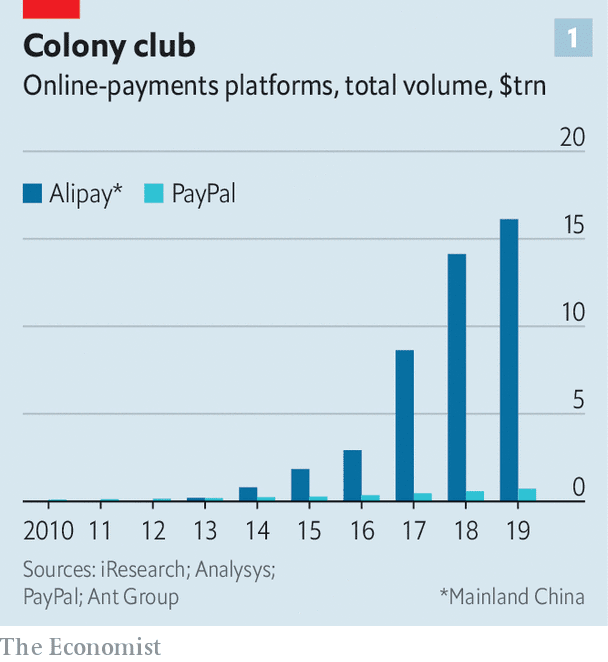
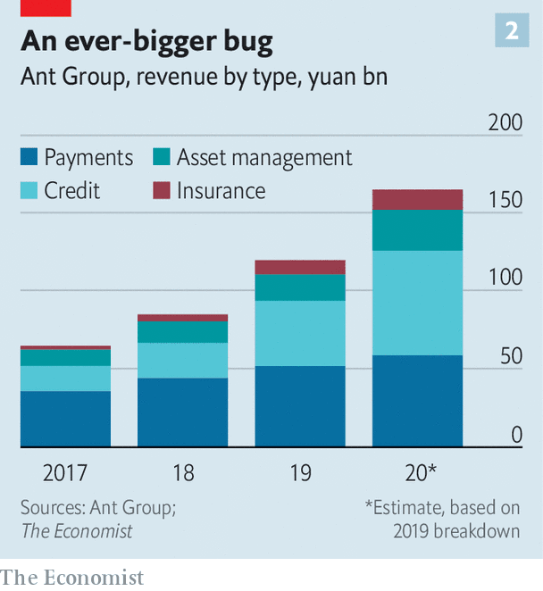

## Queen of the colony

# What Ant Group’s IPO says about the future of finance

> The giant Chinese fintech upstart is expected to raise more than $30bn, eclipsing Saudi Aramco’s debut last year

> Oct 10th 2020SHANGHAI

IN THE STAID world of Chinese banking, it is rare for executives to voice public criticism. So Jack Ma, the founder of e-commerce giant Alibaba, made headlines in 2008 when he bemoaned how hard it was for small businesses to get loans: “If the banks don’t change, we’ll change the banks.” He has not repeated his warning since then. He has not needed to.

Through Ant Group, which began life as a payments service on Alibaba, Mr Ma’s impact on the Chinese financial system has been profound. Ant has helped establish China as the world leader in digital transactions, given entrepreneurs and consumers far greater access to loans, and changed the way that people manage their money. It is now a giant in its own right. Over the past year it counted more than 1bn active users. Last year it handled 110trn yuan ($16trn) in payments, nearly 25 times more than PayPal, the biggest online payments platform outside China (see chart 1).

An initial public offering (IPO) in the coming weeks will bear testimony to Ant’s growth. It is expected to raise more than $30bn, eclipsing Saudi Aramco’s debut last year as the biggest IPO—a symbol of the world’s transition from a century in which oil was the most valuable resource to an era that prizes data. With a forward price-to-earnings multiple of 40, in line with big global payments companies, Ant could fetch a market capitalisation in excess of $300bn, more than any bank in the world.

More important than its size is what Ant represents. It matters globally in a way that no other Chinese financial institution does. China’s banks are huge but inefficient, burdened by state ownership. By contrast foreign financiers look at Ant with curiosity, envy and anxiety. Some hawks in the White House reportedly want to rein in the company or hobble its IPO. Ant is the most integrated fintech platform in the world: think of it as a combination of Apple Pay for offline pay, PayPal for online pay, Venmo for transfers, Mastercard for credit cards, JPMorgan Chase for consumer financing and iShares for investing, with an insurance brokerage thrown in for good measure, all in one mobile app.

Given the abundance of consumer data in China and the relatively lax safeguards around its use, Ant has more to work with than fintech peers elsewhere. More than 3,000 variables have gone into its credit-risk models, and its automated systems decide whether to grant loans within three minutes—a claim that may seem far-fetched but for Alibaba’s proven ability to handle 544,000 orders per second. Ant is, in short, the world’s purest example of the tremendous potential of digital finance. But as it advances further, it may also be an early warning of its limitations.

Start with a deceptively simple question: what is Ant? In its decade as an independent company it has changed names three times—from Alibaba E-Commerce to Ant Small and Micro Financial Services to Ant Group. The company once called itself a fintech leader. Then Mr Ma inverted the term to techfin, in order better to capture its priorities. Such are its efforts to distinguish itself from a purely financial firm that it has asked some brokerages to assign tech analysts to cover it. (Of course, it does not hurt that the valuations for tech stocks are much plumper than for bank stocks.)

Yet there is no doubt that Ant, at its heart, is about finance. The clearest way of understanding its business model is to look at the four sections into which it divides its revenues. The first is payments—how it started and still the foundation of the company. Ant began in 2004 as a solution to a problem. Shoppers and merchants were flocking to Alibaba but lacked a trusted payment option. Alipay was created as an escrow account, transferring money to sellers after buyers had received their products. With the launch of a mobile Alipay app, it moved into the offline world, super-charging its growth in 2011 with the introduction of QR codes for payments. A shop owner needed to show only a QR code print-out to accept money, a big advance for a country previously reliant on cash.

For China as a whole, digital transactions reached 201trn yuan in 2019, up from less than 1trn in 2010. Alipay’s market share has been whittled down by Tencent, which added a payments function to WeChat, China’s dominant messaging app. Both companies earn as little as 0.1% per transaction, less than banks do from debit-card swipes. Given the sheer volume, this still adds up to a lot. Ant generated nearly 52bn yuan of revenues from its payments business last year. But growth is slowing, dropping from 55% of Ant’s revenue in 2017 to 36% in the first half of this year. Instead, the crucial point is that payments are a gateway: how Ant attracts users, understands them and ultimately monitors them.

The biggest beneficiary of all this data is Ant’s lending arm, the second part of the company (which Ant, never one to shy away from jargon, calls CreditTech). Ant began consumer lending as recently as 2014, with the launch of Huabei, a revolving unsecured credit line for purchases—basically a virtual credit card. Alipay users can tap into Huabei to defer payments by a month or to break them into instalments. Credit cards had never taken off in China, so Huabei was lapped up. That led to Jiebei, an Alipay feature which allows users to borrow larger sums. Ant also offers loans, with a focus on very small businesses. Annualised interest rates hover between 7% and 14%, lower than the alternatives from small-loan companies.

Like many Ant clients, Zhu Yifan, owner of Rabbits Go Home, a convenience store in Dongyang, an eastern city, started small. Four years ago she and her husband wanted to open their store. With no property as collateral, they could not get a bank loan. Instead, they pulled together money from friends and relatives, and, on a whim, borrowed 10,000 yuan from Ant, the most they could obtain then. By repaying that initial loan and getting customers to use Alipay—giving Ant a look at her cash flow—Ms Zhu’s credit score improved. Now, she has a 100,000 yuan credit line from Ant, which lets her stock up before busy holidays.

In barely half a decade Ant has reached 1.7trn yuan in outstanding consumer loans, or roughly a 15% share of China’s consumer-lending market. Its loans to small businesses total about 400bn yuan, about 5% of the micro-enterprise loan market. From a financial perspective, Ant’s biggest innovation is the way that it funds the credit. Initially, it made the loans and then packaged them as securities, sold to other financial institutions. But regulators feared parallels with the securitisation boom that preceded the financial crisis of 2007-09. They required that the originators of securities hold capital much like any bank—a rule that cut into Ant’s margins.

So Ant devised a new approach. It now identifies and assesses borrowers, but passes them on to banks which extend the loans. Ant collects a “technology service fee”. For borrowers it is seamless. With a few taps on their smartphones, their credit requests are approved or rejected. Ant ends up with a cash-rich, asset-light lending model. Fully 98% of the loans are held as assets by other firms. Credit has become Ant’s biggest single business segment, accounting for 39% of its revenues in the first half of this year (see chart 2).

The strength of Ant’s platform is what enables its third and fourth business segments: asset management and insurance (InvestmentTech and InsureTech, to use Ant’s nomenclature). Ant got started on asset management in 2013 with the launch of Yu’ebao, or “leftover treasure”. The idea was that merchants or shoppers with cash in Alipay could get a small return by parking it in a money-market fund. That attracted people interested in Yu’ebao purely for storing cash, since its yields (now roughly 1.7%) were higher than those available on current accounts at banks. By 2017 Yu’ebao had given rise to the world’s biggest money-market fund by size.

Ant broadened its offerings to become one of China’s most powerful distribution channels for investments. Today 170 companies sell more than 6,000 products such as stock and bond funds on Ant. Altogether these firms have roughly 4.1trn yuan in assets under management enabled by the app. As with its lending business, Ant screens prospective clients and directs them to products. It then collects a service fee. “Our growth on Ant has been faster than on any other digital platform,” says Li Li, deputy CEO of Invesco Great Wall Fund Management. Her group’s two money-market funds soared from 665m yuan in assets under management in early 2018, when it started selling them on Ant, to 114bn yuan in June.

Ant’s push into insurance happened more recently. For a decade it offered shipping insurance for purchases on Alibaba, letting dissatisfied customers return goods for no charge. But it is only in the past two years that it has applied its asset-management template to insurance. In partnership with big insurance firms, it has unveiled life, car and medical insurance—again collecting fees as a distribution platform. Asset management and insurance now make up nearly a quarter of revenues.

Simply looking at the numbers, Ant can appear unstoppable. It has chalked up dizzying growth rates in every market that it has targeted. It benefits from the network effects so familiar in the tech world: the more people use it, the stronger its attraction for yet more borrowers, lenders and investors. It is a virtuous cycle, especially for Ant’s shareholders. Nevertheless, there exist three kinds of risks that could slow it down: regulatory, competitive and those that are intrinsic to its own model.

The regulatory landscape in China is treacherous. Officials endlessly tweak rules for banks and investors, patching up holes as they emerge in the fast-growing but debt-laden economy. Many have long assumed that the government will give Ant, a private-sector firm, only so much leeway in the state-controlled system.

Indeed, regulators have already put numerous hurdles in Ant’s path. Its first attempt at launching a virtual credit card was blocked. The securitisation crackdown upended its lending model. A government plan to standardise QR codes could weaken it in payments, potentially reducing Ant’s market dominance. Another new rule, taking effect in November, will force Ant to hold more capital.

But if all these hurdles were meant to stop Ant, they have not succeeded. So there exists an alternative explanation. Regulators, wary of the pitfalls in financial innovation, continue to erect guardrails around Ant. In general, though, they like it. Not only has it steered credit towards small consumers and businesses, it has also given the government more information about money flows. Duncan Clark, author of a biography of Jack Ma, notes that regulators have long struggled to monitor all corners of China, referencing the old saying that the mountains are high and the emperor far away. “Ant has basically let Beijing tunnel through the mountains and fly drones over their summits,” he says.

Another threat to Ant is its competitors. Until 2013 mobile pay was, more or less, Ant’s exclusive domain. But Tencent has used its ubiquitous WeChat app to muscle in, taking nearly a 40% market share. Other firms also have financial ambitions. Meituan, an app known for food delivery, now also offers credit. The financial arm of JD.com, an e-commerce firm, and Lufax, an online wealth-management platform, are on track for IPOs this year.

So far these competitors have a much smaller financial footprint than Ant’s. Partly this is because they do not have the same breadth. Shawn Yang of Blue Lotus, a boutique Chinese investment bank, says that Tencent, for instance, has high-frequency but low-value consumption data, less rich than the trove that Ant has thanks to Alibaba, which accounts for more than half of Chinese online retail sales.

But it is also a matter of business culture. The most controversial episode in Ant’s history came in 2011 when Mr Ma spun it out from Alibaba, without notifying SoftBank and Yahoo, which together held about 70% of Alibaba’s shares back then. Mr Ma explained that Chinese regulations forbade foreigners from owning domestic payments firms, though there may have been work-arounds. Some suspected that he wanted to bring in powerful investors closer to home. Ant’s earliest rounds of fundraising as an independent firm did indeed attract major state-owned enterprises. A stake was also sold to a private equity firm managed by the grandson of Jiang Zemin, China’s paramount leader during Alibaba’s early years.

Yet in retrospect the spin-off has a clear strategic rationale. As a standalone company Ant has had the motivation to explore distant corners of the banking system and act aggressively. An executive with another e-commerce company says that its financial unit worries about making mistakes that might taint the group’s core retail business. Ant, by contrast, has diversified, with less than 10% of its revenues now from Alibaba. For China’s other e-commerce dynamos, its success offers a template. They may be several years behind but the fintech race is far from over.

The final danger for Ant has the most global resonance: the nature of its model. Unsecured lending to small borrowers is risky, whichever way it is done. Indeed the coronavirus pandemic has offered a sharp test for Ant. Delinquent loans (more than 30 days past due) issued via its app nearly doubled from 1.5% of its outstanding total in 2019 to 2.9% in July. Yet that is better than most other banks in China. Is that because of Ant’s prowess? Some critics say that it reflects its market power. Given the centrality of Alipay and Alibaba to their operations, few dare to default on Ant loans, worried that a downgraded credit rating may damage other parts of their business.

Still, many bankers are persuaded that Ant truly does have an advantage in its analytics. “They don’t need quarterly statements. They see your daily flow of funds. They know who your customer is. They know who your customer’s customer is,” says one. Based on the address for e-commerce deliveries, Ant has more up-to-date information about where someone lives and works than a bank. Based on what that person buys, Ant can work out their income bracket and their habits, preferences and way of life.

But according to Hui Chen, a finance professor at Massachusetts Institute of Technology who has worked on research projects with Ant, individual and systemic risks are different. The machine learning that underpins Ant’s algorithms observes individual behaviour again and again, and is then able to detect patterns and anomalies. But if risks do not appear in the historical data—say, a big economic shock—the same machine learning may stumble.

There are also some limitations hard-wired into Ant’s strategy. By design, it aims for high-volume, small-scale borrowers and investors. “Their analytical advantage is most significant with this mass market, where traditional banking models are most inaccessible,” says Mr Chen. Most corporate lending—about 60% of all credit in China—will remain off limits. Ant also has an awkward relationship with banks. It relies on them to fund the loans on its platform, but as it grows it may become a competitor in their eyes. For now that is not much of a concern, given that it focuses on borrowers ignored by banks. But it means that Ant must befriend the very institutions that it once set out to disrupt.

Doubts exist about its investment and insurance platforms, too. Ant has excelled in selling money-market funds to a plethora of retail investors. Moving up the value chain could be harder. “They are great at selling penny products. But that’s not where you make the money in insurance,” says Sam Radwan of Enhance, a consultancy. To close a deal on a valuable, complex policy like a variable annuity, brokers typically speak with consumers several times. “No ordinary customer is going to trust an online broker for something that complicated,” says Mr Radwan.

Ant’s global ambitions are also running into problems beyond its control. It has stakes in around ten different fintech companies in Asia, such as Paytm in India. Boosters once imagined a world connected by Ant, its credit-to-investment architecture straddling borders. The first blow to that vision came in 2018 when America blocked Ant’s acquisition of MoneyGram, a money-transfer firm, which would have established Ant as a force in global remittances. Security concerns over Ant have increased as China’s foreign policy has become more aggressive. Little wonder that Ant plans to devote just a tenth of its IPO proceeds to cross-border expansion.

Despite all these limitations, one lesson from Ant’s decade in existence is that future possibilities remain vast. Ms Li of Invesco gushes about her fund-management firm’s mini-site within the Alipay app, one of the tens of thousands of separate sections that constitute the Ant ecosystem. In September Invesco hosted a live-stream on the mini-site to discuss its market outlook. More than 700,000 tuned in—just one example of how Ant has become the main doorway into the financial system for tens of millions of people. And for all those who have walked through it, many more have not. Ant will soon know where they live, how much they earn and what they want. It is coming for them. ■

## URL

https://www.economist.com/briefing/2020/10/10/what-ant-groups-ipo-says-about-the-future-of-finance
