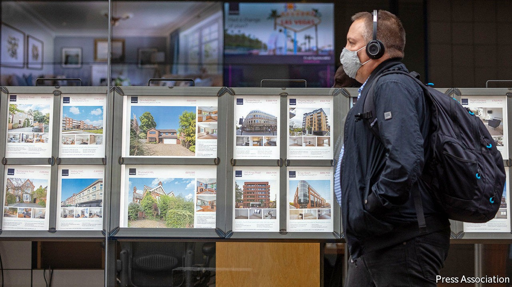
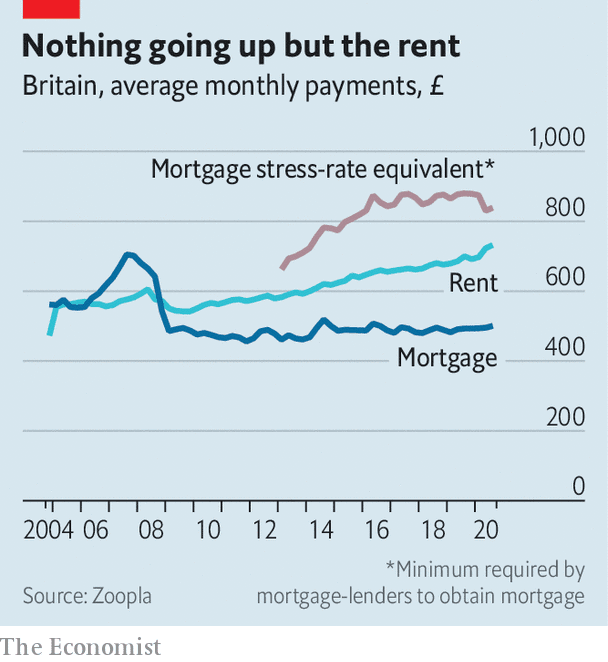

## Mortgage reform

# Boris Johnson wants 25-year fixed-rate mortgages

> Denmark shows the way

> Oct 10th 2020

WITH THE average new mortgage costing 2.14% a year, it has never been cheaper to finance a purchase, and the divergence between the costs of buying and renting (see chart) further strengthens the incentive to buy. But regulation makes it impossible for many.

Rules imposed in the aftermath of a financial crisis caused by dodgy lending require banks to check not just whether applicants can afford the offered interest rate but whether they would still be able to if rates were three percentage points higher. That, together with the need for a chunky deposit, raises the bar to home ownership. According to a recent report by the Centre for Policy Studies (CPS), there are currently more than 3.5m “resentful renters” who would be able to afford the monthly mortgage payments but are held back by stringent affordability checks and high deposit requirements. The CPS’s proposed solution is fixed-rate 25-year mortgages with a loan-to-value ratio of 95%. Fixing the rate for the whole term would obviate the need to stress-test borrowers’ ability to pay more.

The government wants to make this happen. Boris Johnson, in his party conference speech on October 6th, argued that doing so “could create 2m more owner-occupiers, the biggest expansion of home ownership since the 1980s”. But how?

Britain’s mortgage market is dominated by banks and building societies which generally fund themselves with short term borrowings and deposits, and offer fixed rates only for two- or five-year periods to avoid a big mismatch in the duration of assets and liabilities. In Denmark, which has had a system of very long-term fixed-rate lending since the 1850s, the market is served mainly by specialist lenders funded by long-term bonds. No stress-test is needed to avoid a mismatch, so the market determines rates.

A 25-year loan priced at around 4% is an attractive asset in a world in which a 30-year British government bond yields just 0.9%, so the CPS believes that it should be possible to attract insurance companies and pension funds, which have long-term liabilities, into the market. The way mortgages are sold may explain their absence. Brokers, who arrange 70% of mortgages, have an interest in selling clients new products every two or five years rather than one that would last for a quarter of a century. Insurance companies and pension funds are cautious, too. An insurance boss worries that there could be a mis-selling scandal if interest rates were to fall further and new borrowers claimed they had not fully understood the terms and were “trapped on a supposedly penal rate”.

Robert Colvile of the CPS, who helped write the Conservative Party manifesto for the 2019 election, reckons that the government could use its convening power to overcome this hurdle, getting the firms to sit down with the Bank of England and other regulators to make clear that it would welcome such new products. Some Tories want to go further and extend a form of government guarantee to such mortgages, rather as America does through Freddie Mac and Fannie Mae, federally backed mortgage companies. The Treasury, understandably wary of extending a government guarantee to high loan-to-value mortgages, prefers the CPS’s cautious approach.

If it could be made to happen, both long-term lenders and borrowers would benefit. But the government would also need to find a way of getting more houses built if a flood of new money is not just to push prices up even further.■

## URL

https://www.economist.com/britain/2020/10/10/boris-johnson-wants-25-year-fixed-rate-mortgages
