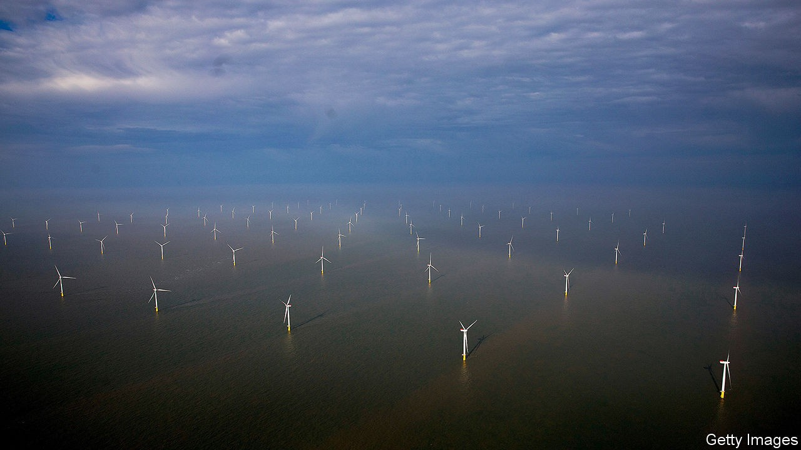

## Wind power

# Boris Johnson’s optimistic green-energy plan

> Making 40GW of electricity from offshore wind is a stretch

> Oct 10th 2020

WHEN IT COMES to self-deprecation, Boris Johnson is hard to beat. “I remember how some people used to sneer at wind power 20 years ago and say that it wouldn’t pull the skin off a rice pudding,” he said at the Conservative Party conference on October 6th. By “some people” he meant “me, myself and I, in 2013”. Rebranding himself as a convert, Mr Johnson set out the first step of a ten-point plan for a “green revolution”, the remainder of which is promised later this month.

Step one will involve producing 40GW of electricity from offshore wind by 2030, a 10GW increase on the existing goal. The boost is not new—it was in the manifesto for the 2019 election. In addition to fixed offshore wind turbines, Mr Johnson wants floating turbines that can venture into deeper waters than their fixed brethren and therefore catch gusts farther afield. All this, he says, will make Britain a world leader in green energy.

The country has a long way to go to get there. Roughly one-third of its electricity comes from renewables—the EU average. Though well endowed with wind, its islands are not leaders in making turbines.

Meeting the 40GW target will be a stretch. Earlier this year, a report by Aurora Energy Research, a consultancy, found that it would mean installing 260 new turbines on average every year for five years. There will need to be more money, too. In some ports loading increasingly unwieldy turbines on and off ships is becoming tricky, and new cables and substations will be needed to connect all those turbines to the national grid. Mr Johnson promised £160m ($207m) in public funds to support tens of thousands of new jobs, and upgrade ports and infrastructure to accommodate the additional offshore wind power.

Yet the proposed sums are trifling compared with what the sector needs. The government estimates that every new gigawatt of offshore generation capacity costs £1.5bn to build. With some 10GW installed today, the additional investment required will be on the order of £45bn. Much of that will come from the private sector, and formalising the 40GW target should help build investor confidence. Still, the investment needed is nearly twice the £24bn estimated to have been made during the past decade.

The government says that the boost to the wind-power industry will “support” 60,000 jobs. The careful wording presumably includes the 44,000 jobs that already exist. Britain is not big in turbine manufacture: none of the four companies that accounted for 55% of new orders globally in 2019 is British. Most of the employment is in firms supplying the turbine-making giants with, for instance, cables and foundations. The industry is growing partly thanks to government regulation. The offshore developers have agreed with the government that by 2030 60% of output by value will derive from Britain, up from around 50% today.

But even if Mr Johnson’s announcement does not add up to much, it is at least in keeping with the government’s environmental targets. The Committee on Climate Change, which advises it on green policy, reckons that Britain could be generating more than 75GW of offshore wind by 2050. Realising this potential, it says, is essential for Britain to meet its goal of reducing its greenhouse gas emissions to net-zero by then. And that will take far more huffing and puffing than is required to pull the skin off Boris’s rice pudding. ■

For more coverage of climate change, register for The Climate Issue, our fortnightly [newsletter](https://www.economist.com//theclimateissue/), or visit our [climate-change hub](https://www.economist.com//news/2020/04/24/the-economists-coverage-of-climate-change)

## URL

https://www.economist.com/britain/2020/10/10/boris-johnsons-optimistic-green-energy-plan
