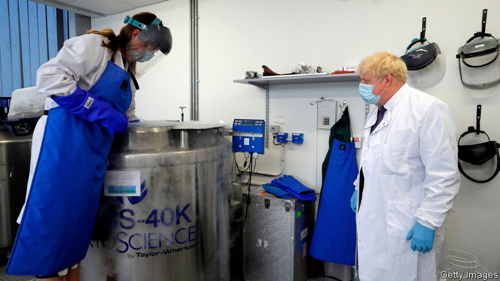
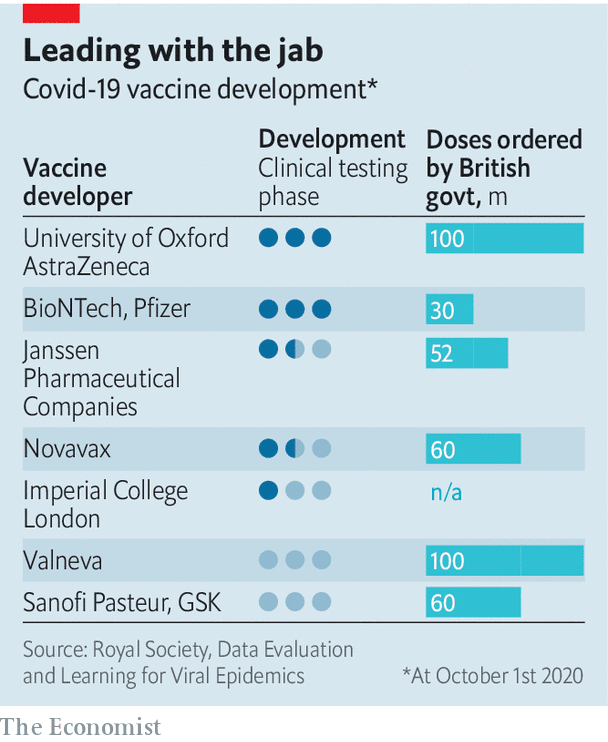

## Ready, steady, jab

# Britain prepares to roll out a covid-19 vaccine

> Woking Leisure Centre is in for a busy year

> Oct 7th 2020

WITH AEROBICS classes, a Costa Coffee and two new swimming-pool slides, Woking Leisure Centre has plenty to attract punters. Soon it may have something more: a mass vaccination centre. According to National Health Service (NHS) plans seen by The Economist, it is one of seven venues so far identified as possible “Nightingale Vaccination Centres” for what will be the country’s biggest-ever vaccination programme. Others include Leeds Town Hall, a university sports centre in Hull and the Olympic Copper Box Arena. The plan is to have some ready to go by the end of the year at the latest.

From its early failure to get on top of the virus to the more recent travails of the test-and-trace system, the British state has struggled to deal with the pandemic. There has been a sharp rise in cases, and the search for a vaccine is increasingly urgent. Yet it is not just a matter of securing a successful vaccine: infrastructure must be in place to inject people as soon as it is ready.

Britain has made deals to buy 400m doses of vaccine, spreading its bets across six different ones under development. Two are out in front: Oxford/AstraZeneca and Pfizer. Expectations are rising that efficacy data could be available within the next month. Then it is up to the regulators. The European Medicines Agency (EMA) started a fast-track review of the Astra vaccine on October 1st and of the Pfizer vaccine on October 6th. Nobody knows how long that will last, but hopes are high for a decision within weeks rather than months.

Brexit could create an extra hurdle: Britain falls within the EMA framework until it leaves the EU at the end of this year. If the British regulator moves ahead of the EMA to allow a vaccine to be used, then from January 1st it would not be possible to use it in Northern Ireland, as it would remain under European legislative control.

Once the regulators give permission for a vaccine to be used, the race is on to get the stuff into people’s arms. Since Britain lacks domestic manufacturing capacity, it has stockpiled enough vials, stoppers and overseals for around 150m doses. It has also accelerated construction of its own vaccine manufacturing facility: the Vaccines Manufacturing Innovation Centre (VMIC) in Harwell, Oxfordshire. While the VMIC is being built, its equipment is at a nearby site run by Oxford Biomedica, which is believed to have the capacity to supply tens of millions of doses in months.

On October 4th Kate Bingham, the head of the government’s vaccine task-force, said that only 30m people—about half the population—might be vaccinated. The numbers are uncertain because they depend in part on the efficacy of the vaccines that are ready for use soonest. They may, for instance, turn out not to prevent infection but to stop the disease getting serious. And, since the vaccines have been developed so swiftly, some residual risk remains which is absent from well-established programmes. The guidance from the Joint Committee on Vaccination and Immunisation, which advises the government, is therefore to prioritise the elderly in care homes, the over-65s and those with complicating health risks. This may change, depending on the successful vaccines’ characteristics. The NHS hopes to be ready to vaccinate 75-100% of the population.

Matt Hancock, the health secretary, has said that the NHS and the army will share responsibility for delivering the vaccine. Yet a Ministry of Defence source says there has been no official request for the armed forces’ assistance. In reality, the health service is likely to do most of the work. It plans to distribute the vaccine both through the existing methods used for the flu jab and also with a new hub-and-spoke model, which with luck will stop breakdowns from jamming up the entire system. The aim will be to use existing supply chains where possible.

Hubs will supply the vaccine, protective equipment for staff and other supplies. Spokes will take three forms: mass vaccination centres (such as at Woking Leisure Centre), mobile sites (which may set up shop in polling stations) and roving teams (which will go door-to-door visiting care homes and the housebound). Speed will be crucial. Early modelling suggested fixed sites would be able to inject 2,500 people a day; roving teams nine households a day. By the end of the year, the NHS hopes to have hundreds of the latter in each region of the country. Legislation is expected to allow non-medics, perhaps including vets and soldiers, to carry out vaccinations.

The vaccines will probably need to be kept extremely cold. The hub-and-spoke model will make this easier. It will, however, require recipients to travel further. Prioritising access to vaccines will also be tricky, requiring data systems from across the health system to be linked up. The NHS’s history of data management suggests it may struggle to make this work. Some observers worry that the health service is taking on too much responsibility, especially when it has already had difficulties delivering flu vaccines. “As usual [with the NHS], it’s a very top-down, ‘We will deliver this, we’re in charge’ thing,” says a local director of public health.

The covid-19 vaccine will bring unique challenges. It will probably arrive soon and preparations for how to distribute it remain a work in progress. Indeed, the work can be finalised only when the characteristics of the winning vaccine are known. Yet insiders are hopeful that vaccine distribution will avoid the chaos seen in Britain’s test-and-trace system. Large-scale vaccination is, at least, not a new task for the British state. Woking Leisure Centre may help redeem the government’s reputation for competence—or damage it still further.■

## URL

https://www.economist.com/britain/2020/10/07/britain-prepares-to-roll-out-a-covid-19-vaccine
