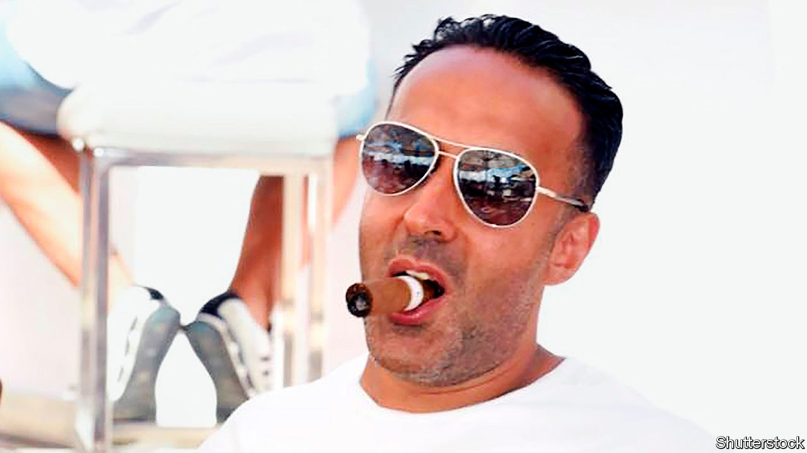

## Dirty money

# Britain’s new anti-corruption tool is proving useful—in certain cases

> Unexplained Wealth Orders force suspects to prove the legitimacy of their assets

> Oct 10th 2020

JUDGING BY HIS social-media posts, Mansoor Mahmood Hussain (pictured) was a successful businessman whose shrewd property deals allowed him to enjoy a lavish lifestyle, which included collecting high-performance cars and hobnobbing at VIP parties with the likes of Beyoncé and Simon Cowell. Investigators looking into criminal gangs in the north of England reached a different conclusion: they suspected Leeds-based Mr Hussain of being a major money-launderer who had helped gangsters, including Mohammed Nisar “Meggy” Khan, a convicted murderer, rinse tens of millions of pounds.

Despite intelligence linking Mr Hussain to organised crime, the National Crime Agency (NCA) struggled to gather the exhaustive evidence needed to bring money-laundering charges. So it turned to a newish legal tool called an Unexplained Wealth Order (UWO). This turns the tables on those suspected of buying assets with dirty money, forcing them to open their books and prove their wealth came from legitimate sources. Mr Hussain has agreed to hand over 45 properties worth £10m ($12.9m). He could yet face a criminal investigation.

The NCA says the result is a “significant” step forward for UWOs, which Britain introduced in 2018. Ireland and Australia already had such provisions. It marks the first time a British case involving a UWO has led to assets being recovered. Criminal money-laundering cases are difficult to prosecute; money trails can be horribly tangled, making it hard to connect the loot to the original crime. The UWO process, administered under civil law, involves a lower burden of proof and puts the onus on the suspect to prove that their wealth was not ill-gotten.

When Britain’s crime-busters started wielding UWOs, anti-corruption campaigners hoped that they would be a powerful weapon against a different type of ne’er-do-well: dodgy “politically exposed persons”, or PEPs—such as kleptocrats and their associates from places like Russia, Central Asia and Africa—who plough corrupt foreign capital into swanky British properties. Such swag is largely responsible for the “London laundry” tag bestowed on the capital.

Here, however, the NCA has found the going tougher. Of the three other UWO cases brought so far, two have involved PEPs. The one that drew more attention was against Zamira Hajiyeva, the wife of a banker from Azerbaijan: £22m-worth of assets, including a London mansion, were frozen. Ms Hajiyeva lost an appeal, but the case grinds on. The other case, involving properties owned by the daughter and grandson of Nursultan Nazarbayev, the former president of Kazakhstan, was thrown out in June. The court found that the NCA had not provided sufficient evidence that the use of offshore entities to hold assets suggested financial shenanigans rather than being for legitimate reasons, such as privacy or legal tax mitigation, says Jonah Anderson of White & Case, a law firm.

Cases against PEPs were never going to be easy. They have plenty of money to hire the best lawyers, and many offshore structures are impenetrable. UWOs may prove more useful in domestic-crime cases than those involving international corruption. Gangsters beware.■

## URL

https://www.economist.com/britain/2020/10/10/britains-new-anti-corruption-tool-is-proving-useful-in-certain-cases
