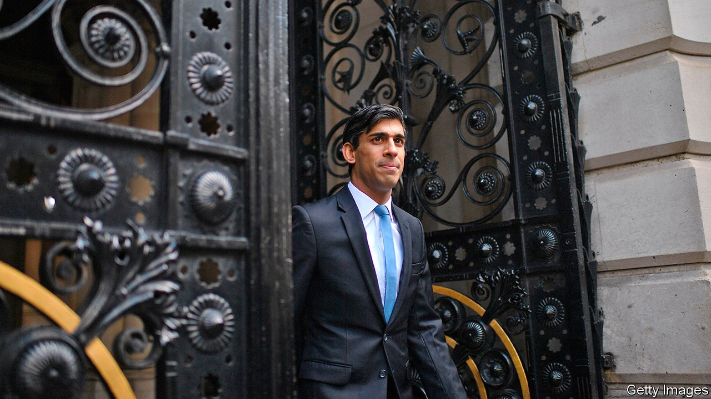
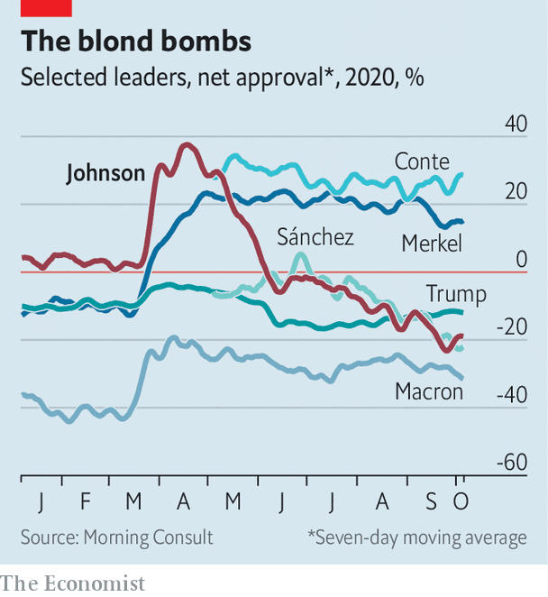
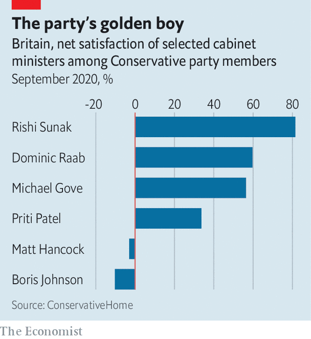

## The Treasury

# The rise of Rishi Sunak

> The chancellor of the exchequer is more popular than his boss. Winter could change that

> Oct 10th 2020

BEFORE HE WAS prime minister Boris Johnson used to enjoy himself at Conservative Party conferences upstaging his duller colleagues, whose jokes fell flat in half-empty halls. Light on substance but full of can-do optimism, his speeches imagined a Britain buzzing with new homes and futuristic energy sources. This year, there was no one to upstage, and no appreciative audience. The prime minister’s address was delivered from a recording studio. The content, though, was familiar: by 2030, he said, Britons would travel in zero-carbon jets and hydrogen-powered trains through a land of plentiful housing, thinner waistlines and racial harmony.

Given Britain’s present difficulties, this talk of sunlit uplands sounded hollow. In a survey by YouGov, a pollster, of how citizens of 22 countries think their government has managed by the pandemic, Britain bumps along at or near the bottom. Mr Johnson’s ratings have suffered in consequence (see chart).

Now Tories are looking to a new king across the water: Rishi Sunak, the chancellor of the exchequer. Not that a leadership challenge is brewing. MPs are grateful to Mr Johnson for the party’s electoral triumph last year. But there are growing doubts about his competence and about recent policy decisions. Many Tories believe that the government has recently erred too far in restricting people’s freedoms, a view that Mr Sunak has championed in cabinet.

A survey of party members by ConservativeHome, the party’s house website, before the conference, produced a damning result for the prime minister (see chart). Last month Ipsos MORI, a pollster, found that Mr Sunak has the highest satisfaction ratings for a chancellor since Denis Healey in 1978. Unlike his boss, he scores better than Sir Keir Starmer, the Labour leader, on most metrics. “Without him we are cream-crackered,” says a Tory.

Talk of rivalry has been fuelled by Mr Sunak’s attentiveness towards other MPs, who feel unloved by Number 10, and an advertising campaign which has seen his personal signature attached to Treasury policies, in the manner of a television chef’s cookware range. Mr Sunak sought to cool it in his brief conference speech, which hailed Mr Johnson’s “special and rare quality” as a communicator.

His rising stock is a reflection of Mr Johnson’s problems. The prime minister called rumours that he is still unwell after being hospitalised with covid-19 in April “seditious propaganda”. But in interviews he has struggled to recall details of regional lockdown regimes. His main domestic agendas—of levelling up Britain’s poor productivity and improving public services—lack policy content.

In many ways Mr Sunak is the opposite of Mr Johnson. To those who never liked or have tired of the prime minister’s personal style, that is part of the chancellor’s appeal. Where Mr Johnson is brimming with personality, Mr Sunak is bland. Where the prime minister is chaotic, the chancellor is perfectly organised, well briefed and pays close attention to detail. Where the prime minister is a mess, the chancellor is impeccably groomed.

He rose swiftly, becoming an MP in 2015 and chancellor in February, and has shown no appetite for ideological grandstanding. Many colleagues regard him as a truer Thatcherite than George Osborne or Philip Hammond, Tory predecessors, but he embraced trade union leaders in designing the wage-subsidy programme. He supported Brexit because he believes it will help Britain prosper, but refrains from bombastic Brussels-bashing. A Stanford graduate who has written pamphlets on how the Tories can reach ethnic minorities, he appeals to younger, liberal voters.

But his popularity springs mostly from his largesse. The Treasury will this year spend £192bn ($248bn) on responding to the crisis, including a furlough scheme for workers, business loans and restaurant subsidies. His face adorns adverts for discounted ales at JD Wetherspoon, a pub chain, which benefited from a sales-tax cut, under the banner “Sunak’s Specials”. These schemes used existing tax and payroll systems, so ran more smoothly than the error-prone test-and-trace programme. And the Treasury is the most competent department in government: if Mr Sunak is managing things well, that is partly thanks to the quality of the ministry he inherited.

It is easy to be popular when you are giving people money; harder when you have to take it away. This month Mr Sunak is replacing the furlough scheme with a much less generous wage-subsidy regime, and the prospects for the economy are deteriorating. Tighter restrictions have hit consumer spending, and summer’s recovery seems to be petering out. Unemployment is forecast to hit 8.3% by year-end. As joblessness rises, the chancellor will come under pressure to increase universal credit, the main unemployment benefit.

He may not be inclined to. He used his conference speech to argue that, once Britain is through the worst of the pandemic, it will need to deal with its vast pile of borrowing. If the Tories argue “that we can simply borrow our way out of any hole,” he asked, “what is the point of us?” Since Mr Johnson is keen to maintain a high level of public services, Mr Sunak will either have to fight the prime minister or raise taxes.

“Hard choices are everywhere,” Mr Sunak added. He is beginning to make some. The popularity he has won so easily will soon be tested.■

## URL

https://www.economist.com/britain/2020/10/10/the-rise-of-rishi-sunak
