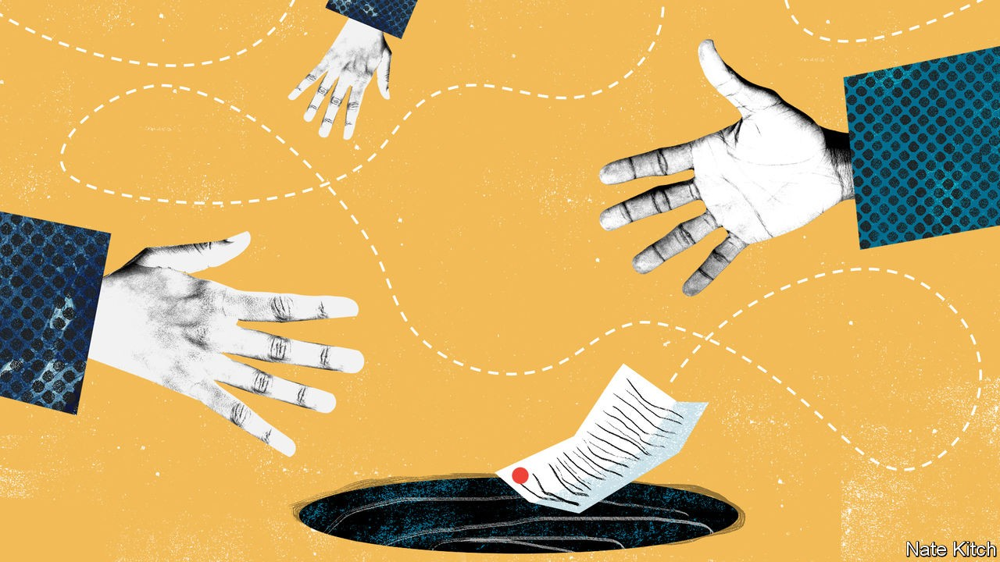

## Brexit talks

# Will Britain's deadline for a trade deal with the EU be met?

> The mid-October cut-off could prove soft

> Oct 10th 2020

EARLY LAST month Boris Johnson proposed a deadline of October 15th for a free-trade deal with the European Union. If missed, both sides should “accept that and move on”. Yet he and the European Commission’s president, Ursula von der Leyen, decided on October 3rd to intensify trade talks, even though nobody now expects a deal next week. The EU similarly fixed a deadline of September 30th for Britain to scrap clauses in its internal-market bill to override the Northern Ireland provisions in January’s withdrawal treaty. Yet that date has passed and, although the EU has initiated legal action, negotiations continue.

What is going on, and do deadlines not matter? The answer to the first question is that, although both sides see the other as unreasonably intransigent, and the EU is genuinely angry about Britain’s plan to breach international law by rewriting the withdrawal treaty, nobody wants to be responsible for breaking off talks. Moreover, even as big gaps remain over fisheries, state aid and dispute settlement, both prefer a deal to no deal. Hence the curious choreography: keep talking at all costs, and avoid any blame for walking out.

The answer to the second question is that most deadlines are soft. But December 31st, the end of the standstill transition period, is far harder. Working backwards, it leaves very little time for a deal. The documentation runs to hundreds of pages, all needing translation and legal cleansing, and it must be approved by the European Parliament and national governments. As Mujtaba Rahman of the Eurasia consulting group says, this always made the end of October or early November a more serious deadline, after which the risk of no deal hugely increases.

But not inevitable—which is why the talks continue. Recently Britain has even seemed more optimistic than the EU, perhaps to redirect blame for any failure. It should be possible to sort out state aid by putting in place a strictly monitored British regime to police it. And it would be preposterous to allow fisheries, which account for barely 0.1% of GDP, to block a deal. Yet Mr Johnson’s unilateral changes to the withdrawal treaty have undermined trust. His supposed need for a safe fallback if there is no deal is absurd, as the Northern Ireland provisions were included precisely to avoid a hard border in Ireland in such circumstances.

The clauses could yet be removed during the bill’s parliamentary progress. And Mr Johnson may offer last-minute concessions to the EU, as he did last autumn to secure the withdrawal treaty. But his team insists concessions must come from the EU, not Britain. And Mr Johnson repeated this week that Britain could “more than live with” an Australia-type outcome, his euphemism for no trade deal, rather than the Canada-style free-trade deal it seeks. There are certainly people at the heart of his government who are relaxed about the prospect of no deal.

Yet the damage of a no-deal Brexit is clear. Modelling by the London School of Economics for the UK in a Changing Europe, a think-tank, finds that it would reduce GDP in ten years’ time by 8% from what it would otherwise be. But the modelling also says a Canadian free-trade deal would reduce GDP by around 4%. And in either case, short-term disruption would be large. The government admits that there may be queues of up to 7,000 lorries to cross the English channel, requiring a new system of truck permits to enter Kent as well as large parking areas. Other changes, such as the ending of pet passports and European health-insurance cards, will happen with or without a trade deal.

Here lies the psychological risk that may ultimately lead to no deal. Since annoying disruption is bound to happen in any case, it is harder for Mr Johnson to blame the EU if he has just agreed to a deal. But if no deal could plausibly be attributed to the EU’s pigheaded obstinacy, the blame game might just work. And that is why, even as talks continue amid optimistic briefings, no deal remains much more likely than is often appreciated.■

## URL

https://www.economist.com/britain/2020/10/10/will-britains-deadline-for-a-trade-deal-with-the-eu-be-met
