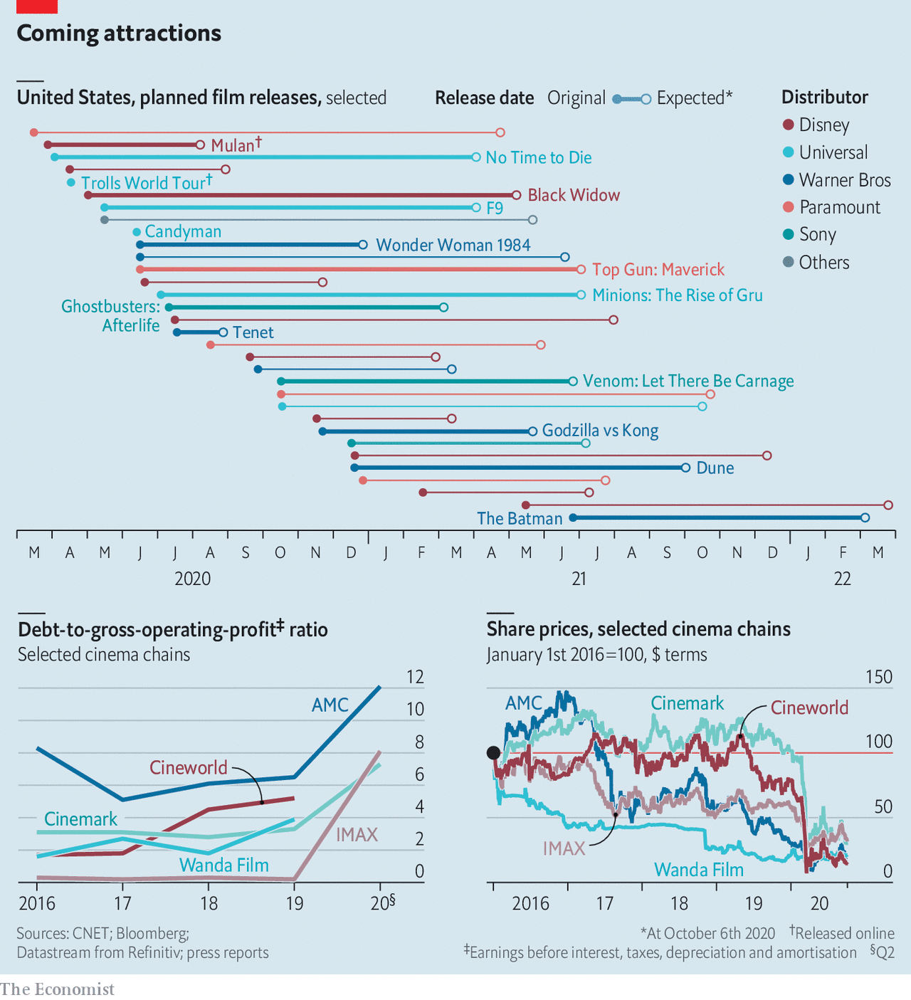

## Curtains

# As audiences gingerly return, cinemas face a new problem

> If Hollywood keeps postponing big releases, many theatre chains will struggle to survive

> Oct 6th 2020

IT IS TURNING out to be a long intermission. Cinemas across the West closed in March and, despite attempts to reopen in the summer, the box office has not recovered. From October 9th Cineworld, the world’s second-largest chain, will temporarily shut its 536 Regal theatres in America and its 127 British outlets. AMC, the biggest, will cut the opening hours at some Odeon cinemas in Britain.

Early in the pandemic the problem was audiences. In March Disney’s “Onward” flopped as people refused to breathe recirculated air with a crowd of strangers. Business got harder when governments ordered theatres to shut, or imposed profit-crushing closures of refreshment counters and caps on capacity.

As countries have eased restrictions and audiences prepared to return, cinemas are finding little to show them. In China, where covid-19 seems under control, studios have resumed pumping out hits. But Hollywood will not risk premiering costly blockbusters while many markets, including New York and California, remain closed, and cinema-goers wary. Most big titles have been postponed (see chart). The last straw for Cineworld was the decision on October 2nd by MGM and Universal Pictures to delay “No Time to Die”, James Bond’s latest caper, from November until April 2021. No big release is planned until Christmas Day, when Warner Bros’ “Wonder Woman 1984” will ride to the rescue.

She may be too late. Attendance was declining before covid-19. To distinguish a night at the movies from a night with Netflix, cinemas built snazzy multiplexes with waiters ferrying burgers to viewers lolling in reclining seats. This helped rack up debt: AMC’s $10bn-worth was more than six times last year’s gross operating profit. Cineworld’s ratio was almost as high.

Nine months without revenues from big releases would be disastrous. America’s National Association of Theatre Owners predicts that seven out of ten small or medium-sized cinema companies will go bust without a bail-out, which it has urged Congress to grant. Both AMC and Cineworld are likely to default or file for bankruptcy, believes Moody’s, a ratings agency;AMC could run out of cash by January. Share prices of Western operators have slumped this year, and are now worth a fifth as much as five years ago. (Chinese ones have done better.)

Cinema bosses have urged studios to keep the films coming. Eric Wold of B. Riley, an investment bank, says Hollywood may need to “take a hit to feed the industry” and keep it from “completely falling apart”. Warner Bros took one by releasing “Tenet” in the summer; with takings of just $45m at the American box office, the sci-fi thriller may not break even. And studios cannot afford charity. Disney recently laid off 28,000 workers from its covid-hit theme parks.

One day the blockbusters will return. Even then, cinemas will have to defer investments, raise prices and close branches to shore up their balance-sheets—just as viewers have more reasons than ever to stay home. The average American household subscribes to four streaming services, reckons Deloitte, a consultancy. Film studios are bargaining down how long films are shown exclusively in theatres; AMC recently let Universal put future releases online after just three weekends in cinemas, in return for a share of the takings. Even if covid-19 doesn’t smash it entirely, the big screen is likely to get a lot smaller.■

Editor’s note: Some of our covid-19 coverage is free for readers of The Economist Today, our daily [newsletter](https://www.economist.com/https://my.economist.com/user#newsletter). For more stories and our pandemic tracker, see our [hub](https://www.economist.com//news/2020/03/11/the-economists-coverage-of-the-coronavirus)

## URL

https://www.economist.com/business/2020/10/06/as-audiences-gingerly-return-cinemas-face-a-new-problem
