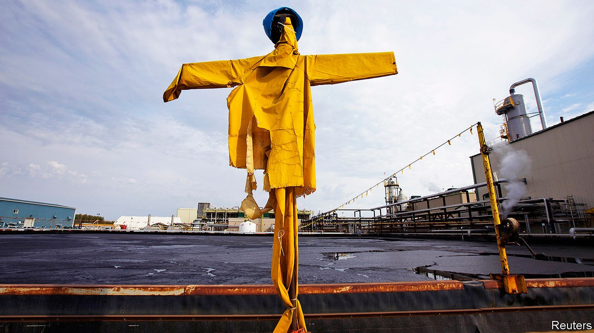

## Crude crutch

# Canadian oilmen drill the government for aid

> Finding oil looks like a doddle in comparison

> Oct 10th 2020

IN FRIGID WATERS 350km east of Newfoundland, the West White Rose project is designed to produce up to 75,000 barrels of oil a day. Whether it actually pumps a drop is a separate question. In September Husky Energy, its main backer, said it would review the investment and urged Canada’s government to take a direct stake. The province has since set new incentives for exploration and the federal government has announced C$320m ($240m) to support its energy sector. Yet Husky says West White Rose’s future remains in doubt.

This year’s implosion of oil prices has led companies to reconsider investments from Newfoundland to Nigeria. As capital has become scarce, some governments have taken action—for better or worse. Norway set new climate targets but also passed tax relief to encourage new drilling. In Canada, where an index of energy companies has shed more than half its value this year, the downturn has amplified long-standing questions about how the government can help—or whether it should.

Canada pumps more oil than anyone bar America, Saudi Arabia and Russia. But covid-19 caps a bumpy decade. American shale has offered fast, easy (if not always profitable) growth compared with Canada’s offshore projects or its mucky oil sands, where building mines and processing thick bitumen is both costly and carbon-intensive. Inadequate pipelines from Alberta, the industry hub, added further strain. Equinor of Norway, ConocoPhillips, an American major, and Royal Dutch Shell, an Anglo-Dutch one, sold their oil sands in 2016 and 2017. In February Teck Resources, based in Vancouver, scrapped plans for a large new project. The company cited capital constraints, opposition from indigenous groups and uncertain regulation.

Justin Trudeau, Canada’s prime minister since 2015, has coupled green ambition with a desire to avert the industry’s collapse. In his first term he passed a carbon tax. But he also backed the government’s purchase of the Trans Mountain pipeline from Kinder Morgan, an American firm, to bring oil from Alberta to the Pacific.

As the pandemic has battered Canadian oil firms, Mr Trudeau has tried to prop companies up without quite bailing them out. Measures include C$1.7bn to clean up abandoned wells and a national scheme to help all industries pay wages, more than C$1bn of which went to oil, gas, mining and quarrying firms. The C$320m earmarked for Newfoundland and Labrador aims to help oil producers reduce their emissions and invest in research and facilities.

Paul Barnes of the Canadian Association of Petroleum Producers, a trade group, welcomes the assistance for Newfoundland and Labrador. Whether it helps projects advance is another matter, he says.

Equinor is among those to delay plans for Canadian offshore drilling. In September Jason Kenney, Alberta’s premier from the opposition Conservative Party, blasted Mr Trudeau, a Liberal, for failing to offer more help. Mr Kenney maintains that Canada’s oil sector can thrive if only Mr Trudeau would let it (and, in a feat of rhetorical finesse, has argued the world will continue to depend on oil, not “unicorn farts”). In March Alberta took a C$1.5bn stake in TC Energy’s Keystone XL pipeline, to funnel crude from Alberta to refineries along America’s Gulf Coast, and backstopped the project with a $6bn loan guarantee.

Even generous aid would not spur rapid growth. Suncor, a giant Canadian producer, announced 2,000 lay-offs this month. Investors have little appetite for big projects. The sector won’t vanish; existing oil-sands endeavours can have operating costs as low as C$7 a barrel, says Mark Oberstoetter of Wood Mackenzie, a research firm. Beside fast-depleting American shale, oil sands’ steady output may look attractive, says Benny Wong of Morgan Stanley, a bank. Waterous Energy Fund, a private-equity firm that has bought more than half of the Canadian reserves sold in the past three years, has a simple strategy, says its boss, Adam Waterous: “Hold production flat and maximise sustainable free cashflow.” With or without government handouts. ■

## URL

https://www.economist.com/business/2020/10/10/canadian-oilmen-drill-the-government-for-aid
