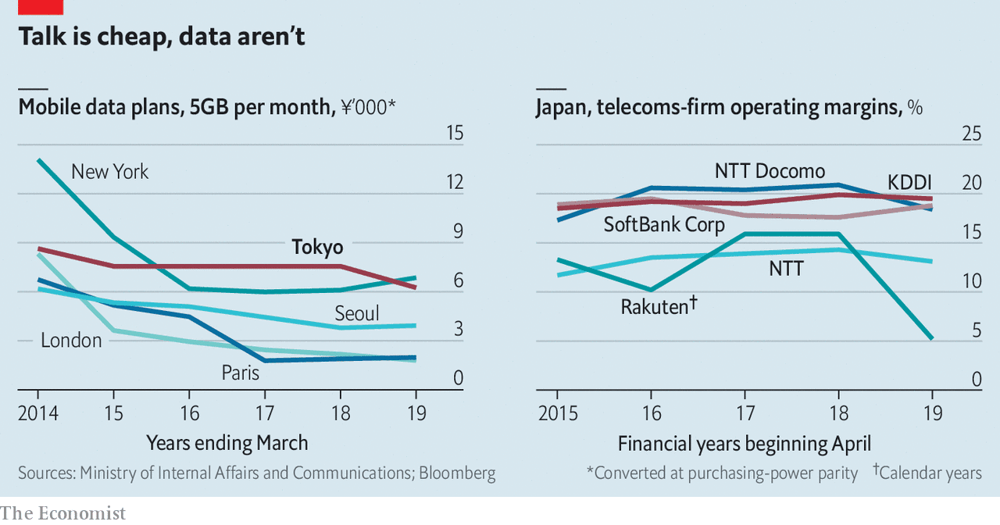

## Dialling down

# Japan’s cosy telecoms firms are being told to lower prices

> Rate cuts to bring prices for customers more in line with other developed markets will hurt margins

> Oct 10th 2020TOKYO

WHEN SUGA YOSHIHIDE emerged as the likeliest to succeed Abe Shinzo as Japan’s prime minister, telecoms bosses in Tokyo let out a collective groan. As Mr Abe’s chief cabinet secretary, Mr Suga urged operators to cut prices by as much as 40%. “They are using our public airwaves, an asset of the people,” he said in 2018. “They should not be generating excessive profit.” Since replacing Mr Abe last month, Mr Suga has made competition in mobile services a signature issue. The share prices of Japan’s three big carriers—NTT DoCoMo, SoftBank Corp and KDDI—fell by 10-15% between late August and late September. 

Mr Suga’s calls were also the soundtrack to a pair of blockbuster announcements. On September 29th Nippon Telegraph and Telephone (NTT) said it was taking NTT DoCoMo, its listed mobile subsidiary, private. The tender offer, of $40bn for the 34% of shares it does not already own, is Japan’s biggest ever. The next day Rakuten, a Japanese e-commerce giant with ambitions to shake up mobile telephony, launched its much-awaited 5G network. An entry-level plan costs ¥2,980 ($28) a month, about half as much as comparable offers from rivals. 

The government reckons that data-heavy users in Japan pay more than in other developed countries. For users of plans with 5GB of data, prices in Tokyo are three times higher than in Paris (see chart). Operators counter that users get what they pay for. Japanese networks consistently rate among the world’s best. The three big providers top the global rankings for 4G availability compiled by Opensignal, an analytics firm. Consumers have choice: SoftBank Corp and KDDI have their own budget brands, and myriad “mobile virtual network operators”, which piggyback on existing infrastructure, have cropped up in recent years, offering cheaper services. 

Yet the promise of bringing prices down offers the new prime minister a quick political win. “Most people have phones and most people think they are expensive,” says Yokota Hideaki of MM Research Institute, a consultancy. Such efforts have been under way for years. Back in 2015 Mr Abe argued that phone bills were a drag on household budgets. Legislation enacted last year capped subsidies on handsets and cracked down on contracts that made it difficult to switch providers. DoCoMo announced a round of price cuts that brought it closer to SoftBank’s and KDDI’s levels. 

The main tool for spurring competition was supposed to be Rakuten’s entry in the market, which Mr Suga encouraged under Mr Abe. The tech firm at last launched its cloud-based 4G network in April and its 5G service last month. That may put downward pressure on prices eventually. But Rakuten’s network coverage remains too patchy and its market share too small to spook the incumbents right away.

A bigger jolt may come from the spectre, raised by Mr Suga, of higher fees for mobile-spectrum use. (Japan awards its spectrum to operators based on merit, a nebulous concept, rather than auction.) NTT’s buy-out of DoCoMo, which was at least six months in the making, may make it easier to placate the prime minister. When he announced the deal, the company’s chief executive, Sawada Jun, said it would leave DoCoMo in “a more solid financial position so it will have capacity to carry out further price cuts”. SoftBank and KDDI have since said they, too, will consider cuts.

After being spun off from NTT in 1992, DoCoMo became a pioneer of mobile internet, launching i-mode, which allowed users to read email and browse the web, eight years before the iPhone was released. Yet the firm has slipped recently. Although DoCoMo has the largest market share of the three large carriers, with 37% to KDDI’s 28% and SoftBank’s 22%, its profits have fallen and a hacking scandal undermined an attempt to expand into fintech. NTT hopes that bringing it in-house will help speed up decision-making and unlock cost savings that will mollify minority shareholders angry about rate cuts. 

The reductions, when they come, are unlikely to be anywhere near the 40% Mr Suga once sought. “There will be pressure on pricing, but there won’t be massive step change in the industry,” reckons Kirk Boodry of Redex Holdings, an advisory firm. Cuts could be targeted at heavy data-users or low-earners. The reduced sales will only accelerate the mobile operators’ shift from providing connectivity towards other revenue streams, such as offering fintech products for consumers or cloud services for businesses, says Mr Boodry. Operators will focus on attracting customers to pricier 5G plans. With a cap on handset subsidies, competition will shift to network quality, argues Tsuruo Mitsunobu of Citigroup, a bank. That, he says, “is exactly what the government wants to see”. ■

## URL

https://www.economist.com/business/2020/10/10/japans-cosy-telecoms-firms-are-being-told-to-lower-prices
