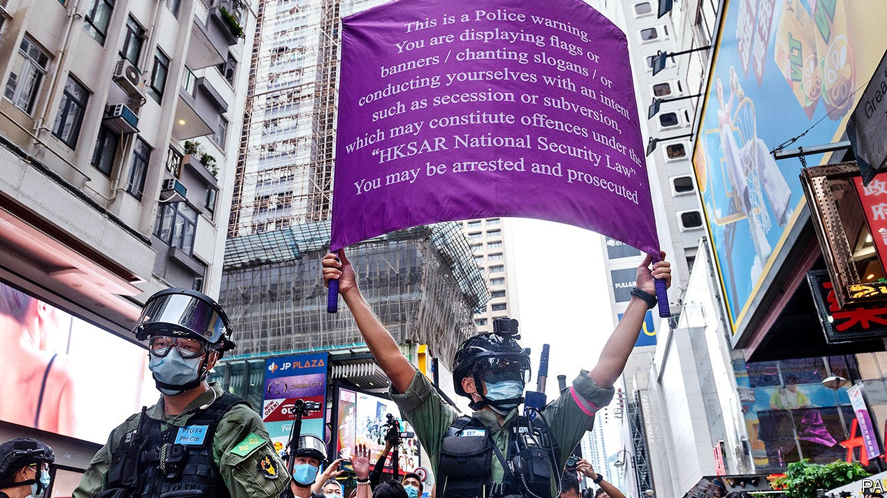

## Slow strangulation

# Hong Kong’s new security law is being applied sparingly, so far

> Pro-democracy campaigners should not feel relieved

> Oct 8th 2020HONG KONG

REMINDERS OF HONG KONG’s draconian new security law are everywhere. It is advertised on billboards and giant hoardings (“Restore stability,” they enjoin). During scattered protests on October 1st, China’s national day, Hong Kong’s police raised purple banners warning demonstrators that their slogans or flags may incur charges of secession or subversion under the act. Fear of it is everywhere, too. On the same day a year ago, hundreds of thousands of people joined unauthorised demonstrations calling for full democracy. Now only the very brave are prepared to protest without police approval.

Many of the activists involved in the unrest that swept Hong Kong for months last year are keeping their heads down. Some have been organising workshops to teach like-minded citizens how the mainland’s secret police work—the new law allows its state-security officers to operate in Hong Kong. Those attending include people working in NGOs that are likely to face scrutiny under the act (the law calls for strengthened “management” of foreign groups). They learn how to evade surveillance by using encrypted apps and VPNs and how to respond to questions by police—tactics that are second nature to dissidents on the mainland, but unfamiliar to many in once carefree Hong Kong.

Among those who were at the forefront of last year’s protests, alarm has risen since August 23rd, when Hong Kong’s police confirmed that their mainland counterparts had seized 12 people trying to flee the territory by boat. They had been intercepted in mainland waters, apparently on their way to Taiwan. At least one of them had been accused in Hong Kong of violating the security law (though he had not been formally charged). They are being held across the border in Shenzhen, where their treatment has been a chilling reminder of how mainland justice works. Officials have called them “separatists”. They are being denied family visits. They may use only state-appointed lawyers. “I don’t think anyone else will try to flee by boat now,” says a Hong Konger with several friends who have already escaped to Taiwan. “Our thinking now is that we would rather spend ten years in a Hong Kong jail than disappear into the mainland system.”

So far, however, the law has been sparingly applied. Hundreds of people have been arrested for protest-related offences since the central government in Beijing imposed the act on June 30th. They include Joshua Wong, one of Hong Kong’s most prominent activists. But the police have accused them of violating other statutes, not the security law. Mr Wong’s alleged crimes are joining an illegal gathering last year and ignoring a (pre-covid) ban on mask-wearing by protesters.

Only about 30 people have been arrested under the new law. Among them is Jimmy Lai, a media tycoon and outspoken champion of pro-democracy causes. He has been accused of collusion with foreign forces. But he has not (yet) been formally charged with that offence and is out on bail.

The only person who has been prosecuted is Tong Ying-kit. He has been charged with terrorism for allegedly ramming his motorcycle into three police officers, and with incitement to secession for flying a flag on the back of the bike with the words “Liberate Hong Kong, revolution of our times”—a slogan often used during last year’s protests. Mr Tong’s case is being argued in an open court “in a way that would be unimaginable under the mainland legal system”, says Danny Gittings, a legal scholar. There have been no reports of the new law being used against foreign firms.

But anti-government activists are right to be afraid. On September 30th Luo Huining, the mainland’s top official in Hong Kong, said the security law had ended what he called “savage” unrest. But were protests to flare up as they did last year, with demonstrators surrounding mainland-government offices and throwing stones and petrol bombs, the central government would surely urge more sweeping use of the new act. Under it, Mr Luo has been appointed as a national-security “adviser” to Hong Kong’s government. In effect, that means he calls the shots on such matters.

It is clear already that mainland officials are frustrated with the way some of Hong Kong’s prosecutors and judges have been handling cases involving protesters. Since the unrest began in June 2019, more than 10,000 people have been arrested in connection with it. But only around 20% of them have been formally charged (Hong Kong’s post-colonial constitution, the Basic Law, says that decisions on whether to prosecute must be “free from any interference”). Communist Party-controlled newspapers in Hong Kong frequently complain about charges being dropped or sentences being too light. They blame “yellow” influence in the legal apparatus, referring to the symbolic colour of the protest movement.

To ensure that protesters charged under the old laws are dealt with as harshly as possible, pro-Communist politicians have been demanding “legal reform”. They want the government to set up a sentencing committee, which would set clearer guidelines for how specific crimes should be punished. They also want a “special court” set up to handle cases involving rioting and to guarantee they are fast-tracked.

The national-security law may have shattered the notion of Hong Kong being run according to a framework of “one country, two systems”. But it is not yet the case that every wish of mainland officials is immediately acted on in the territory. On September 23rd Hong Kong’s chief justice, Geoffrey Ma, issued a lengthy statement in defence of the territory’s legal system. “There must not be a politicisation of the judiciary and its functions,” he wrote. Pro-Communist media and politicians grumbled that he had dodged their demands.

Worryingly, debate has flared up over how independent the judiciary should be. In August it emerged that new editions of school textbooks would not refer to a “separation of powers” between the judiciary, executive and legislature in Hong Kong. The territory’s chief executive, Carrie Lam, defended this, insisting that Hong Kong was “executive-led”—even though Mr Ma himself had said in 2014 that the Basic Law “sets out clearly the principle” that there should be such a separation.

Public anxiety was fuelled last month by the resignation of an Australian judge, James Spigelman, from Hong Kong’s Court of Final Appeal. Mr Spigelman, one of 14 foreign judges who sit on the territory’s highest court, said his decision was “related to the content of the national-security legislation”. He has not elaborated.

As a bellwether of how robust Hong Kong’s judiciary remains, all eyes will be on the case of Mr Lai, the media entrepreneur currently on bail. Mr Lai has been a thorn in the side of the Communist Party since it massacred protesters in Beijing in 1989. His newspaper, Apple Daily, is one of Hong Kong’s biggest-selling and among the most critical of the party. “I’m not sure what is going to happen,” says Mr Lai. But he has no doubt that the party “will decide how to treat me based on what is most politically expedient for them”. Few in Hong Kong are in much doubt of that either. ■

## URL

https://www.economist.com/china/2020/10/08/hong-kongs-new-security-law-is-being-applied-sparingly-so-far
