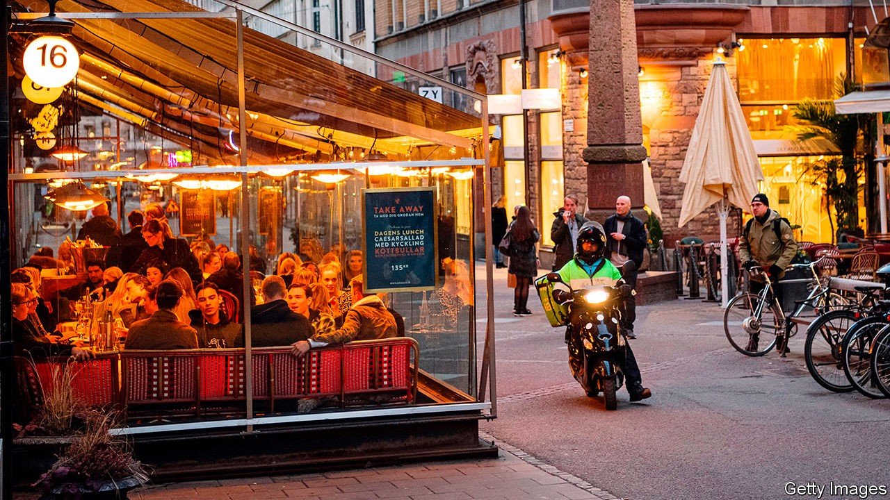
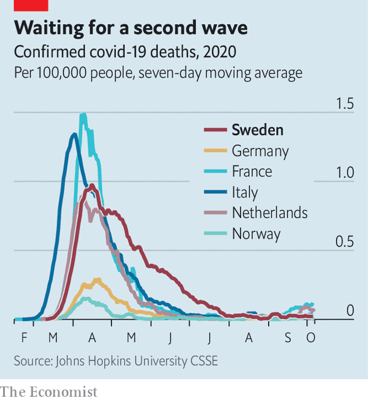

## Europe’s odd man out

# How Sweden hopes to prevent a second wave of covid-19

> A lot more tracing is expected

> Oct 10th 2020STOCKHOLM

ON A CRISP October evening the tables outside Stockholm’s trendy bars and restaurants sit empty. Inside, most tables are full. As life moves indoors in the coming months, covid-19 cases will inevitably rise, says Johan Carlson, head of Sweden’s public-health agency. Case numbers are already creeping up, though not as steeply as they did in the spring, and more slowly than in much of Europe. In response, Sweden is starting to ramp up contact-tracing and quarantining—but in ways that, once again, set it apart.

When the pandemic rolled into Europe in March, Sweden stood out by not locking down. Life did not carry on entirely as normal: universities and schools for children over 16 switched to online learning (though they have now reopened); gatherings of more than 50 were banned and people were asked to work from home. Those over 70 were urged to self-isolate. But child care and schools for younger pupils stayed open, as did gyms, bars and restaurants (with some restrictions to reduce the mixing of patrons). The goal, as in other countries, was fewer contacts between people and protecting the most vulnerable. But the means were less draconian.

Though social life did not grind to a halt, for most of the spring and summer the footfall at workplaces and on public transport was 20-30% lower than before the pandemic. But in recent weeks offices have been busier, which may be partly why cases are up. Shopping and going out (excluding to parks) also fell by 20-30% in the spring, but have since been back to normal.

On protecting the elderly, however, Sweden failed. Its covid-19 death rate per person is one of the highest in Europe, and ten times that of Norway and Finland. As in other countries, about half of Sweden’s deaths were in care homes. A public investigation is looking into what went wrong. An early mistake in some municipalities was to ban care workers from wearing masks and gloves, on the grounds that the people they cared for might feel offended.

Beyond care homes, covid-19 has hit ethnic minorities particularly hard. At the cemetery in Sodertalje, a small city near Stockholm that is home to many immigrants, most of the fresh graves hold people who had roots in Syria. Almost all died of covid-19, says Nuri Kino, an activist and journalist. Michel Varli, who runs a restaurant in Sodertalje, calls the first week of April a “catastrophe”. Ambulances were coming and going all day, he says. “Every family around here had someone.”

Covid-19 spread in some immigrant communities unexpectedly fast and early, says Anders Tegnell, the country’s chief epidemiologist. Six of Stockholm’s first ten covid deaths were Swedish Somalis. Official guidance reached immigrant groups too late. Before the ban on large gatherings, funerals with hundreds of guests were the norm—and the source of some early outbreaks. The Sunday service at one of the Syrian Orthodox cathedrals in Sodertalje would draw about 500 people. Households with eight to ten people and three generations under the same roof are common among immigrants. And the elderly in these tight-knit communities have busy social lives. Mr Varli, who has ten siblings, says that before covid his mother would usually see her children and grandchildren every week. She is a lot more cautious now.

By the end of the summer, Sweden’s epidemic subsided without a need for new measures. Covid-19 wards have emptied; the virus is no longer spreading widely. Dr Tegnell says that, based on various studies that test for antibodies, the best guess is that about 20% of Swedes have been infected and so are presumed to be immune, though the rate varies a lot even between parts of Stockholm. This level of immunity is, by itself, not enough to stop the virus. But combined with social-distancing and hygiene measures, it brought Sweden’s first wave to an end.

To prevent a second wave, Sweden is putting new measures into the mix. It recently resumed contact-tracing and quarantining, backed up by an expanded testing capacity. In most of Europe, strict 14-day quarantines are slapped on all contacts of infected people and anyone who travels to some parts of Europe. Sweden’s quarantine, however, is for seven days and only for those who live with an infected person. If a test on day five is negative, the quarantine can end then. Children with no symptoms are exempt from quarantine. All other contacts are simply alerted that they may be infected. They are urged to work from home for a week, to get tested if they have even the slightest symptoms in the next 14 days, and to be extra careful about seeing elderly relatives in that period.

The World Health Organisation bristles at quarantines shorter than 14 days. But the Swedish approach is to have measures that people can live with for at least a year, says Dr Carlson, because there is no vaccine yet. The goal is to stop as much transmission as possible without unduly disrupting people’s lives, especially in ways that harm their mental or physical (not to mention economic) health. Transmission happens most easily within households, and people are most contagious in the first week after they are infected. So Sweden’s quarantine policy could stop the bulk of covid’s spread—as long as people comply.

They probably will. A cash payment is available for quarantined people who cannot work from home, such as taxi drivers. The government pays for antibody tests for anyone who wants one. A positive antibody test exempts you from quarantine and the hassle of getting tested for covid if you have a cold or flu-like sniffle. All these measures look a lot laxer than the other systems across Europe. But whether by doing less Sweden ends up achieving more will become clear only in the next few months. ■

Editor’s note: Some of our covid-19 coverage is free for readers of The Economist Today, our daily [newsletter](https://www.economist.com/https://my.economist.com/user#newsletter). For more stories and our pandemic tracker, see our [hub](https://www.economist.com//news/2020/03/11/the-economists-coverage-of-the-coronavirus)

## URL

https://www.economist.com/europe/2020/10/10/how-sweden-hopes-to-prevent-a-second-wave-of-covid-19
