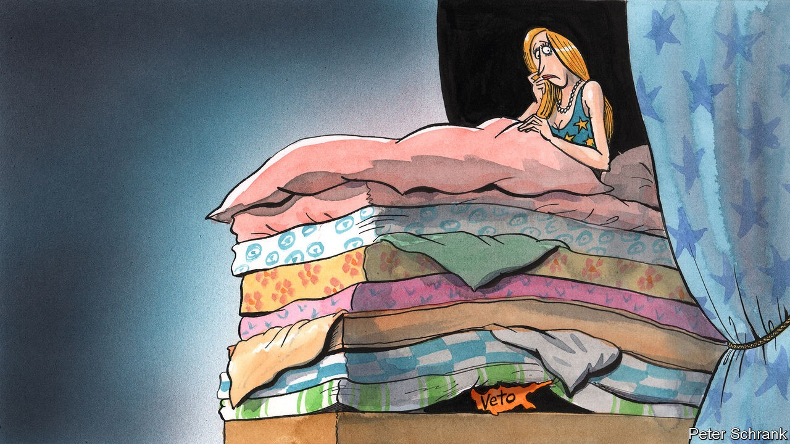

## Charlemagne

# Scrapping vetoes won’t help European foreign policy

> The EU should heed the lesson of “The Princess and the Pea”

> Oct 10th 2020

HANS CHRISTIAN ANDERSEN’S story of “The Princess and the Pea” is not on the reading list of many foreign-policy wonks. Perhaps it should be. In the Danish fairy tale, a pea is secretly placed beneath a stack of mattresses on a young lady’s bed. She finds the tiny bump horribly uncomfortable, thus proving herself to be a princess. It is a surprisingly relevant lesson for the EU. The bloc sees itself as a superpower, but when it comes to foreign policy it sometimes behaves like a dainty princess. A single objection from even a pea-sized state is enough to scupper its plans.

So it was when Cyprus, the third-smallest EU country in population and a rounding error in terms of GDP, became a one-country obstacle to sanctions against the Belarusian authorities. Unless the EU agreed to sanctions on Turkey for menacing Cypriot waters, the island would refuse to back similar measures on Belarus. A bloc with designs on being a global actor was held back from flexing its muscle at a country next-door by one of its smallest members. Senior EU wallahs despaired. “Our credibility is at stake,” declared Josep Borrell, the EU’s foreign-policy chief. As in Andersen’s telling, small discomfort led to late-night strife: it was only during an EU leaders’ summit that dragged on past midnight—the most auspicious hour in any fairy tale—that Cyprus backed down.

The Cypriot last stand renewed calls for the EU to switch to qualified majority voting on foreign-policy issues. This would allow countries representing 55% of all member states and two-thirds of the EU’s population to ram through any policy. Mr Borrell is a fan of the idea, as is Ursula von der Leyen, the European Commission’s president. They have a compelling case. How can the EU face up to China or America if countries representing a fraction of its citizens are able to stymie its ability to act? Imagine American foreign policy if, say, Delaware were able to veto the actions of the federal government. In a world without vetoes, the likes of Cyprus would no longer be able to hold others to ransom. Remove the pea, they argue, and Europe can proceed undisturbed.

Scrapping such vetoes would be a big shift. They loom large in the EU’s history. Charles de Gaulle, the former French president, spent the 1960s blocking things he did not like (such as the entry of Britain). A compromise emerged whereby national capitals would not throw their weight around, unless they felt their vital interests were threatened. In a club of half a dozen, allowing each country to scupper a policy made some sense. Now the EU is a cumbersome body of 27 sovereign countries. On most topics, such as the workaday issues of governing the single market, vetoes have been replaced by “qualified majority” voting. About 80% of EU laws are passed this way. But on controversial topics, such as tax, trade deals and foreign policy, unanimity is still required.

Removing these powers, though, would be a mistake. Critics of vetoes fall back on comforting fairy tales. In their telling, with no vetoes a beefier foreign policy is possible. This is naive. Foreign policy is difficult for the EU precisely because countries do not agree on fundamental issues. Whereas France takes an aggressive approach on Turkey, Germany has been doveish. Russia is seen as a potential ally in France, a business opportunity in Germany but a threat in Poland and the Baltic states. Hammering together a cohesive foreign policy on one of these topics, then forcing it through via a majority, is a recipe for rows. The fairy tale is alluring because Brussels is good at procedure. But procedure does not resolve political disputes, points out Nicolai von Ondarza from the German Institute for International and Security Affairs (SWP).

Nor is there a guarantee of a happily-ever-after with qualified majority voting. It can backfire. In 2015 EU countries pushed through a decision to relocate refugees against the wishes of Hungary, the Czech Republic and Slovakia. Their response was simple: they ignored it. EU leaders made a gentlemen’s agreement not to force such measures through in this way again. Consensus is far more comfortable for diplomats, and for good reason. In the kaleidoscopic world of EU politics, any country can find itself in the minority on a particular issue. Overrule a fellow EU member state one week, and you may find your own country overruled the next. In some years as many as 90% of decisions are passed without a single vote against, according to figures from SWP.

The power of vetoes to make or break the EU is overstated. They tend to delay decisions rather than stop them. Last year Emmanuel Macron, France’s president, halted the accession process to the EU of North Macedonia and Albania. But after a few months of largely procedural fiddling, both countries were allowed to take the next step towards membership. When David Cameron vetoed a fiscal treaty at the height of the euro-zone crisis, some legal gymnastics allowed fellow EU leaders to bypass the British blockade. Even Cyprus’s last stand delayed the EU’s sanctions on Belarus (in any case rather puny) by only a few weeks.

Vetoes have their uses, too. Charles Michel, the European Council president, is right when he argues that unanimity breeds legitimacy, which is vital for the EU’s still fledgling foreign policy. An American state can swallow disagreements in a way that the EU’s sovereign members cannot. It may lead to lowest-common-denominator policies, but this is better than ambitious ones that are ignored. Overriding Cyprus’s wishes would be one thing, but a foreign policy without the backing of, say, France, now the bloc’s sole global hard power, would be preposterous. The veto is the weapon of last resort for small countries, who make up the bulk of EU member states. If Cyprus is steamrollered on Turkey, then Estonia may fear that its interests will be overlooked on Russia. Its occasional use does little to blow the EU off course, while reassuring national capitals that their existential concerns will never be trampled beneath majority rule. Like a pea, a veto causes brief discomfort. But the EU is not a fairy-tale princess. It can cope. ■

## URL

https://www.economist.com/europe/2020/10/10/scrapping-vetoes-wont-help-european-foreign-policy
