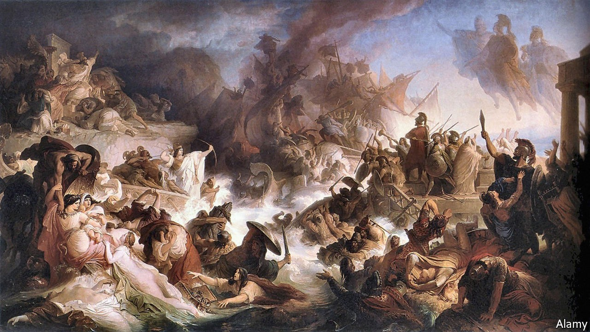

## Sun, sea and naval history

# Why tourists shun Salamis, site of a great sea-battle

> 2,500 years ago a small Greek fleet thrashed a huge Persian one. Holidaymakers don’t care

> Oct 10th 2020

PEOPLE ON SALAMIS hoped that their hilly island would be on the tourist map this year. It is the 2,500th anniversary of one of the greatest naval battles of the ancient world. In the early autumn of 480BC, in the strait between Salamis and the mainland, a few hundred Greek triremes (warships with three banks of oars and bronze battering-rams) defeated a much larger Persian armada.

It was an unexpected triumph. Xerxes, the Persian king, was so confident of victory that he erected a throne from which to enjoy it, on a slope overlooking the sea. To his horror, the agile Greek fleet sank 200 lumbering Persian vessels, and lost only 40 of its own. Xerxes “counted them at break of day—/And when the sun set, where were they?” crowed Lord Byron, an English poet, 2,300 years later. The victory opened the way for Athens, which led the Greek fleet, to become Europe’s first superpower. A Hollywood film in 2014 portrayed the Greek sailors as perfectly sculpted hunks (and annoyed modern Iranians with its cartoonish depiction of the Persians).

Yet still the tourists do not come to Salamis. Covid-19 scuttled plans for a big celebration. Tourist visits to Greece fell by around 75% this summer. Only a few history buffs came to view the battle site. “It’s been a big disappointment,” says Georgios Panagopoulos, the mayor.

There are other reasons why Salamis has never become a tourist destination. It is host to a naval base, so parts of the island are off-limits. It is also close to Perama, a scruffy port surrounded by small ship-repair yards. And there is not much to see, apart from two modern bronze statues of warriors on a low mound, the supposed burial place of sailors killed in the battle. Nearby, noisy hammering comes from a large shed beside a pier. A rusty ship is moored alongside. A 50-year-old shipyard on the island’s Kynousoura peninsula is still in business, despite four government rulings since 2010 declaring the area a protected archaeological zone.

This year the environment ministry fast-tracked a new 15-year licence for the yard, whose owner, say islanders, has powerful connections. Clientelism is hard to crack in Greece, but Mr Panagopoulos, a newish mayor, says “We’ll do our utmost to get this yard shut down.” If he clears it, they may come. Greeks have beaten tougher odds before.

## URL

https://www.economist.com/europe/2020/10/10/why-tourists-shun-salamis-site-of-a-great-sea-battle
