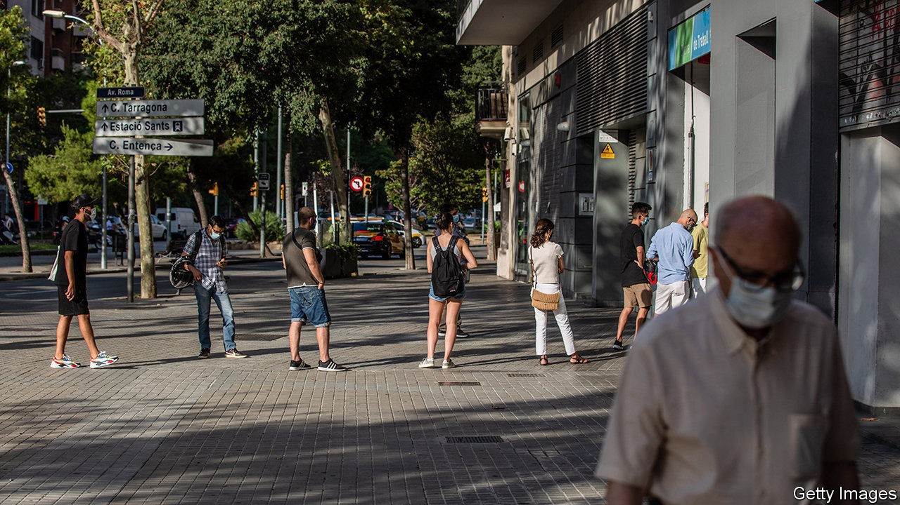
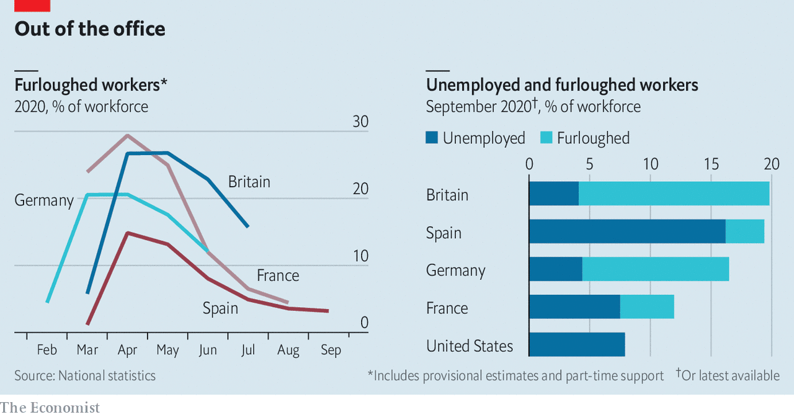

## Pain relief

# Are Europe’s furlough schemes winding down?

> Nearly 9% of workers are still on the schemes, down from 20% in April

> Oct 8th 2020

SO IMPRESSIVE IS Germany’s trading prowess that when the coronavirus pandemic struck, it even found something new to export: its short-time working scheme, or Kurzarbeit. Most OECD countries deployed such programmes this year, as they sought to avert mass unemployment and support workers’ incomes during lockdowns. Those that had never had them, such as Britain, imported the idea wholesale. Others, such as Spain, drastically expanded access to existing programmes. America, however, went in another direction, preferring to increase the generosity of unemployment benefits.

In April more than 26m workers in Britain, France, Germany and Spain were on furlough schemes, equivalent to a fifth of the workforce (see chart). While America’s unemployment rate swelled from just over 3% in February to 14.7% in April, in Europe it barely budged.

A few months on, how has the picture changed? In the big four countries nearly 11m workers were still on job-retention schemes in the summer, or 9% of the workforce. The numbers have fallen dramatically in France and Spain. By contrast, 15% of British workers were still furloughed in July, according to official data, a fifth of whom worked in the hospitality industry. A survey of employers suggests the share of furloughed workers fell to 11% in August.

The furlough schemes were intended to freeze the labour market in place, covering the cost of workers so that bosses facing a temporary cash crunch during shutdowns did not have to sack them, and allowing for seamless recovery once economies reopened. Most people coming off the schemes indeed seem to have resumed work. Unemployment rates have edged up only a little as the number on short-time working schemes has fallen. Workforce participation has so far fallen very slightly, suggesting few were discouraged enough to leave the labour market altogether.

Despite these successes, though, about 11m workers are still waiting to resume their normal working hours. The longer they are furloughed, the more likely it is that normality is not restored. Yet they have little incentive to find other work. In June economists at Allianz, an insurer, reckoned that up to 9m furloughed jobs in industries such as tourism and hospitality in Europe may be eventually culled.

This suggests that the true unemployment rate in Europe is probably higher than official figures suggest. As an upper bound, if you were to assume that all of those still on furlough schemes are in fact out of a job, unemployment rates in the big four would rise to 12-20%. America’s rate, in contrast, has gone in the opposite direction, falling from its peak in April to just below 8% in September. ■

Editor’s note: Some of our covid-19 coverage is free for readers of The Economist Today, our daily [newsletter](https://www.economist.com/https://my.economist.com/user#newsletter). For more stories and our pandemic tracker, see our [hub](https://www.economist.com//news/2020/03/11/the-economists-coverage-of-the-coronavirus)

## URL

https://www.economist.com/finance-and-economics/2020/10/08/are-europes-furlough-schemes-winding-down
