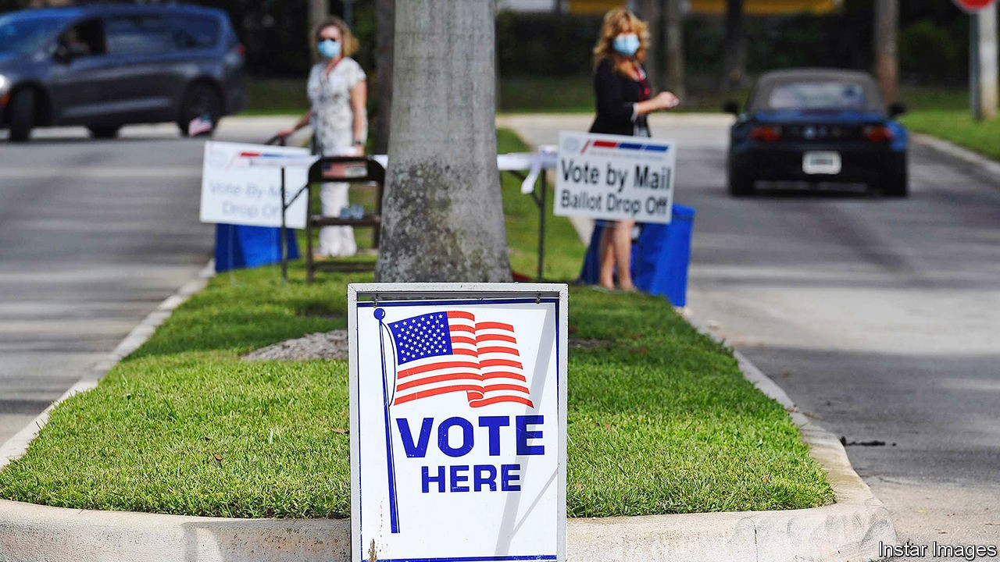
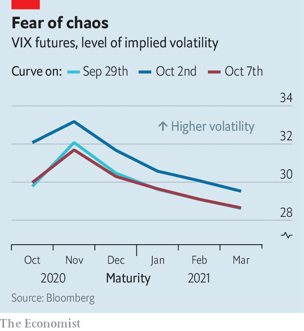

## Braced for impact

# How investors are hedging against possible election chaos in America

> They were once betting on a contested outcome. That has changed

> Oct 10th 2020NEW YORK

ELECTION YEARS are not often the best times for stockmarket investors. Over the past 90 years shares included in the S&P 500, an index of America’s biggest firms, have returned an average of about 8.5% a year. The twelve months leading up to each of the 22 presidential elections in that time have been leaner affairs, returning just 6%. Investors tend not to care whether the victorious candidate is Democratic or Republican, but they do like familiarity—returns are a shade higher in years when incumbents are returned to office. The democratic cycle, for all its virtues, tends to bring with it a dose of uncertainty—first about who will win and then about what that victor will do. And uncertainty tends to make financiers nervous.

These jitters are most easily observed in VIX futures, derivatives that measure the level of volatility in stocks. Because periods of very high volatility are correlated with plunging share prices, VIX futures are often traded by investors as an insurance policy against losses in the S&P 500. Because there is usually more potential for volatility over longer time horizons, longer-dated VIX futures tend to be more expensive. They also tend to be dearer around uncertain events that are likely to prompt volatility, such as elections or even important central-bank meetings.

Investors appear to be especially keen on downside protection around this election. In September Cameron Crise, a strategist at Bloomberg, wrote that VIX futures markets have “never had an event risk command this sort of premium”. Even more unusually, VIX futures prices are elevated not just around the date of the election, but for the months between the vote on November 3rd and the inauguration on January 21st (see chart).

There are plenty of reasons for investors to worry about post-election chaos: the coronavirus pandemic means an enormous number of voters will opt to avoid crowded polling stations this year and send their ballots in by post instead. These votes can take longer to count, raising the prospect of a period without a clear winner. Even once a victor is declared, a slew of lawsuits may follow. The uncertainty is exacerbated by President Donald Trump’s suggestion that postal ballots may be fraudulent, and his reluctance to say that he will accept the election result.

The nearest guide to market reaction in such a situation would be to look at the contest between Al Gore and George Bush in 2000, which was too close to call on election day and involved recounts and lawsuits. Markets dropped by 1.6% the day after the election as it became clear there was no decisive winner. The S&P 500 sank by more than 8% by the end of the year—though at least some of that probably reflects the beginnings of the dotcom bust.

A happier scenario for investors—and citizens more broadly—would see a clear victor emerging on election day. And it may be that investors have begun to think this has become more likely than they did mere days ago. Though the news that Mr Trump had been diagnosed with covid-19 sent VIX futures higher on October 2nd, by the 7th futures maturing in November, December and January had dropped below the level they had reached after the first presidential debate on September 29th. That might be thanks to a flurry of polls putting Joe Biden, Mr Trump’s Democratic challenger, even further ahead. As the campaign moves into the home straight, investors are betting on less, rather than more, chaos. ■

## URL

https://www.economist.com/finance-and-economics/2020/10/10/how-investors-are-hedging-against-possible-election-chaos-in-america
