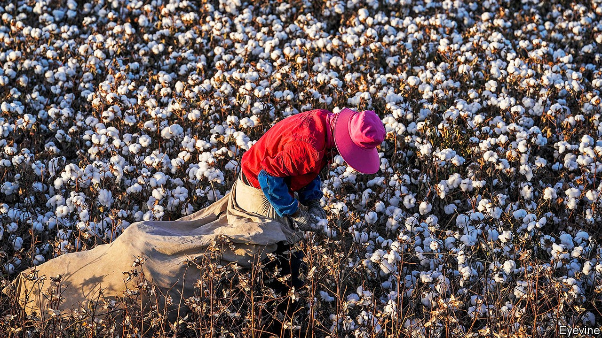

## Working to rule

# How trade is being used to enforce labour standards

> Both America and the EU are toughening up

> Oct 10th 2020WASHINGTON, DC

EVEN ARDENT free traders have their limits. Most would agree, for example, on the odiousness of imports made with slave labour. They could also sniff at stuff made by children, or workers unable to join a union of their choice. And yet, as one person’s labour protections are another’s protectionism, baking such standards into the global trading rules has proven impossible. Increasingly, though, America and the European Union (EU) are toughening up on their own.

This year America has added new rules to the books, and tightened enforcement of existing ones. It has applied 12 “withhold release orders” (WROs) mostly on products from China on the grounds that they had been made with forced labour in Xinjiang. These allow customs agents to seize suspicious shipments; in order to secure their entry into the country, companies must prove that the goods have not been made with forced labour.

The USMCA, America’s deal with Canada and Mexico, which was implemented on July 1st, also builds in opportunities for enforcement. All signatories must enact bans on imports made with forced labour—Canada introduced its version in March. The deal also sets out a swathe of labour reforms for Mexico to implement. And a new “rapid-response mechanism” allows for independent experts to assess whether factory workers have been denied the right to organise—and if they have, for targeted trade restrictions to be used.

The EU has mostly worked to enforce already existing rules. At a hearing on October 8th it accused South Korea of breaking the labour rules agreed in their bilateral trade deal. In August it raised tariffs on imports from Cambodia, in response to human- and labour-rights violations. And more action seems likely. It has appointed a chief enforcement officer, who will make lodging such complaints easier. At his confirmation hearing on October 2nd Valdis Dombrovskis, the EU’s new trade commissioner, said that he would be willing to explore “conditioning tariffs on certain sustainability outcomes” in future deals.

Past experience suggests that there are limits to how far such measures will spread, and how effective they can be. Poorer countries tend to be reluctant to sign up to them, complaining that they are an affront to their sovereignty, and a ruse to neutralise their comparative advantage. Companies despise them too, for undermining the certainty trade deals are supposed to generate. Moreover, if rich countries write the rules too broadly, their own labour practices might come under scrutiny. American negotiators have long been wary of that happening—which is why the USMCA’s rapid-response mechanism requires complaints against America to be made domestically first.

Overly harsh action also risks unwarranted supply-chain disruption. Earlier this year American customs agents mulled a WRO on all cotton imported from Xinjiang, which could have affected billions of dollars’ worth of imports. But the opacity of supply chains means that such a measure would probably have ended up banning some fairly produced stuff, too. The idea is reportedly undergoing legal analysis.

Still, the activist trend is here to stay. On September 22nd America’s House of Representatives passed a bill that would force customs authorities to apply the broader WRO (though it is unlikely to get Senate approval). Joe Biden, America’s Democratic nominee for president, has pledged both to enforce labour standards and to require provisions in future trade deals. The EU is planning to oblige companies to be transparent about their supply chains.

What of the charge that all this reflects an onslaught of protectionism? It is difficult to see how the actions so far could bring jobs back to America or Europe, where wages are much higher than in the countries their measures typically target. And although there may be scope for enforcement tools to be applied too broadly, there are certainly legitimate reasons to suspect that imports from Xinjiang are made with forced labour.

Within the USMCA, the process of coaxing evidence from workers afraid of retaliation is hard enough that a wave of frivolous cases seems unlikely. Although the AFL-CIO, an American union of unions, was hoping to file a case against a Mexican producer by the end of September, it did not, partly because the pandemic made gathering evidence harder. “We want to bring a strong case to start off with,” says Eric Gottwald of the AFL-CIO. Some rules, and their limits, are still to be tested.■

## URL

https://www.economist.com/finance-and-economics/2020/10/10/how-trade-is-being-used-to-enforce-labour-standards
