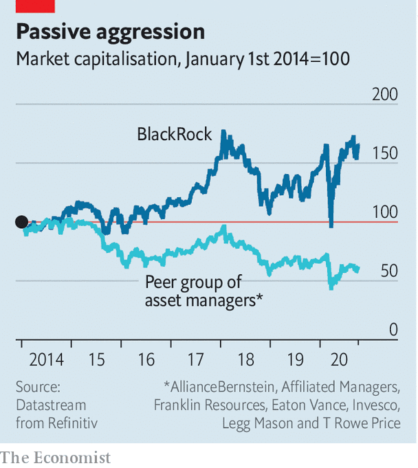

## Buttonwood

# What takeovers of fund managers tell you about markets

> Trian, an activist hedge fund, has taken stakes in two asset managers. It has mergers on its mind

> Oct 8th 2020

MARTIN AMIS, a novelist, was once asked why he preferred roll-ups to ready-made cigarettes. “It’s simply the best burn available,” he replied. In finance, a roll-up is a strategy of buying lots of small companies in the same industry and combining them into a big one. A big firm can cut costs by reaping economies of scale—in marketing or IT, say, or in negotiations with suppliers. The markets are attracted to the glow. They often assign big companies a higher valuation than small ones.

Could a roll-up work in fund management? The question is often asked, only to be dismissed: you would have to be unusually daring (or smoking roll-ups of the jazz variety) to consider taking on such a challenge. So a few eyebrows were raised when it emerged last week that Trian, a hedge fund led by Nelson Peltz, a veteran agitator for corporate change, had taken stakes of almost 10% in two asset managers, Invesco and Janus Henderson. Asset management is undergoing significant change, noted Trian in its regulatory filings. Firms with scale and a breadth of products are better placed to succeed. So Trian has in mind “certain strategic combinations” to generate value from its newly acquired stakes.

Both Invesco and Janus Henderson are the product of recent industry mergers. Were Trian to act as broker to a merger between them, the result would look awfully like a roll-up. If so, it is a bold gambit. But it is one that is telling about the state of the industry, and the markets more broadly. The pressures in fund management come from two familiar sources. The first is lower expected returns. Long-term interest rates in both nominal and real terms have been declining steadily for four decades. They took a decisive fall after the global financial crisis of 2007-09. The pandemic has postponed any prospect of a revival. The value of many assets has risen in lock-step with the fall in real interest rates. Share prices in America have rarely been higher relative to company earnings. Since fund-management companies charge a fixed fee on the stock of the assets they manage, a stockmarket boom is a boon to current revenues. But higher valuations today mean lower expected returns tomorrow. And that translates into a gloomier outlook for asset managers in general.

The second factor is the growth of low-cost index investing. An index fund holds shares in proportion to its constituents’ market capitalisation. Trading costs are negligible. The fund buys shares when they qualify for the index and sells those that drop out. The market for large-capitalisation stocks is liquid enough to absorb any sales or purchases without moving prices whenever index funds need to match inflows or redemptions. There are powerful economies of scale in index investing, which is why just three firms—BlackRock, Vanguard and State Street—have come to dominate it. The marginal cost of running a bigger fund is trivial: it simply requires a bit more computing power. There are no expensive portfolio managers. So management fees are low—just a few basis points.

You can see the effect in the diverging path of share prices (see chart). Conditions seem ripe for an industry roll-up. Scale seems to be an advantage; there are plenty of target firms to buy; and the prices of many firms have become more attractive. “A lot of midsized players are now priced for ripping out costs,” as one industry bigwig rather brutally puts it.

As anyone who has fiddled with a tobacco pouch and papers can attest, the results of a roll-up are not always great. For a start, there are the problems that bedevil any biggish merger: clashes of business culture; incompatible IT systems; mutinous staff; and so on. It is far from easy to find savings in asset management, where the biggest cost is people. And the industry’s main problem is growth. For the past half decade, the flow of new business has gone to index funds, much of it to the Big Three. Active managers have suffered outflows. Their business is steadily shrinking. Drawn-out mergers often make the outflows even worse. New clients may stay away while a tie-up is pending. And bigness is not itself a very distinctive capability. The index giants are already working that particular corner.

Yet for all the pitfalls, there is something almost inevitable about a fund-management roll-up. The scale economies of index investing create excess capacity. Mergers are a way to reduce it. Like the tobacco version, industry roll-ups are messy. You can be easily burned. But if you need a fix, you’ll try it—if only because there are no alternatives around.

## URL

https://www.economist.com/finance-and-economics/2020/10/08/what-takeovers-of-fund-managers-tell-you-about-markets
