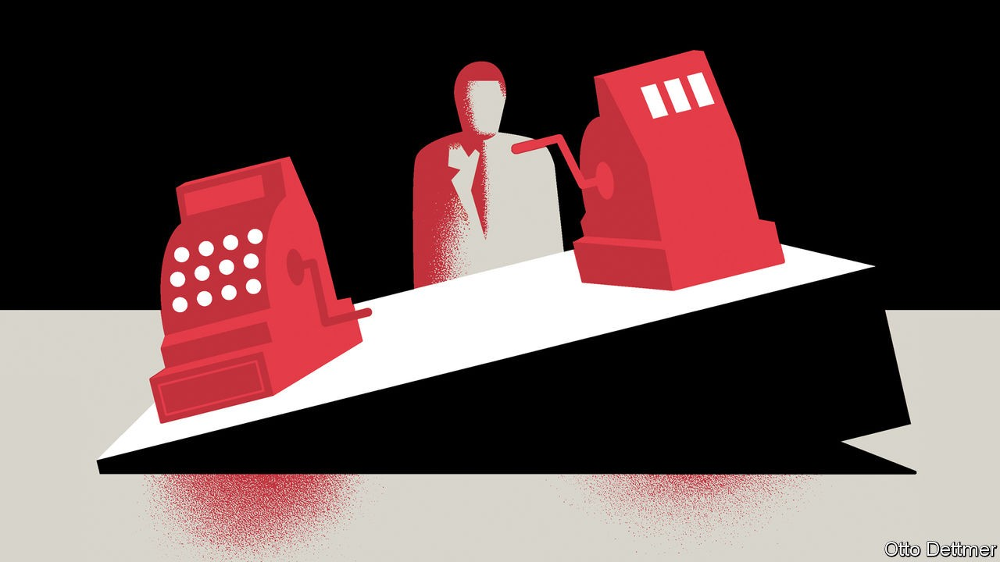

## Free exchange

# Why trade imbalances are a worry during a global downturn

> Monetary policy begins to look more like a zero-sum game

> Oct 10th 2020

LIKE OTHER crises before it, covid-19 seems destined to accentuate troublesome features of the world economy. Take global imbalances. Though these were briefly suppressed when the pandemic first struck, they have now rebounded. America recorded its largest trade deficit in 14 years in August, despite having gone from being a big importer of oil to a net exporter in that time. Its goods deficit is neatly matched by a resurgent surplus in China. Temporary factors, such as a surge in China’s exports of personal-protective equipment, are partly to blame. But there is reason to worry that these fault lines will persist, adding a dangerous element to an already fraught global policy environment.

Global imbalances reached a modern peak just before the onset of the financial crisis of 2007-09, when the absolute sum of countries’ current-account surpluses and deficits amounted to over 5% of world GDP. Current-account gaps were pushed wider in part by what economists called the “global saving glut”, the result of soaring oil prices, and precautionary saving by emerging-economy governments prepared for sudden reversals in global risk appetites. Gaps eased in the decade after the crisis as oil prices fell and China edged towards rebalancing its economy. Yet on the eve of the pandemic, imbalances still remained at about 3% of global GDP, roughly one-and-a-half times the level common in the early 1990s. And yawning trade gaps have since opened up in some places. America’s current-account deficit, which stood at 2% of GDP at the end of 2019, had leapt to 3.5% of GDP six months later. China’s current-account balance went from a surplus of 1.1% of GDP in late 2019 to a deficit in the first quarter of 2020, before flipping back to a surplus of 3.1% of GDP in the second.

Current-account gaps are not inherently bad. A developing economy in need of investment, for instance, might consume more than it produces for a time as it builds up its productive capacity—and the wherewithal to repay accumulated foreign obligations in future. But in some cases they can be a source of crisis, if they reflect a build-up of financial vulnerabilities. And, most pertinently for the global economy today, in times of depressed demand they are particularly problematic. Economies run current-account surpluses when they produce more than they consume. When there is plenty of global demand to go around, this is at most a minor inconvenience for deficit economies, which enjoy more consumption than their domestic productive capacity alone would allow. When demand is scarce, however, surplus countries siphon off spending power from trading partners when they have precious little to spare.

In a paper published in 2015, Ricardo Caballero of the Massachusetts Institute of Technology, Pierre-Olivier Gourinchas of the University of California, Berkeley, and Emmanuel Farhi, then also of Berkeley, described this effect. The authors frame their argument in terms of the demand for safe assets. Globally, every surplus must be matched by a deficit, and saving in one place must be met by borrowing elsewhere. Surplus countries save by buying foreign government bonds. When global interest rates are well above zero, these purchases simply push interest rates down, inducing deficit countries to borrow and spend more. When interest rates drop to zero, however, this channel stops working, as rates cannot fall much further. Instead, the offsetting rise in borrowing in deficit countries must come through squeezed incomes—a recession.

Since the financial crisis, interest rates across the rich world have been near zero, with a few brief exceptions. And parts of the emerging world have edged closer to the low-rate quagmire this year. In these circumstances, fiscal expansion—which increases the global stock of government bonds—is an effective way to boost growth, both within the stimulating country and beyond. America’s large current-account deficit partly reflects strong consumption, supported by stimulus, of goods produced at home and abroad. But decisions about monetary easing become more fraught. Part of the boost, especially at low rates, comes from currency depreciation, which helps exporters grab a larger share of trading partners’ spending. In the 1930s, countries on the losing end of such demand grabs put up tariff barriers, leading to escalating protectionism and the breakdown of global trade.

Today, bold fiscal stimulus could spare the world this fate. But governments are already less free-spending than they were in the spring. On October 6th President Donald Trump ended talks on a new round of stimulus. The day before, Rishi Sunak, Britain’s chancellor of the exchequer, spoke of the need to get public finances under control. If fiscal stimulus is scaled back, that leaves monetary easing looking increasingly zero-sum. A doveish tweak to the Federal Reserve’s strategy in August contributed to a decline in the dollar against the euro, exacerbating a deflation problem in Europe. For its part, America is putting some surplus countries in the cross-hairs. On October 2nd it opened an investigation into currency manipulation by Vietnam. Rapid growth in the foreign-exchange reserves of a number of surplus Asian economies suggests that governments are intervening to depress their currencies, reckons Brad Setser of the Council on Foreign Relations, a think-tank. American scrutiny of China might also intensify if imbalances stay wide. Though the dollar has fallen against the yuan by around 5% since May, some evidence suggests that China has acted on the sly to slow the pace of its currency’s appreciation.

The trade spats of recent years were in many ways a delayed reaction to earlier economic grudges, inflamed by persistent imbalances. Had the global expansion continued, they might have fizzled out. Instead, the world finds itself bound once more by the harsh realities of depression economics. If they are not defused by enlightened self-interest and co-operation, imbalances could easily become the basis for debilitating economic conflict. ■

## URL

https://www.economist.com/finance-and-economics/2020/10/10/why-trade-imbalances-are-a-worry-during-a-global-downturn
