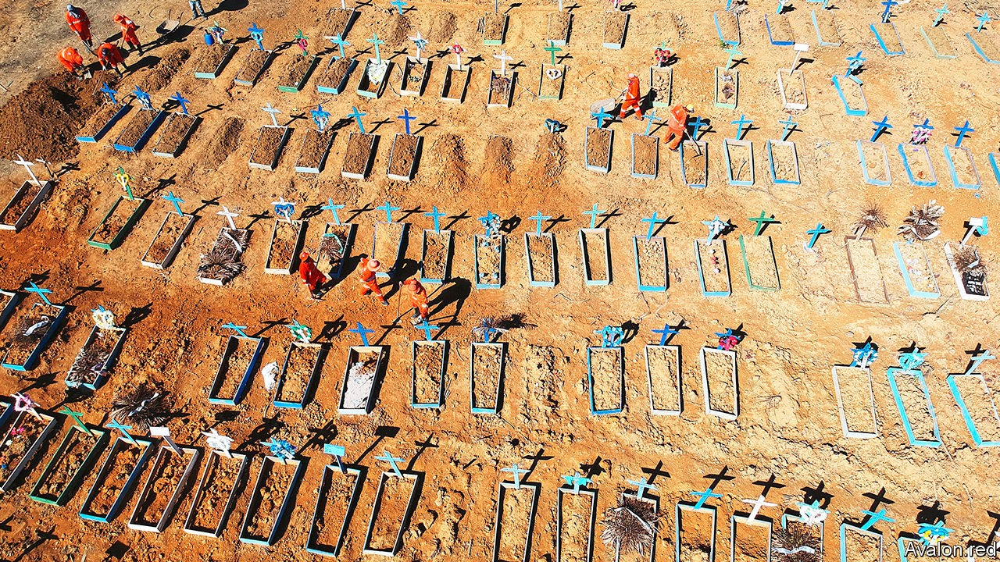

## Terminal verbosity

# Covid-19 is helping wealthy countries talk about death

> Amid mass mortality, a taboo is fading

> Oct 10th 2020

UNTIL THIS year many New Yorkers had never heard of Hart Island, where the city’s unclaimed dead are buried. Then, in the midst of the pandemic, video of contractors digging long trenches there went viral. Around 120 bodies were sent to the tiny islet every week, as burial grounds and crematoriums struggled to keep pace with covid-19. One funeral home in Brooklyn was sued for stacking bodies in an unrefrigerated rental truck. At the peak of the epidemic Sal Farenga, an undertaker in the Bronx, was doing three times as many funerals as usual and turning away 50 grieving families a day. “It was heartbreaking,” Mr Farenga says.

Covid-19 has caused more than a million recorded deaths, most not in developing countries like Brazil (pictured) but in developed ones. That cuts against a long-standing trend. Since the second world war, wealthy states have had few massive episodes of premature fatality. Their cultures have tended to push mortality out of sight, into hospitals and out of polite conversation. Now, the pandemic is nudging people in the rich world to adopt the open and pragmatic approaches to death that are more typical in developing countries, where poverty, poor health care, dangerous roads and armed conflict keep people on familiar terms with the grim reaper.

A new survey by Hospice UK, a charity, found that this year 40% of British who lost a family member to covid-19 wrote down their end-of-life wishes, and a third planned their own funerals. (Overall, less than a fifth of Britons have done either.) More people are opting to die at home: since early June the percentage has been 30-40 points above the five-year average in England and Wales. Reminders of the epidemic—not just news reports but masks and hand-sanitiser bottles—raise the subliminal awareness of death which psychologists term “mortality salience”. “We are surrounded by death whether we like it or not, and it is healthier for us to accept it,” says Tracey Bleakley, head of Hospice UK.

In many ways, rich countries are reverting to old habits. Until the 20th century early death was common in America and Europe. In Victorian Britain families dressed up their departed and posed with them for photographs. An old saw had it that the front room (now the venue of TV dinners) was used for two things: a visit from the queen or laying out a body. But the first world war and the influenza pandemic of 1918-20 left the public exhausted by loss, and an industry emerged to take it off their hands. “I don’t think the public was aware of how [completely] death would be taken away from families and homes,” says Caitlin Doughty, a mortician and advocate for the “death positive” movement, which promotes discussion of it.

In the rich world today, bereavement has been professionalised, medicalised and sanitised. Many youngsters—especially well-off ones—have never seen a corpse. Only 30% of Americans and 25% of Britons die at home. Most pass away in hospitals or nursing homes, where friends and relatives see less of them in their final days. Distance breeds squeamishness. In a recent poll 90% of Germans said most people don’t know how to act around someone who is dying.

The pandemic has helped people to get over such shyness. Susan Barsky Reid launched the Death Café in 2011, organising meetups between strangers over cake and tea (and more recently over Zoom) to discuss everything from estate planning to theories of the afterlife. The number of events has shot up this year. “You don’t get pregnant by talking about sex and you don’t die by talking about death,” she says, but many people think it bad luck. Indeed, it took the pandemic to nudge Ms Barsky Reid herself to broach the topic of end-of-life wishes with her husband.

Such conversations are, literally, morbid. But talking about death can help the old and sick feel less anxious. Frank conversations about end-of-life wishes avert conflict by letting loved ones know whether a patient would want to be taken to hospital or put on a ventilator. Demand for help making a will, advance statement or lasting power of attorney has shot up. Ian Bond, head of will-writing services at Britain’s Law Society, says not just the elderly but medics and young people are calling on his services. “Everyone wants to be remembered for the person they are and not the mess they left behind,” says Mr Bond.

Among medical professionals, the epidemic has accelerated a movement towards helping patients face up to the possibility of death. Ariadne Labs, a research group in Boston, published a conversation guide in April instructing clinicians to tell their patients that not everyone survives the virus, and to ask them about end-of-life decisions. The toolkit lays out the big questions. Whom do you trust to take medical decisions on your behalf? Which abilities are so important to your life that you can’t imagine living without them? It has been downloaded by 9,000 people.

Massachusetts General Hospital, also in Boston, began training doctors in 2017 to have such conversations and document them in patients’ files. In April and May alone the hospital recorded 5,100 conversations, two-thirds as many as the total up to then. “It is mortality salience that allows clinicians, patients and families to get over the emotional barriers,” says Vicki Jackson, head of the hospital’s palliative care and geriatric medicine division.

Even before covid-19, people in the rich world were wondering whether the end of life had to be a clinical experience. In 2017 more people in America died at home than in hospitals for the first time since the early 20th century. The epidemic has reinforced that trend. Many people shun hospitals and care homes for fear of catching the virus or contributing to pressure on health services. Strict rules around visits by loved ones have made patients more reluctant to spend their final days in institutions.

None of this is new in developing countries, where lots of people die at home and cultural taboos on discussing death are often nonexistent. The Acholi people of northern Uganda make little effort to keep death out of sight: village elders meet to discuss support for the family, and the tombstones of ancestors buried on the family homestead are important markers of land ownership. Indeed, one reason counting fatalities from covid-19 is difficult in poor countries is that so many victims die in their own houses. A study of cancer patients in 2015 found almost 60% of deaths in Mexico occurred at home, compared with 12% in South Korea. In some places the issue is access to health care, in others it is simply custom.

For the Tana Torajans in Indonesia the home is deathbed and funeral parlour. Saba Mairi’ recalls losing her grandfather when she was 11. Her family kept his body in a room next to the kitchen, offering him rice and water at mealtimes. Even after the funeral five years later the family did not say goodbye. Following Torajan tradition, they periodically fetch mummified bodies from their tombs, clean them, dress them in new clothes and throw a party. “For us,” says Ms Saba, now 36, “they are still family members and we love them.”

Some traditional practices had already been modernising before the pandemic, though not necessarily in the direction of Western modesty. As incomes have risen in northern Uganda, families have begun using professional funeral services rather than doing the job themselves, sometimes printing T-shirts with the face of the deceased. In Ghana modern families routinely place deceased relatives in deep-freezers for months or years while they save up money for the funeral, a celebratory occasion which can last for days.

Yet in some parts of the developing world, covid-19 may be sparking a secular turn. In the Middle East places of worship have been spurned as hotspots of contagion. Mourning has moved online, where religious authorities have less reach. Such is the anger at Iran’s ruling clerics for their botched handling of the pandemic that mourners are posting poetry rather than scripture. “Please no religious recitations,” requested one family in the Iranian city of Shiraz. “The nurse became more holy than the imam,” says Hamed Abdel-Samad, an Egyptian-born lecturer in Islamic studies living in Germany.

In the West, ironically, the pandemic is threatening the traditional funeral industry. America’s National Funeral Directors Association (NFDA) says cremation rates have risen, partly because some regulators banned burials for victims of covid-19 in case corpses carry the virus. This furthers a decades-long shift that squeezes the industry’s profitability. In 2015 cremations overtook burials as the most common form of funeral in America. They typically cost around $5,150 with all the extras, compared with $7,640 to go six feet under.

Adding to undertakers’ woes are limits on large gatherings. NFDA members say families are postponing memorials. They have started offering live-streaming options, but those reduce in-person guest lists. That could stick when the virus passes: impious mourners tend to stage simpler ceremonies, and the share of Americans who think it very important to have a religious funeral fell from 50% in 2012 to 35% in 2019.

Lately, those seeking less old-fashioned burial methods have been flocking to a lush forest 45 minutes outside Frankfurt. The woodland, popular with picnicking families, is also a funeral ground where youcan have your ashes buried in biodegradable urns. Alexa Drebes, a local ranger, had to double the number of tours she ran last month. The pandemic, she says, has made people of all ages more conscious of death.

Even for those not talking about it, reminders of the epidemic are everywhere. That has provided a natural experiment for researchers of a psychological notion called Terror Management Theory. This holds that it is the awareness of mortality which sets humans apart from other animals. Researchers find that as the crisis goes on Americans agree more with traditional gender stereotypes such as that men should be brave and that women should be clean, perhaps reflecting a need for certainties in the face of death. (They also think a consciousness of human ephemerality may foster boozing and snacking.)

Yet acknowledging mortality doesn’t have to be depressing. A Bhutanese saying has it that contemplating death five times a day brings happiness. With that in mind, an app called WeCroak sends its users five daily quotations reminding them of their own impermanence. In a pandemic, such an app may seem redundant. But if covid-19 forces people in the rich world to start thinking and talking about death in a more candid, practical way, it will have achieved something that doctors, lawyers, morticians and psychologists have been struggling to do for decades.■

## URL

https://www.economist.com/international/2020/10/10/covid-19-is-helping-wealthy-countries-talk-about-death
