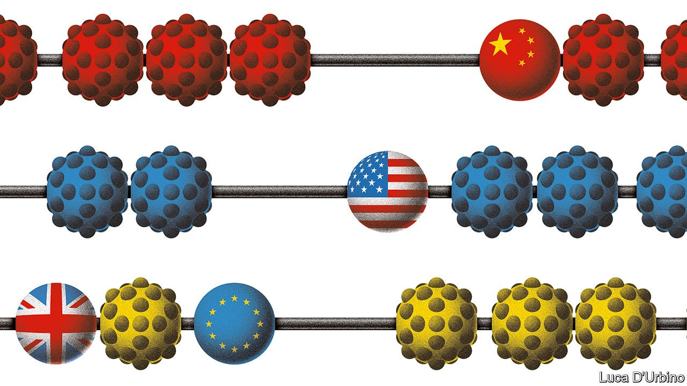

## Winners and losers

# The pandemic has caused the world’s economies to diverge

> But its long-term impact will be even more far-reaching

> Oct 8th 2020

Editor’s note: Some of our covid-19 coverage is free for readers of The Economist Today, our daily [newsletter](https://www.economist.com/https://my.economist.com/user#newsletter). For more stories and our pandemic tracker, see our [hub](https://www.economist.com//news/2020/03/11/the-economists-coverage-of-the-coronavirus)

IN FEBRUARY THE coronavirus pandemic struck the world economy with the biggest shock since the second world war. Lockdowns and a slump in consumer spending led to a labour-market implosion in which the equivalent of nearly 500m full-time jobs disappeared almost overnight. World trade shuddered as factories shut down and countries closed their borders. An even deeper economic catastrophe was avoided thanks only to unprecedented interventions in financial markets by central banks, government aid to workers and failing firms, and the expansion of budget deficits to near-wartime levels.

The crash was synchronised. As a recovery takes place, however, huge gaps between the performance of countries are opening up—which could yet recast the world’s economic order. By the end of next year, according to forecasts by the OECD, America’s economy will be the same size as it was in 2019 but China’s will be 10% larger. Europe will still languish beneath its pre-pandemic level of output and could do so for several years—a fate it may share with Japan, which is suffering a demographic squeeze. It is not just the biggest economic blocs that are growing at different speeds. In the second quarter of this year, according to UBS, a bank, the distribution of growth rates across 50 economies was at its widest for at least 40 years.

The variation is the result of differences between countries. Most important is the spread of the disease. China has all but stopped it while Europe, and perhaps soon America, is battling a costly second wave. Over the past week Paris has closed its bars and Madrid has gone into partial lockdown. In China, meanwhile, you can now down sambuca shots in nightclubs. Another difference is the pre-existing structure of economies. It is far easier to operate factories under social distancing than it is to run service-sector businesses that rely on face-to-face contact. Manufacturing makes up a bigger share of the economy in China than in any other big country. A third factor is the policy response. This is partly about size: America has injected more stimulus than Europe, including spending worth 12% of GDP and a 1.5 percentage point cut in short-term interest rates. But policy also includes how governments respond to the structural changes and creative destruction the pandemic is causing.

As our [special report](https://www.economist.com//special-report/2020/10/10/the-peril-and-the-promise) this week explains, these adjustments will be immense. The pandemic will leave economies less globalised, more digitised and less equal. As they cut risks in their supply chains and harness automation, manufacturers will bring production closer to home. As office workers continue to work in their kitchens and bedrooms for at least part of the week, lower-paid workers who previously toiled as waiters, cleaners and sales assistants will need to find new jobs in the suburbs. Until they do, they could face long spells of unemployment. In America permanent job losses are mounting even as the headline unemployment rate falls (see [article](https://www.economist.com//united-states/2020/10/08/the-reasons-behind-americas-new-wave-of-lay-offs)).

As more activity moves online, business will become more dominated by firms with the most advanced intellectual property and the biggest repositories of data; this year’s boom in technology stocks gives a sense of what is coming, as does the digital surge in the banking industry (see our [leader](https://www.economist.com//leaders/2020/10/08/ant-group-and-fintech-come-of-age) on Ant Group). And low real interest rates will keep asset prices high even if economies remain weak. This will widen the gulf between Wall Street and Main Street that emerged after the global financial crisis and which has worsened this year. The challenge for democratic governments will be to adapt to all these changes while maintaining popular consent for their policies and for free markets.

That is not a concern for China, which so far seems to be emerging from the pandemic strongest—at least in the short run. Its economy has bounced back quickly. Later this month its leaders will agree on a new five-year plan which emphasises Xi Jinping’s model of high-tech state capitalism and increasing self-sufficiency. Yet the virus has exposed longer-term flaws in China’s economic apparatus. It has no safety-net worth the name and this year had to focus its stimulus on firms and infrastructure investment rather than shoring up household incomes. And in the long run its system of surveillance and state control, which made brutal lockdowns possible, is likely to impede the diffuse decision-making and free movement of people and ideas that sustain innovation and raise living standards.

Europe is the laggard. Its response to the pandemic risks ossifying economies there, rather than letting them adjust. In its five biggest economies, 5% of the labour force remains on short-work schemes in which the government pays them to await the return of jobs or hours that may never come back (see [article](https://www.economist.com//finance-and-economics/2020/10/08/are-europes-furlough-schemes-winding-down)). In Britain the proportion is twice as high. Across the continent, suspended bankruptcy rules, tacit forbearance by banks and a flood of discretionary state aid risk prolonging the life of zombie firms that should be allowed to fail. This is all the more worrying given that, before the crisis, France and Germany were already embracing an industrial policy that promoted national champions. If Europe sees the pandemic as a further reason to nurture a cosy relationship between government and incumbent businesses, its long-term relative decline could accelerate.

The question-mark is America. For much of the year it got the policy balance roughly right. It provided a more generous safety-net for the jobless and a larger stimulus than might have been expected in the home of capitalism. Wisely, it also allowed the labour market to adjust and has shown less inclination than Europe to bail out firms that are in danger of becoming obsolete as the economy adjusts. Partly as a result, unlike Europe, America is already seeing the creation of many new jobs.

Instead America’s weakness is toxic and divided politics. This week President Donald Trump seemed to ditch talks over renewing its stimulus, meaning that the economy could fall over a fiscal cliff. Critical reforms, whether to redesign the safety-net for a tech-driven economy or to put deficits on a sustainable course, are all but impossible while two warring tribes define compromise as weakness. Covid-19 is imposing a new economic reality. Every country will be called on to adapt, but America faces a daunting task. If it is to lead the post-pandemic world, it will have to reset its politics. ■

## URL

https://www.economist.com/leaders/2020/10/08/the-pandemic-has-caused-the-worlds-economies-to-diverge
