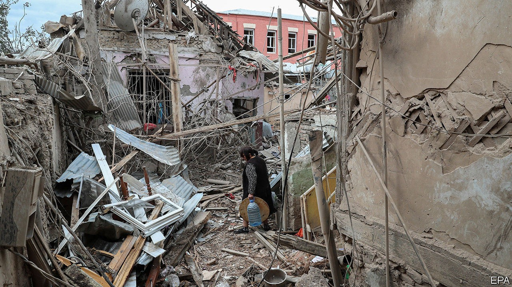
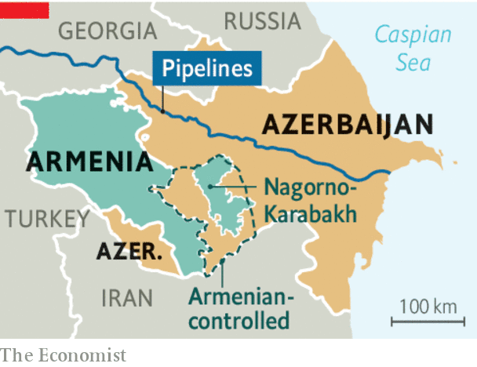

## Lessons of Nagorno-Karabakh

# Why “America First” makes wars in other places more likely

> A vacuum of global leadership lets local conflicts expand

> Oct 10th 2020

MORE THAN 200 people, mostly soldiers, have been killed in the past ten days. Shells are falling on towns in and around Nagorno-Karabakh. Turkish-made drones are loitering in the sky before blasting targets on the ground—and filming the destruction, to be posted on YouTube (see [article](https://www.economist.com//node/21792682)). This is not just a small war in a far-off place. It already involves bigger powers, and it could get much bloodier and nastier.

Nagorno-Karabakh is a disputed enclave populated largely by (Christian) Armenians. It broke away from (Muslim) Azerbaijan as the Soviet Union collapsed. Armenia supported it, and seized a huge chunk of Azerbaijani territory to connect with it, during a war that killed tens of thousands of people and displaced perhaps 1m more. A ceasefire was reached in 1994, but there have been repeated flare-ups since then—and this one is easily the worst. The Azerbaijanis are again trying to take their land back by force. Russia has a collective-security agreement with Armenia. Turkey backs Azerbaijan, whose people are ethnically and culturally close to Turks. Turkey’s president, Recep Tayyip Erdogan, sees the conflict as a chance to assert himself as a regional hegemon and Muslim champion, as he is already doing in Syria and Libya. Russia has so far acquiesced, but that may not last. Iran borders both countries and has a large Azeri minority; it could easily be sucked in. Pipelines carrying gas from the Caspian Sea run near the front lines.

The outlines of a solution have been promoted by outsiders for over a decade. Nagorno-Karabakh must have a legally guaranteed autonomous status, pending a final determination based on something like a plebiscite. In return, Armenia will have to hand back the Azerbaijani districts it grabbed in the early 1990s, retaining only a narrow corridor linking Armenia to Nagorno-Karabakh. Both governments once broadly accepted these principles. Now, however, neither is willing to compromise.

The tragedy for everyone is that the mechanisms for fixing this sort of crisis seem to have broken down. One obstacle is the coronavirus. In the past, the ground would have been thick with negotiators from an alphabet soup of peacemaking outfits and concerned nations, all trying to build local and regional confidence. The pandemic makes that sort of diplomacy much harder in conflict zones all around the world.

The bigger problem, though, is the absence of global leadership. America and Russia helped bring about the ceasefire in 1994, and in the past the two powers have kept a lid on things. America started to turn inward under Barack Obama. During the presidency of Donald Trump it has brokered improvements in relations between Arab rulers and Israel, which go down well at home. But it almost entirely abandoned the long, thankless slog of routine peace-maintenance. Turkey is an ally in NATO, which might in the past have been a useful forum to urge Mr Erdogan to stop meddling, and to press the combatants to lay down their weapons. But Mr Trump has little time for NATO, which without America is rudderless. Past American presidents might have put time, brainpower and muscle into preventing war in the Caucasus, but Mr Trump showed no interest even before he fell sick with covid-19. In the past Russia, too, might have reined in Mr Erdogan; but Vladimir Putin, like Mr Trump, is preoccupied with his own domestic troubles, and sees little harm in allowing the strongman in Ankara to make mischief, within limits. Pretty much anything that drives a wedge between Turkey and the rest of NATO suits the Kremlin.

There are many “frozen conflicts” around the world: places where war may not be raging, but where the underlying tensions have not been resolved and historical or territorial grievances run deep. The trouble with frozen conflicts is that they can turn hot at any moment. In a world where the democratic superpower is resentful, consumed and distracted, averting wars is far harder than it was—or should be. ■

## URL

https://www.economist.com/leaders/2020/10/10/why-america-first-makes-wars-in-other-places-more-likely
