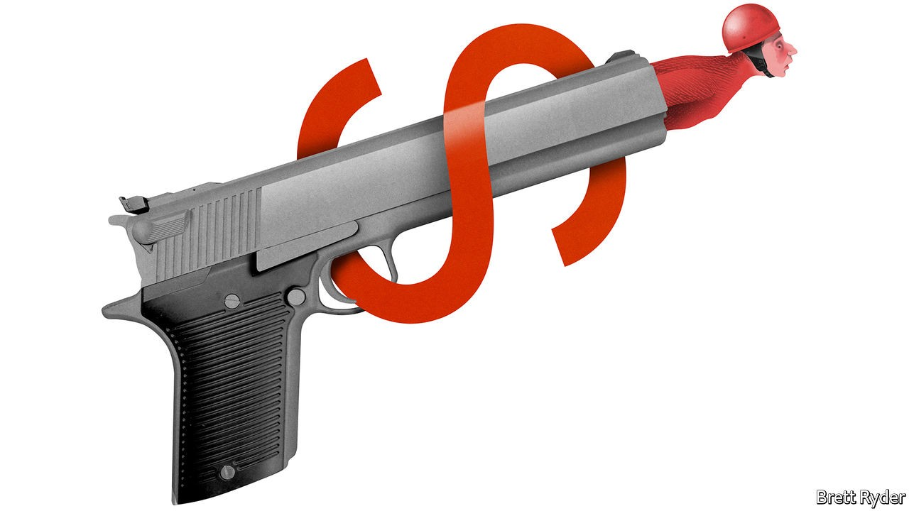
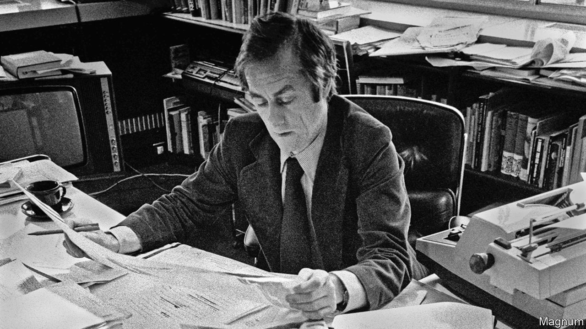

## On Mexico, “Cuties”, democracy, Milton Friedman, the Supreme Court, Harold Evans, tanks

# Letters to the editor

> A selection of correspondence

> Oct 10th 2020

Letters are welcome via e-mail to [letters@economist.com](https://www.economist.com/mailto:letters@economist.com)

The idea that Andrés Manuel López Obrador might be afraid of two magazines and their editors, who are sharp critics of the Mexican president, would be hilarious, were it not so misleading (Bello, [September 26th](https://www.economist.com//the-americas/2020/09/24/amlos-war-against-the-intelligentsia)). The president thrives in debate and his administration encourages a degree of freedom of the media not seen in Mexico since 1913. He is the only head of state, as far as I know, who holds a daily press conference.

I have known the past seven presidents of Mexico and can testify that Mr López Obrador is the most intellectually inclined among them. He is a voracious reader, particularly of the history and literature of his country, and was a protégé of Carlos Pellicer, a great poet. He is married to a university professor with a PhD in literature. I even expect that, at the end of his term, he will devote his time to academic pursuits.

From your writing I suspect that The Economist is mostly in touch with the upper echelons of Mexican society, the business and financial communities, who feel threatened by change and the new priorities of the government, such as its fight against corruption and inequality. Perhaps you ought to get closer to other parts of society, including underprivileged Mexicans, in order to gain a more balanced view of Mexico these days.

SENATOR HÉCTOR VASCONCELOSChairman of the Foreign Relations Committee in the Mexican SenateMexico City

I read your review of “Cuties”, a controversial French film on the hyper-sexualisation of pre-teens (“The dancer and the dance”, [September 19th](https://www.economist.com//books-and-arts/2020/09/19/a-bold-french-film-stirs-controversy-in-america)). You did recognise that the film contains uncomfortable scenes and that its subject matter is “a troubling phenomenon”, but you ultimately called it a “strong debut feature”, ignoring whether the film is legitimate at all.

In the film actresses aged 11 to 13 dance in an extremely sexual manner for long scenes. They are depicted in stages of undress. The Economist, like so many other publications, fell into the trap of defending this work when it deserves censure. Perhaps the fact that right-wing American politicians have condemned the film caused you to laud it. Perhaps because the director is a woman of colour, reflecting her own experience, you thought it was valid commentary. Or perhaps French-language films are just above reproach.

Whatever the reasons, defenders of this film should be ashamed. It is a mechanism for and depiction of the sexual exploitation of minors. It is another sad example of the film industry becoming inured to the images of sexualised underage actors to the point where it doesn’t blink an eye.

LAURA STANTON HAAKWashington, DC

Your article on the increasing popularity of citizens’ assemblies did not have much to say about the Middle East (“Some assembly required”, [September 19th](https://www.economist.com//international/2020/09/19/citizens-assemblies-are-increasingly-popular)). Steps are being taken in a handful of Arab countries to establish, with Western support, economic and social councils. Although more formal and not as randomly selected than the assemblies you mentioned, these councils have representatives from unions, business, universities and other parts of society and provide advice to the government. Jordan’s council just produced a series of evidence-based studies on the effects of covid-19 on the country.

As your article highlighted, some legitimacy and empowerment would go a long way into making citizens’ assemblies relevant and effective. They could be the secret ingredient to renewing the social contract that the Arab spring failed to achieve.

NADIM KHOURIWashington, DC

* Not all countries are dissatisfied with their democratic institutions. In a study this year researchers at Cambridge University found that the seven countries with the highest political satisfaction all have proportional representation. In countries where the parliament reflects society in terms of age, gender, ethnicity, and so on, there is less need to create a representative citizens’ assembly. The coalition governments in these countries are often better equipped at reaching a cross-party consensus on thorny subjects.Only three countries in Europe use a “winner-takes-all” system (Belarus, Britain and France). All the others use some form of proportional representation.

KATHRINE SANTOSLondon

* Your advocacy for deliberative democracy brought to mind my own long study of Thomas Jefferson’s promotion of what he called “ward republics”, local citizen assemblies deliberating over the particular concerns of the local community. These assemblies were central to his understanding of the nature of republicanism since early Rome. In a letter written well after leaving the presidency, he stated: “The further the departure from the direct and constant control by the citizens, the less has the government of the ingredient of republicanism.” To recapture popular sovereignty and empower currently disaffected citizens of America, the more deliberative democracy and local republicanism should be restored.

GARY HARTKittredge, Colorado

The complexities of stakeholder capitalism were pointed out clearly by Schumpeter ([September 19th](https://www.economist.com//business/2020/09/19/what-is-stakeholder-capitalism)). But although Milton Friedman would perhaps turn in his grave about Walmart’s new corporate strategy embracing “green energy and gay rights”, it would not be a complete 180-degree turn.

Yes, in his famous article from 1970 Friedman declared that those who promote desirable social ends for companies are “preaching pure and unadulterated socialism”. Those opening paragraphs are punchy, but many people stop reading the essay too soon. Because a little further down in the same article Friedman says the following:

Stakeholder capitalism is gaining ground because there is a business case as well as a moral case for it. I think Friedman would have approved.

DANIEL MALANAssistant professor in business ethicsTrinity College Dublin

The chart in “Courting trouble” ([September 26th](https://www.economist.com//united-states/2020/09/26/the-knife-fight-over-ruth-bader-ginsburgs-replacement)) of Supreme Court nominations during a presidential election year had a slight error in it. John Jay’s second nomination was in fact confirmed by the Senate in 1800. However, Jay declined the position. John Adams then nominated John Marshall, his secretary of state, to the court, who went on to become one of its most highly regarded justices. Marshall was nominated by a lame-duck president and confirmed by a lame-duck Senate. Try imagining what would happen if Donald Trump tried to appoint Mike Pompeo to the Supreme Court after losing this election.

BARRY SWEETProfessor of political scienceClarion University of Pennsylvania

You rightly praised Harold Evans in your obituary ([October 3rd](https://www.economist.com//obituary/2020/10/03/harold-evans-died-on-september-23rd)) as an outstanding post-war editor. But in lauding his achievement as editor of the Sunday Times you did a disservice to the paper he inherited. The colour section was not Harry’s invention but that of Denis Hamilton who had introduced it five years before, along with founding the Insight team and a separate business section. Far from being a “staid, class-bound broadsheet”, it was a rapidly growing title with a worldwide reputation and a circulation of 1.5m. Hamilton, like Harry, was from the north of England, had left school at 17 to work as a junior reporter on the local Middlesborough paper and as editor of the Sunday Times recruited a range of talent from many backgrounds.

He brought Harold Evans to the paper in 1966 and made him editor a year later. Hamilton continued as editor-in-chief and adviser to Harry.

ADRIAN HAMILTONShepton Mallet, Somerset

“Army surplus?” ([September 12th](https://www.economist.com//science-and-technology/2020/09/12/tanks-have-rarely-been-more-vulnerable)) reported that the army’s peak-tank period is probably behind us. However, I think that post-peak-tank the continued existence of the armoured vehicle will serve a purpose of providing the think-tanks referred to in the article with a reason for continuing to think about tanks.

JIM LEWISBasel, Switzerland

* Letters appear online only

## URL

https://www.economist.com/letters/2020/10/10/letters-to-the-editor
