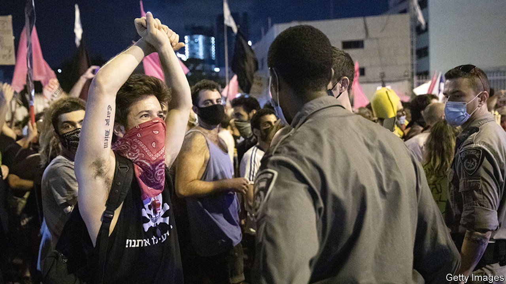
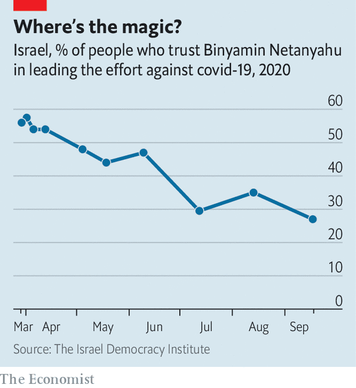

## Pandemic politics

# Binyamin Netanyahu is losing support

> The Israeli prime minister’s botched response to covid-19 is costing lives and public trust

> Oct 10th 2020JERUSALEM

WITH ISRAEL in indefinite nationwide lockdown against covid-19, Binyamin Netanyahu, the prime minister, tried on October 5th to put a positive spin on the situation. “We were the first to go into lockdown” in the second wave, he said. This was therefore an achievement, rather than the result of the highest recorded daily infection rate in the world and one of its highest recorded death rates.

Few Israelis believe him. Polls suggest that if an election were held now, Mr Netanyahu’s Likud party would lose more than a quarter of the seats it took in March. Many would go to another right-wing party led by Naftali Bennett, his former aide.

The swing is not about ideology or policy. Both men hold similar views on many issues. It is a kick in the teeth for the prime minister. In April 58% of Israelis approved of his handling of the pandemic. Now just 27% do (see chart).

Israel’s longest-serving prime minister should have been at the peak of his powers. After calling three elections, each ending in a stalemate, he managed in May to split the opposition against him and cajole his main challenger, Benny Gantz, leader of the centrist Blue and White party, to join him in a coalition government. Under his leadership Israel seemed to have dealt well with the pandemic’s first wave. He could also boast of a summer of diplomatic triumphs, with the United Arab Emirates and Bahrain agreeing to establish full relations.

But more recently his poorly organised reopening of schools and the economy has led to another surge of infections and a breakdown of public trust in him. Mr Netanyahu’s coddling of his ultra-Orthodox allies, who have been openly flouting medical guidelines, has made matters worse.

Left-wingers who have protested for months outside his residence, calling for his resignation, have been a particular irritation. Papers friendly to him have branded them as “anarchists” and “disease-spreaders”. The latest lockdown rules seemed aimed as much to target them as to suppress the virus. “Whenever the protesters come up in cabinet meetings,” says one minister, “Netanyahu simply loses it.”

Yet the lockdown is failing on both counts. The protesters can no longer gather in thousands outside Mr Netanyahu’s house. But they have dispersed into hundreds of smaller demonstrations, gaining new followers. Some even take place in Jewish settlements on the West Bank.

Defying the new rules, Israelis now seem less inclined to stay at home. Mobile-phone data show that they moved around 75% less than normal in the first lockdown. Now they are moving just 60% less than usual. “The public is much less disciplined,” says Eran Segal of the Weizmann Institute. As a result, the infection rate will probably fall slowly, adding to Mr Netanyahu’s woes. “Covid has tainted him,” says a former aide who has seen him come back from polling slumps before. “Netanyahu can’t rebuild his image after this.” ■

## URL

https://www.economist.com/middle-east-and-africa/2020/10/10/binyamin-netanyahu-is-losing-support
