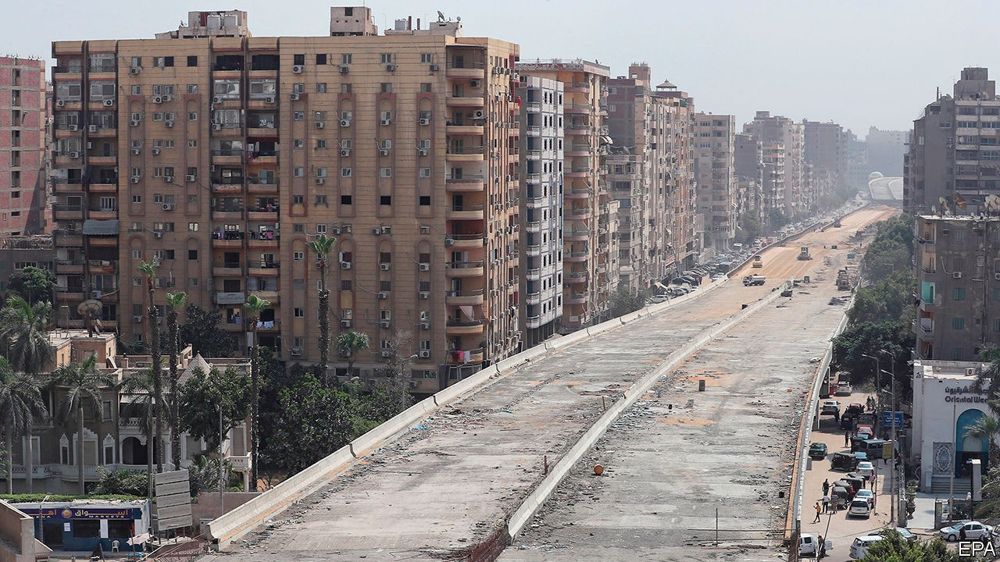

## A rage for roads

# Egypt is busily building expressways

> But locals would prefer a more carfree Cairo

> Oct 8th 2020CAIRO

THE NEW flyover in Giza, near Cairo, is something to behold. The road runs so close to the adjacent apartment buildings that some residents can reach out of their windows and touch it (see picture). One jokingly told a local newspaper that he would invite passing motorists in for tea on his balcony. But the road is more than just an object of ridicule. To many Egyptians, it is a symbol of their government’s ineptitude, as it pursues an ambitious national development plan.

The scale of construction, which includes highways linking new and planned cities, is vast. In August the transport minister, Kamel al-Wazir, said 130bn Egyptian pounds ($8.3bn) had been allocated to complete 1,000 bridges and tunnels by 2024 (about 600 are already done). The goal is to double Egypt’s urban space over the next 30 years. President Abdel-Fattah al-Sisi, a former general, wants the work done quickly. Roughly a fifth of Egypt’s 100m citizens live in Cairo, the timeworn capital.

Many Egyptians support the effort. Cairo’s roads are notoriously clogged. Part of the plan is to reorient the flow of traffic towards a shimmering new capital, 45km east of the current one. With new highways taking shape, commutes into central Cairo from the periphery have never been so brisk. The roads are a rare but tangible way in which the quality of life for many Egyptians has improved under Mr Sisi.

But much of the construction appears poorly planned. The new concrete bridges and flyovers are eyesores. Residents of Heliopolis, a relatively posh neighbourhood in the capital, mourn the loss of hundreds of trees. Public parks and squares have been paved over and roads have gobbled up pavements to make way for cars. Dozens of pedestrians were struck on one expanded stretch of road in the weeks after it reopened earlier this year. The carnage forced the government to station soldiers there to help people cross.

The construction also threatens Egypt’s heritage. One planned expressway would slice through the City of the Dead, an ancient necropolis listed by UNESCO as a world heritage site. Bulldozers have already begun rolling through a section of its more contemporary graves. Elsewhere a pair of highways is being carved through the Giza plateau, near the Great Pyramids. Egyptologists worry that archaeological treasures may be lost under concrete. (An earlier version of the Giza highway plan was scrapped in the 1990s after an outcry.)

Locals complain that the government has not consulted them (they are not allowed to protest). Urban planners say the development is misguided. They point to cities elsewhere, from Paris to Seoul, which have recently become more green and walkable. Norman Foster, an architect, put it plainly at a forum in Cairo: “One has to question why one part of the world is building huge roadwork when elsewhere...the lessons have been already learned.” ■

## URL

https://www.economist.com/middle-east-and-africa/2020/10/08/egypt-is-busily-building-expressways
