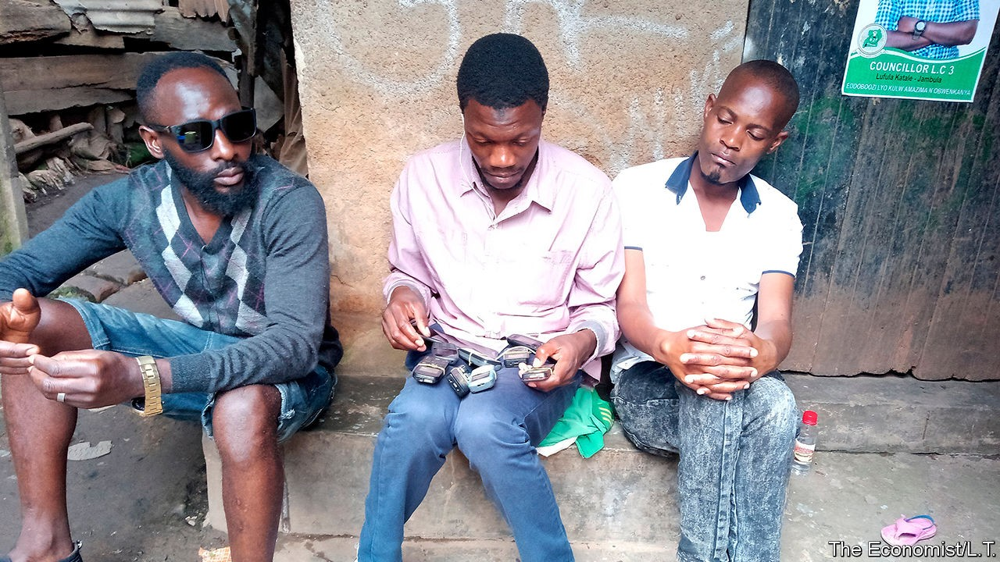

## When calling is a calling

# For some Ugandans, phoning the radio is a way of life

> Those who praise politicians can land plum jobs

> Oct 10th 2020KAMPALA

THE TRICK to getting on Ugandan radio is to call early and often, says Rajabu Bukenya (pictured). A phone is tucked in his shirt pocket, its radio receiver tuned to a popular talk show. Eight others are balanced on his thighs, all dialling the station’s number. Soon one connects and he gives his trademark introduction. “This is Rasta Man in Bwaise who eats once a day!” Hunched on a step, beside a wall scrawled with graffiti, he has all of Kampala as his audience.

Mr Bukenya says he phones “from morning up to evening”, expounding on crooked politics, bad roads, or the floods that sweep through Bwaise, a poor quarter of the Ugandan capital. He considers himself a “freedom fighter”. But not everyone concurs. Adam Kungu, who hosts a political talk show on Top Radio, says that eight in ten calls come from regulars like Mr Bukenya, stopping ordinary listeners from getting through. “Repetitive callers are a menace,” complains Abby Mukiibi, a programmer at CBS, another station. “To them it is a way of living now, it’s employment.”

The business model is murky. Some callers have clubbed together into trade associations. A member says they meet to discuss issues and do not take money from politicians. But most listeners suspect otherwise. Mr Mukiibi says he knows one caller who used his earnings to buy a chicken farm and another who got a job in the intelligence service. When he tries to block repeat callers he gets messages from state security saying “Let those people do it.”

The most dedicated diallers can do well. Linos Ngompek used to drive taxis to pay his college fees. After graduating he started phoning radio stations to praise the ruling party, and soon joined other “media activists” in government-run training sessions. “Sometimes you find that a ministry is being bashed on air, so these ministers would call us to give us facts,” he says. He denies receiving cash, but says calling helped him in other ways: in 2014 he was appointed a local security chief by the president, and he is now running for parliament.

The men who phone in—very few are women—insist they are not driven by a desire for fame or money. The role of a caller is to fill “a vacuum” that exists between government and the people, says Nicholas Musinguzi, a spokesman for “Kangabaije”, a pressure group which phones in daily to stations in Hoima town. It takes its name from a drum traditionally beaten to alert the community in a crisis. In Bwaise, Mr Bukenya canvasses opinion with market vendors and motorbike-taxi drivers. He still lives in “the ghetto”, but now even big politicians take his calls. “My aim is for my voice to reach where I cannot,” he says.

## URL

https://www.economist.com/middle-east-and-africa/2020/10/10/for-some-ugandans-phoning-the-radio-is-a-way-of-life
