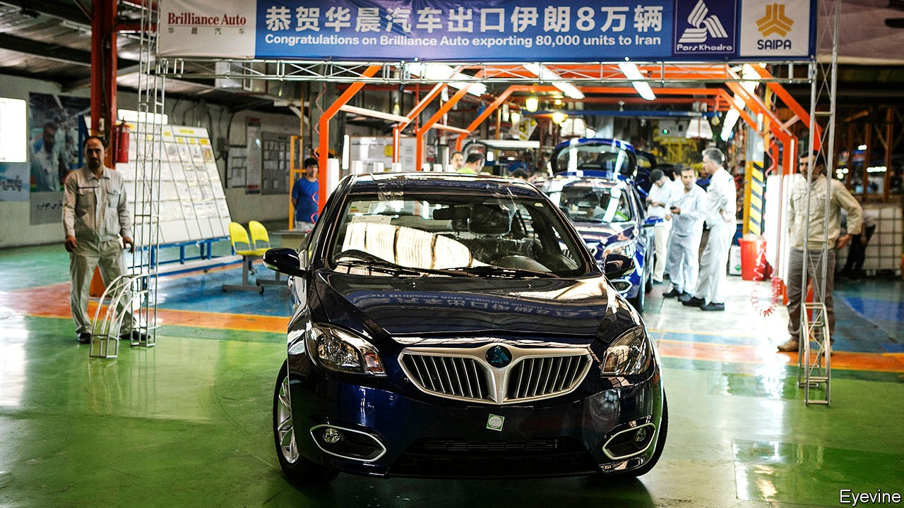
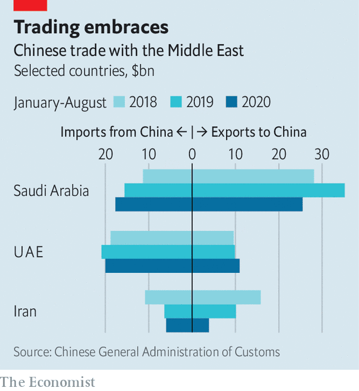

## Friends with few benefits

# Iran wants a “strategic partnership” with China

> For China, Iran is just one piece on a large chessboard

> Oct 10th 2020BEIRUT

CHINA COMMANDS a certain mystique in the Middle East. For politicians in Lebanon, broke and on the brink of hyperinflation, it is an ATM waiting to dispense billions if they can only find the passcode. For the regime of Bashir al-Assad in Syria it is a deus ex machina to rebuild a shattered country. Often caricatured, the Middle East is prone to draw caricatures of its own.

On October 1st Hassan Rouhani, the Iranian president, declared a “major step” in Iran’s relations with China. For months the two have been discussing plans for a 25-year “strategic partnership”. But the details remain vague.

Leaked drafts call for big Chinese investment in everything from roads and ports to telecoms and nuclear energy. The agreement would probably give China a stake in Iran’s oil industry, guaranteeing a market for its crude and refined products. Infrastructure projects would stitch Iran into the Belt and Road Initiative as a transit point between Asia, Europe and the Middle East. Rumours flew in Iran’s media that it might even cede control of Kish, an island that is a free-trade zone in the Persian Gulf. The government says this is bunk. The draft makes no mention of it.

China’s new friendship has caused a measure of alarm in Washington. Mike Pompeo, America’s secretary of state, warned that it would “destabilise the Middle East”. Like much Chinese diplomacy in the Middle East, however, its proposed partnership with Iran is long on ambition but short on detail. Rather than a comprehensive road map, the proposal is more a sign of both Iran’s desperation and the limits of China’s ambition.

Even without covid-19 battering the world economy, Iran would be in dire straits. Sanctions reimposed by America in 2018 have pushed Iran’s oil production to its lowest levels since the 1980s. In July it pumped an estimated 1.9m barrels per day (b/d), about half of what it was pulling from the ground in 2018. Most of its output is being used for domestic consumption or diverted to storage. Exports, depressed by sanctions and the pandemic, were probably well below 500,000b/d.

The sanctions failed in their stated goal of compelling Iran to agree to more restrictions on its nuclear programme and to roll back its meddling in the region. But they have crippled its economy, which shrank by 7.6% last year after a 5.4% contraction in 2018. Its currency, the rial, traded at 3,800 to the dollar when Donald Trump took office in 2017. Now a dollar costs more than 29,500 rials. In May parliament approved a plan to lop four zeroes off banknotes. The original nuclear deal brought the promise of investment and trade from Western countries. Mr Trump’s Iran policy has dashed such hope.

To judge by the rhetoric in Tehran and Beijing, China should be rushing to fill the void. During the previous round of sanctions, which culminated in the nuclear deal in 2015, it emerged as the buyer of last resort for Iranian oil. But the resulting barter system was often derided as “trash for oil”. Consumers got cheap stuff, but some of it was junk: in 2011 Iran banned the import of scores of shoddy Chinese products.

It has not been a saviour this time either. Last year bilateral trade between Iran and China fell by about one-third. In the first eight months of this year China’s imports from Iran decreased by 62%, from $10.1bn to $3.9bn. Exports have held up better, dropping by just 7%: Iran still relies on Chinese-made goods, even if China does not need so much of Iran’s oil.

The circumstances have been unusual, of course. Oil demand in China has fallen because of covid-19. But trade with other oil-producers has not been so affected (see chart). Imports from Saudi Arabia, mostly oil and petrochemicals, are down by a less awful 28%. Those from the United Arab Emirates are up by 11%.

Unlike America, China is happy to cultivate ties with all sides in the Middle East. But some of those relationships have limits. Talk of partnerships aside, China cares more about America than about Iran. It backed out of a $5bn deal to develop Iran’s South Pars gasfield rather than fall foul of American sanctions. Common sense plays a role, too. As Lebanon tips into economic crisis, and with its Arab and Western partners reluctant to help, some Lebanese politicians are keen to “look east” and court Chinese aid. To date, though, there has been no major Chinese investment in their country, and its endemic corruption will probably keep China away. “Maybe they’ll build a power station or a highway. But they’re not going to park $10bn in the central bank,” says a diplomat in Beirut.

China’s most valued relationships are with the rich, well-run Gulf states. They in turn are willing to tolerate China’s diplomatic ties with Iran. In June, for example, China voted against a resolution at the International Atomic Energy Agency, the UN’s watchdog, that urged Iran to let inspectors into two nuclear facilities. The vote passed smoothly. A Chinese military base across the Persian Gulf would, however, be another matter. So would big Chinese arms sales to Iran, which are possible if a UN embargo is not renewed this month.

China and Iran will probably conclude an agreement within months. For Iran, it will seem a vital lifeline—particularly if Mr Trump wins a second term. For China, though, Iran will remain just one piece on a much larger chessboard. ■

## URL

https://www.economist.com/middle-east-and-africa/2020/10/10/iran-wants-a-strategic-partnership-with-china
