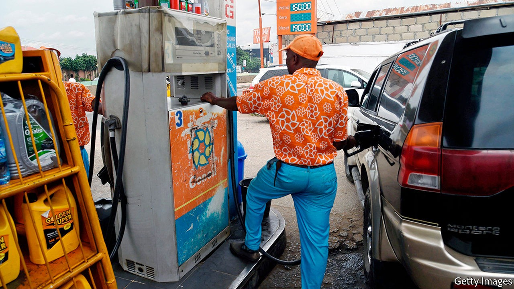

## Fuel me once

# Nigeria’s President Buhari is doing away with petrol subsidies

> The reform is long overdue

> Oct 10th 2020ABUJA

TIME IN NIGERIA sometimes seems to follow its own rhythm. When the government introduced petrol subsidies they were meant to last just six months. Some four decades later, they endure.

Africa’s biggest oil producer sometimes has the continent’s longest queues outside filling stations. Not one of its four refineries has produced a drop of petrol in more than a year. The reason is that the government forces oil companies to sell petrol at the pump for less than it is worth on international markets (with the state, belatedly, paying the difference). The subsidies have been a huge drain on the treasury: when oil prices were higher in 2011 they equalled almost 5% of GDP. The subsidies are often stolen. And when they are not, they encourage overconsumption of a planet-cooking fossil fuel.

Muhammadu Buhari, now in his second term as Nigeria’s president, has long promised to repair state-owned refineries to reduce the fuel-import bill. But he has also balked at letting them sell petrol at prices high enough to make refining profitable. Until now. Over the past few months the government has steadily lifted the retail price of fuel after announcing in June that it would phase out the subsidies. A litre now sells for 162 naira ($0.42), up from 121 naira in June.

These reforms have irked opposition parties and trade unions. Labour bosses threatened strikes, as they did when a previous government tried to end petrol subsidies in 2012. Then, after ten days of protests and 12 deaths (mostly from police bullets), the government backed down and reduced subsidies instead of eliminating them.

This time the government has little choice but to hold firm. The World Bank reckons Nigeria’s economy will shrink by 3.2% this year, its worst recession in four decades. Government revenues are slumping, leaving little cash to support the more than 40% of Nigerians who are extremely poor, let alone provide subsidised petrol to middle-class motorists.

The economic crisis also seems to have dampened the unions’ fighting spirit. Low oil prices mean that the loss of the subsidies is not being felt as keenly as in 2012. They called off a nationwide strike scheduled for September 28th after talks with the government. They did not leave empty-handed: the government put on hold planned increases in electricity prices, which are needed to make it profitable for companies to generate the stuff. The unions, it seems, would rather have cheap imaginary power than slightly dearer juice that actually comes out of the socket. ■

## URL

https://www.economist.com/middle-east-and-africa/2020/10/10/nigerias-president-buhari-is-doing-away-with-petrol-subsidies
